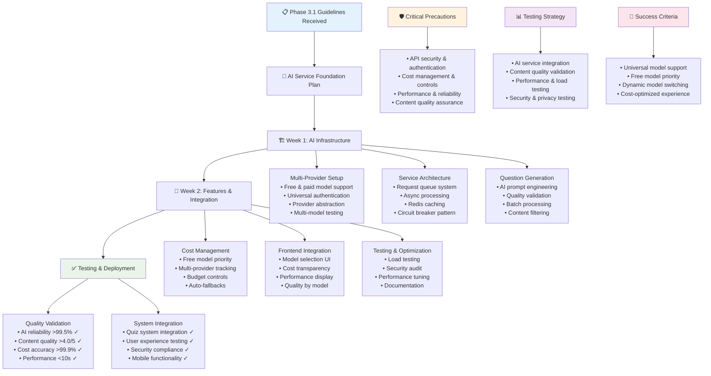

# QuizMaster Pro - Phase 3.1 Instructions & Guidelines

## 🎯 Phase 3.1 Objective
**Goal**: Build a comprehensive AI Service Foundation with OpenAI GPT-4 integration for intelligent question generation, content validation, and enhanced quiz experiences. This system must provide reliable AI-powered features while managing costs, handling failures gracefully, and maintaining high content quality standards.

**Duration**: 2 Weeks (14 days)  
**Success Metric**: Stable AI service capable of generating 1000+ high-quality questions daily with 95% uptime, accurate cost tracking, and seamless integration with existing quiz systems

**Prerequisites**: Phase 1.1, 1.2, 1.3, 2.1, 2.2, and 2.3 must be 100% complete and functional

---

## 📋 FEATURES TO IMPLEMENT

### **AI Provider Integration & Setup**
- **Universal AI Model Support**: Support for any AI model - free or paid (GPT-4, Claude, Gemini, Llama, etc.)
- **Dynamic Model Switching**: Real-time switching between different AI models and providers
- **Multiple Provider Integration**: OpenAI, Anthropic, Google, Hugging Face, local models, and custom APIs
- **Free Model Support**: Integration with free models like Llama 2/3, CodeLlama, and open-source alternatives
- **Paid Model Support**: Premium models like GPT-4, Claude 3, Gemini Pro with cost optimization
- **API Key Management**: Secure storage and rotation of credentials for multiple providers
- **Environment Configuration**: Development, staging, and production configurations for all providers
- **Connection Pooling**: Efficient connection management for high-volume requests across providers
- **SSL/TLS Security**: Encrypted communication with all AI service providers
- **Backup Provider System**: Automatic failover between different AI providers and models

### **AI Service Architecture**
- **Service Abstraction Layer**: Clean interface abstracting AI provider specifics
- **Request Queue Management**: Queue system for managing AI processing requests
- **Async Processing**: Non-blocking AI request processing with callback mechanisms
- **Caching System**: Redis-based caching for frequently requested AI generations
- **Load Balancing**: Distribute AI requests across multiple API keys/accounts
- **Circuit Breaker Pattern**: Prevent cascade failures when AI services are down
- **Monitoring & Health Checks**: Real-time monitoring of AI service availability

### **AI Question Generation System**
- **Topic-Based Generation**: Generate questions for specific topics and subjects
- **Difficulty Scaling**: AI generates questions at specified difficulty levels (1-5)
- **Question Type Support**: Multiple choice, true/false, short answer generation
- **Context Awareness**: Use previous questions as context for better generation
- **Batch Processing**: Generate multiple questions in single API calls
- **Quality Scoring**: Internal scoring system for generated question quality
- **Content Validation**: Automated validation of generated question format and content

### **Cost Management & Usage Tracking**
- **Real-Time Cost Tracking**: Track API usage costs in real-time
- **Usage Quotas**: Implement daily, weekly, monthly usage limits
- **Cost Alerts**: Automated alerts when approaching spending thresholds
- **User-Level Tracking**: Track AI usage per user for billing/limiting
- **Cost Optimization**: Implement strategies to minimize unnecessary API calls
- **Budget Management**: Administrative controls for AI spending limits
- **Usage Analytics**: Comprehensive analytics on AI service utilization

### **Error Handling & Resilience**
- **Graceful Degradation**: Maintain core functionality when AI services fail
- **Retry Logic**: Intelligent retry mechanisms with exponential backoff
- **Fallback Content**: Pre-generated question pools as AI service fallbacks
- **Error Classification**: Categorize and handle different types of AI service errors
- **Timeout Management**: Appropriate timeouts for AI requests to prevent hanging
- **Circuit Breaker Implementation**: Automatic failover when AI services are unhealthy
- **Recovery Procedures**: Automated recovery when AI services come back online

### **Rate Limiting & API Management**
- **Request Rate Limiting**: Respect OpenAI API rate limits and quotas
- **User Rate Limiting**: Prevent individual users from overwhelming AI services
- **Queue Management**: Handle burst requests through intelligent queuing
- **Priority System**: Priority queuing for premium users or critical requests
- **Load Balancing**: Distribute requests across multiple API keys/endpoints
- **Throttling Mechanisms**: Dynamic throttling based on current API availability
- **Fair Usage Policy**: Implement fair usage policies for AI-generated content

### **Content Quality & Validation**
- **Response Validation**: Validate AI responses meet required format and quality
- **Content Filtering**: Filter inappropriate or low-quality AI-generated content
- **Fact Checking**: Basic fact validation for AI-generated question content
- **Duplicate Detection**: Prevent duplicate question generation
- **Quality Metrics**: Scoring system for AI-generated content quality
- **Human Review Integration**: Queue system for human review of AI content
- **Feedback Loop**: Use user ratings to improve AI question quality

### **AI Model Flexibility & Management**
- **Universal Model Support**: Compatible with any AI model architecture (Transformer, State-space, etc.)
- **Runtime Model Switching**: Switch between models without service interruption or restart
- **Model Performance Comparison**: A/B testing between different models for quality assessment
- **Cost-Performance Optimization**: Automatic selection of most cost-effective model for each request
- **Local Model Integration**: Support for self-hosted and local AI models (no external costs)
- **Hybrid Model Usage**: Combine multiple models for different aspects (generation, validation, etc.)
- **Model Configuration Profiles**: Pre-configured settings for different models and use cases
- **Custom Model Integration**: Support for proprietary or fine-tuned models via API endpoints

### **Frontend AI Integration**
- **AI Question Request Interface**: User-friendly interface for requesting AI questions
- **Model Selection Interface**: Users can choose preferred AI models or let system auto-select
- **Generation Progress Tracking**: Real-time progress indicators for AI processing
- **Cost Display**: Transparent display of AI usage costs to users (free models show $0.00)
- **Model Performance Display**: Show which model was used and its performance metrics
- **Topic Suggestion Engine**: AI-powered topic suggestions based on user history
- **Quality Rating System**: Allow users to rate AI-generated questions by model
- **AI Settings Panel**: User preferences for AI generation parameters and model selection
- **Generation History**: Track and display user's AI usage history with model information

---

## ⚠️ CRITICAL PRECAUTIONS

### **API Security & Authentication Precautions**
1. **API Key Security**: Secure storage of OpenAI API keys with encryption at rest
2. **Key Rotation**: Regular rotation of API keys and secure key management
3. **Request Authentication**: Ensure all AI requests are properly authenticated
4. **Data Privacy**: Protect user data sent to AI services and ensure compliance
5. **Audit Logging**: Comprehensive logging of all AI service interactions
6. **Access Control**: Restrict AI service access to authorized users and systems
7. **Secure Transmission**: Encrypt all data in transit to AI service providers

### **Cost Management Precautions**
1. **Budget Controls**: Hard limits on AI spending to prevent cost overruns
2. **Usage Monitoring**: Real-time monitoring of API usage and costs
3. **Alert Systems**: Immediate alerts for unusual spending patterns
4. **User Quotas**: Per-user limits to prevent abuse and control costs
5. **Cost Optimization**: Regular review and optimization of AI usage patterns
6. **Billing Validation**: Validate AI service billing against internal usage tracking
7. **Emergency Shutoffs**: Ability to immediately disable AI services if costs spike

### **Performance & Reliability Precautions**
1. **Timeout Management**: Appropriate timeouts for all AI service calls
2. **Circuit Breaker**: Prevent cascade failures with circuit breaker patterns
3. **Caching Strategy**: Aggressive caching to reduce API calls and improve performance
4. **Rate Limiting**: Respect API rate limits to prevent service interruption
5. **Load Testing**: Regular testing under high AI request volumes
6. **Failover Systems**: Reliable failover to backup content when AI fails
7. **Performance Monitoring**: Continuous monitoring of AI service performance

### **Content Quality Precautions**
1. **Content Validation**: Strict validation of all AI-generated content
2. **Quality Thresholds**: Minimum quality standards for AI-generated questions
3. **Human Review**: Human oversight for AI-generated content quality
4. **Bias Detection**: Monitor and prevent biased content from AI services
5. **Factual Accuracy**: Validation mechanisms for factual correctness
6. **Content Filtering**: Remove inappropriate or harmful AI-generated content
7. **User Feedback Integration**: Use user feedback to continuously improve quality

---

## 🚫 COMMON ERRORS TO PREVENT

### **AI Integration Errors**
- **API Key Exposure**: Accidentally exposing API keys in client-side code or logs
- **Authentication Failures**: Improper authentication leading to service failures
- **Rate Limit Violations**: Exceeding API rate limits causing service interruption
- **Request Format Errors**: Sending malformed requests to AI service APIs
- **Timeout Issues**: Not handling long AI processing times appropriately
- **SSL Certificate Problems**: SSL/TLS certificate validation issues with AI services
- **Version Compatibility**: Using incompatible API versions causing failures

### **Cost Management Errors**
- **Runaway Costs**: Uncontrolled AI usage leading to unexpected high costs
- **Double Charging**: Duplicate API calls charging users multiple times
- **Usage Tracking Failures**: Inaccurate cost tracking leading to billing discrepancies
- **Budget Overflow**: Not enforcing spending limits allowing cost overruns
- **Ghost Usage**: Phantom API calls not associated with user requests
- **Currency Conversion Issues**: Incorrect cost calculations due to currency conversion
- **Billing Reconciliation**: Mismatches between internal tracking and provider billing

### **Performance & Reliability Errors**
- **Memory Leaks**: AI service connections causing memory accumulation
- **Connection Pool Exhaustion**: Running out of available connections to AI services
- **Blocking Operations**: Synchronous AI calls blocking the main application thread
- **Cache Invalidation**: Stale cached AI responses providing outdated content
- **Circuit Breaker Failures**: Circuit breaker not triggering during AI service outages
- **Retry Storm**: Excessive retry attempts overwhelming failing AI services
- **Resource Cleanup**: Not properly cleaning up AI service connections and resources

### **Content Quality Errors**
- **Format Validation Bypass**: AI responses not meeting required format specifications
- **Quality Score Manipulation**: Gaming quality scoring systems with biased inputs
- **Content Duplication**: AI generating duplicate or near-duplicate questions
- **Inappropriate Content**: AI generating offensive, biased, or inappropriate content
- **Factual Inaccuracies**: AI providing incorrect information in generated questions
- **Context Loss**: AI losing context leading to inconsistent question generation
- **Validation Failures**: AI content validation systems having false positives/negatives

### **Security & Privacy Errors**
- **Data Leakage**: Exposing user data to AI services without proper consent
- **Injection Attacks**: Malicious prompts manipulating AI service responses
- **Authentication Bypass**: Unauthorized access to AI service functionality
- **Logging Sensitive Data**: Accidentally logging user data or API keys
- **GDPR Violations**: Non-compliance with data privacy regulations
- **Cross-User Data**: AI responses containing data from other users
- **Audit Trail Gaps**: Missing audit logs for AI service interactions

---

## 🏗️ BEST IMPLEMENTATION PRACTICES

### **Architecture Design Best Practices**
1. **Service Abstraction**: Abstract AI providers behind clean, consistent interfaces
2. **Microservice Architecture**: Separate AI services from core application logic
3. **Event-Driven Design**: Use events for AI processing workflows and notifications
4. **Circuit Breaker Pattern**: Implement circuit breakers for resilient AI service calls
5. **Async Processing**: Non-blocking AI request processing with proper callback handling
6. **Caching Strategy**: Multi-layer caching for AI responses and processed content
7. **Monitoring Integration**: Comprehensive monitoring and alerting for AI service health

### **Universal AI Model Integration Best Practices**
1. **Provider-Agnostic Architecture**: Use abstracted interfaces that work with any AI provider
2. **Official SDK Usage**: Utilize official SDKs when available (OpenAI, Anthropic, Google, etc.)
3. **Fallback HTTP Clients**: Robust HTTP clients for providers without official SDKs
4. **Connection Pooling**: Efficient connection management for high-volume requests across all providers
5. **Request Optimization**: Batch multiple requests and optimize for each provider's API structure
6. **Response Streaming**: Use streaming when supported for real-time AI interactions
7. **Context Management**: Efficient management of conversation context across different model architectures
8. **Token/Credit Optimization**: Optimize prompts for each provider's pricing model (tokens, credits, characters)
9. **Dynamic Model Selection**: Choose optimal models based on cost, quality, and speed requirements
10. **Free Model Prioritization**: Prefer free models when quality requirements are met

### **Security Implementation Best Practices**
1. **Zero Trust Architecture**: Never trust AI service responses without validation
2. **Input Sanitization**: Sanitize all inputs sent to AI services
3. **Output Validation**: Validate all AI outputs before processing or storage
4. **Encryption**: Encrypt sensitive data sent to and received from AI services
5. **Access Control**: Implement proper access controls for AI service functions
6. **Audit Logging**: Comprehensive logging of all AI service interactions
7. **Privacy by Design**: Build privacy protection into AI service architecture

### **Performance Optimization Best Practices**
1. **Response Caching**: Aggressive caching of AI responses for common requests
2. **Request Batching**: Batch multiple AI requests to improve throughput
3. **Async Operations**: Use asynchronous processing for all AI service calls
4. **Connection Reuse**: Reuse connections to AI services for better performance
5. **Load Balancing**: Distribute AI requests across multiple API keys or endpoints
6. **Predictive Caching**: Preemptively generate content based on usage patterns
7. **Performance Monitoring**: Continuous monitoring and optimization of AI service performance

### **Cost Optimization Best Practices**
1. **Free Model Prioritization**: Always prefer free models (Llama, CodeLlama, local models) when quality is adequate
2. **Smart Model Selection**: Automatically choose cheapest model that meets quality requirements
3. **Usage Analytics**: Deep analytics to understand and optimize AI usage patterns across all models
4. **Intelligent Caching**: Cache expensive AI operations to reduce redundant calls across all providers
5. **Request Optimization**: Optimize prompts for each provider's pricing model (tokens, characters, API calls)
6. **Batch Processing**: Process multiple requests together to reduce per-request costs
7. **Hybrid Approach**: Use free models for bulk generation, paid models for quality validation
8. **Local Model Integration**: Deploy local models to eliminate external API costs entirely
9. **Cost Monitoring**: Real-time cost tracking with automatic switching to free alternatives
10. **Usage Forecasting**: Predict and budget for AI service costs with free model fallbacks

---

## 🧪 COMPREHENSIVE TESTING STRATEGY

### **AI Service Integration Testing**

**Unit Testing:**
- API authentication and connection establishment
- Request formatting and payload validation
- Response parsing and error handling
- Rate limiting and throttling mechanisms
- Circuit breaker functionality and recovery
- Caching mechanisms and cache invalidation

**Integration Testing:**
- End-to-end AI question generation workflow
- Cost tracking accuracy across multiple requests
- Error handling during AI service outages
- Performance under varying AI service response times
- Integration with existing quiz management systems
- User authentication and authorization for AI features

### **Content Quality Testing**

**Unit Testing:**
- AI response format validation algorithms
- Content quality scoring mechanisms
- Duplicate detection and prevention systems
- Inappropriate content filtering logic
- Fact-checking validation procedures
- User feedback integration and processing

**Integration Testing:**
- Complete AI question generation and validation pipeline
- Quality consistency across different topics and difficulties
- User rating system integration with quality metrics
- Content review workflow for human oversight
- Integration with existing question database systems
- Performance impact of quality validation on generation speed

### **Performance & Load Testing**

**Load Testing:**
- 1000+ AI requests per day sustained processing
- Concurrent AI request handling without degradation
- Database performance with large volumes of AI-generated content
- Caching effectiveness under high request volumes
- API rate limiting behavior under load
- Cost tracking accuracy during peak usage periods

**Stress Testing:**
- Maximum concurrent AI request handling capacity
- System behavior when AI service quotas are exceeded
- Memory usage during extended AI processing operations
- Recovery behavior after AI service outages
- Performance degradation patterns under extreme load
- Failover system effectiveness during stress conditions

### **Security & Privacy Testing**

**Security Testing:**
- API key protection and rotation mechanisms
- Input sanitization for AI service requests
- Output validation for AI service responses
- Authentication and authorization for AI features
- Data encryption during AI service communication
- Audit logging completeness and security

**Privacy Testing:**
- User data protection during AI service interactions
- GDPR compliance for AI-generated content processing
- Data retention policies for AI requests and responses
- Cross-user data isolation verification
- Consent management for AI service usage
- Data anonymization effectiveness

### **Cost Management Testing**

**Cost Tracking Testing:**
- Accuracy of real-time cost calculations
- Usage quota enforcement mechanisms
- Billing reconciliation with AI service providers
- Cost alert system functionality
- Multi-user cost allocation accuracy
- Historical usage reporting and analytics

**Budget Control Testing:**
- Hard limit enforcement for AI spending
- Emergency shutoff functionality
- User-level quota management
- Cost optimization algorithm effectiveness
- Budget alert delivery and escalation
- Financial reporting accuracy and completeness

---

## 📊 TESTING CHECKLIST

### **AI Integration Testing**
- [ ] Multiple AI providers connect successfully (OpenAI, Anthropic, Google, Hugging Face, etc.)
- [ ] Free models (Llama, CodeLlama, local models) integrate without external costs
- [ ] Paid models (GPT-4, Claude, Gemini) connect with proper cost tracking
- [ ] Dynamic model switching works without service interruption or data loss
- [ ] AI service requests are formatted correctly for each provider's API structure
- [ ] AI service responses are received and parsed accurately across all models
- [ ] Rate limiting respects each provider's API quotas and prevents service interruption
- [ ] Circuit breaker activates during AI service outages and recovers properly
- [ ] Error handling gracefully manages all types of AI service failures across providers
- [ ] API key rotation and security measures function correctly for all providers
- [ ] Model performance comparison and A/B testing functionality works correctly
- [ ] Cost-performance optimization automatically selects most efficient models

### **Question Generation Testing**
- [ ] AI generates questions on specified topics with appropriate difficulty
- [ ] Generated questions follow required format (multiple choice, true/false, short answer)
- [ ] Question quality meets minimum standards for gameplay
- [ ] Context awareness works for generating related questions
- [ ] Batch generation processes multiple requests efficiently
- [ ] Content validation catches and filters inappropriate or low-quality content
- [ ] Duplicate detection prevents repetitive question generation
- [ ] Generated questions integrate properly with existing quiz database

### **Cost Management Testing**
- [ ] Real-time cost tracking accurately calculates AI usage expenses across all providers
- [ ] Free model usage shows $0.00 cost and doesn't count toward spending limits
- [ ] Paid model usage is tracked accurately with proper cost calculation
- [ ] Dynamic cost-performance optimization chooses most cost-effective models
- [ ] Usage quotas are enforced and prevent cost overruns for paid services
- [ ] Cost alerts trigger appropriately when approaching spending thresholds
- [ ] User-level cost tracking works for individual usage monitoring across models
- [ ] Budget controls can disable paid AI services while maintaining free model access
- [ ] Automatic fallback to free models when budget limits are reached
- [ ] Billing reconciliation matches internal tracking with provider charges
- [ ] Cost optimization strategies effectively reduce unnecessary paid API calls
- [ ] Usage analytics provide comprehensive insights into AI service utilization by model type

### **Performance Testing**
- [ ] AI requests complete within acceptable time limits (< 10 seconds)
- [ ] System handles 100+ concurrent AI requests without degradation
- [ ] Caching reduces redundant AI service calls and improves response times
- [ ] Memory usage remains stable during extended AI processing operations
- [ ] Database performance is maintained with high volumes of AI-generated content
- [ ] Load balancing distributes AI requests effectively across available resources
- [ ] Async processing prevents blocking of main application threads
- [ ] Response times meet user experience requirements for AI features

### **Security & Privacy Testing**
- [ ] API keys are securely stored and not exposed in client-side code
- [ ] User data sent to AI services is properly encrypted and protected
- [ ] AI service responses are validated before processing or storage
- [ ] Access controls prevent unauthorized use of AI service features
- [ ] Audit logs capture all AI service interactions for security monitoring
- [ ] Input sanitization prevents malicious prompt injection attacks
- [ ] Data privacy regulations (GDPR) are properly followed
- [ ] Cross-user data isolation is maintained throughout AI processing

### **Content Quality Testing**
- [ ] AI-generated questions meet educational quality standards
- [ ] Content validation catches factual errors and inappropriate content
- [ ] User rating system provides meaningful feedback on question quality
- [ ] Quality metrics accurately assess generated content usefulness
- [ ] Human review processes work for flagged AI-generated content
- [ ] Bias detection identifies and prevents prejudiced content generation
- [ ] Content improvement feedback loop enhances AI generation over time
- [ ] Generated content integrates seamlessly with existing quiz experiences

### **Error Handling Testing**
- [ ] Graceful degradation maintains quiz functionality when AI services fail
- [ ] Fallback content systems provide backup questions during AI outages
- [ ] Retry logic handles temporary AI service failures appropriately
- [ ] Error messages provide helpful information without exposing system details
- [ ] Circuit breaker prevents cascade failures during AI service problems
- [ ] Recovery procedures automatically restore AI functionality when services return
- [ ] Timeout handling prevents hanging requests from blocking system resources
- [ ] Error logging captures sufficient information for debugging and monitoring

### **User Experience Testing**
- [ ] AI question request interface is intuitive and easy to use
- [ ] Model selection interface allows users to choose preferred AI models easily
- [ ] Free vs paid model options are clearly labeled with cost implications
- [ ] Generation progress indicators provide clear feedback during AI processing
- [ ] Cost display transparently shows AI usage expenses (free models show $0.00)
- [ ] Model performance display shows which model was used and quality metrics
- [ ] Topic suggestions are relevant and helpful for question generation
- [ ] Quality rating interface allows easy feedback on generated questions by model
- [ ] AI settings panel provides appropriate customization options for all models
- [ ] Generation history tracks and displays user's AI usage effectively with model info
- [ ] Auto-model selection works transparently when users prefer system optimization
- [ ] Mobile interface works properly for AI-powered features across all models

---

## 🎯 SUCCESS VALIDATION

### **Acceptance Criteria**
1. **Universal AI Integration**: Support for any AI model (free or paid) with 99.5% uptime and proper error handling
2. **Dynamic Model Switching**: Real-time switching between AI models without service interruption
3. **Free Model Priority**: System prioritizes free models and only uses paid models when necessary
4. **Quality Content Generation**: AI generates high-quality questions rated 4.0+ out of 5.0 across all models
5. **Cost Control**: Accurate cost tracking with budget controls and automatic free model fallbacks
6. **Performance Standards**: AI requests complete within 10 seconds with system supporting 100+ concurrent requests
7. **Security Compliance**: All AI interactions are secure with proper data protection across providers
8. **User Experience**: Intuitive AI interfaces with clear model selection and cost transparency
9. **Content Integration**: AI-generated questions integrate seamlessly with existing quiz systems
10. **Scalability**: System architecture supports growth to 10,000+ AI requests per day across all models

### **Quality Gates**
- All automated tests pass (unit, integration, load, security, cost management)
- Manual testing validates complete AI workflow from request to integration
- Performance benchmarks met under simulated production load
- Security audit passes with no critical vulnerabilities
- Cost management systems validated with controlled spending tests
- Content quality assessment shows acceptable standards for educational use
- User experience testing confirms intuitive and effective AI interfaces

### **Performance Benchmarks**
- AI question generation: < 10 seconds per request
- System response with AI caching: < 2 seconds
- Cost calculation accuracy: 100% match with provider billing
- Concurrent request handling: 100+ requests simultaneously
- Memory usage: Stable during 1000+ AI requests per hour
- Cache hit rate: >70% for repeated AI content requests
- Error recovery time: < 30 seconds after AI service restoration
- Content quality score: >4.0/5.0 average user rating

### **Reliability Standards**
- AI service uptime: >99.5% excluding planned maintenance
- Question generation success rate: >95% under normal conditions
- Cost tracking accuracy: >99.9% match with provider billing
- Content quality consistency: <5% variation in quality scores
- Error recovery: Automatic recovery from 95% of transient errors
- System stability: No memory leaks during 48-hour AI operation
- Security compliance: Zero security incidents related to AI services

### **User Experience Standards**
- User satisfaction: >4.5/5 rating for AI-powered features
- Feature adoption: >70% of active users try AI question generation
- Task completion: >90% successful completion rate for AI requests
- Error rate: <2% of AI interactions result in user-visible errors
- Learning curve: New users can generate AI questions within 3 minutes
- Mobile experience: Full AI functionality available on mobile devices
- Accessibility: AI features work with screen readers and keyboard navigation

### **Documentation Requirements**
- AI service architecture and multi-provider integration documentation
- Universal AI model integration guidelines and best practices
- Model switching and management procedures
- Free model setup and local deployment guides
- Paid model cost optimization strategies
- Cost management and budget control procedures
- Content quality standards and validation processes across all models
- Security guidelines for AI service interactions with all providers
- Troubleshooting guide for common AI service issues by provider
- User guide for AI-powered question generation features with model selection
- Administrative guide for AI service monitoring and maintenance across all models

---

## ⚡ IMPLEMENTATION TIMELINE

**Week 1 - AI Infrastructure & Core Services**

**Day 1-2**: Multi-Provider AI Setup & Integration
- Set up multiple AI provider accounts (OpenAI, Anthropic, Google, Hugging Face, etc.)
- Configure free model integrations (Llama, CodeLlama, local models)
- Implement secure API key management and storage for all providers
- Create abstracted AI service layer with universal provider interfaces
- Build basic connection and authentication testing for all supported models

**Day 3-4**: AI Service Architecture
- Design and implement request queue management system
- Build async processing framework for AI requests
- Create caching system using Redis for AI responses
- Implement circuit breaker pattern for reliability

**Day 5-7**: Universal Question Generation System
- Develop AI question generation algorithms and prompts for all model types
- Implement dynamic model switching and performance comparison
- Build cost-performance optimization for automatic model selection
- Implement question format validation and quality scoring across all models
- Build batch processing for multiple question generation across providers
- Create content validation and filtering mechanisms for all AI outputs

**Week 2 - Features, UI & Integration**

**Day 8-10**: Cost Management & Monitoring
- Implement real-time cost tracking and usage analytics
- Build budget controls and spending limit enforcement
- Create usage quota system for users and administrators
- Develop cost alerting and notification systems

**Day 11-12**: Frontend Integration & User Interface
- Build AI question request interface with model selection for users
- Implement model switching interface and performance display
- Create cost display showing free vs paid model usage
- Implement generation progress tracking and status displays
- Create usage analytics dashboards with model breakdown
- Develop quality rating system for AI-generated content by model

**Day 13-14**: Testing, Optimization & Documentation
- Comprehensive testing of all AI service functionality
- Performance optimization and load testing validation
- Security audit and penetration testing
- Complete API documentation and user guides
- Integration testing with existing quiz systems

---

## 🚨 CRITICAL SUCCESS FACTORS

1. **Universal AI Service Reliability**: Multi-provider AI integration must be stable across all models and handle failures gracefully without disrupting core quiz functionality
2. **Cost Management**: Prioritize free models to minimize costs, with accurate tracking and budget controls for paid services to prevent unexpected expenses
3. **Content Quality**: AI-generated questions must meet educational standards and provide value comparable to human-created content
4. **Performance Optimization**: AI requests must complete quickly enough to maintain smooth user experience without blocking core operations
5. **Security Implementation**: Proper protection of API keys and user data during AI service interactions critical for compliance and trust
6. **User Experience Design**: AI-powered features must be intuitive and provide clear value to users without complicating existing workflows
7. **Integration Quality**: Seamless integration with existing question management and quiz systems without disrupting established functionality
8. **Scalability Architecture**: System must support significant growth in AI usage without requiring major architectural changes

**Technology Foundation**: This phase introduces AI capabilities that will enhance all future quiz experiences, so reliability and quality standards must be exceptionally high to maintain user trust and system integrity.

**Cost Management Critical**: Unlike previous phases, this introduces external service costs that could scale rapidly, making cost management and optimization absolutely critical for long-term viability.

**Model Flexibility Advantage**: The universal AI model architecture allows leveraging the best and most cost-effective models for each use case, including free alternatives that eliminate external API costs entirely.

**Future Enhancement Platform**: The multi-provider AI service architecture built here will enable advanced features like personalized learning paths, adaptive difficulty, and intelligent content recommendations using any combination of free and paid models in future phases.

---

