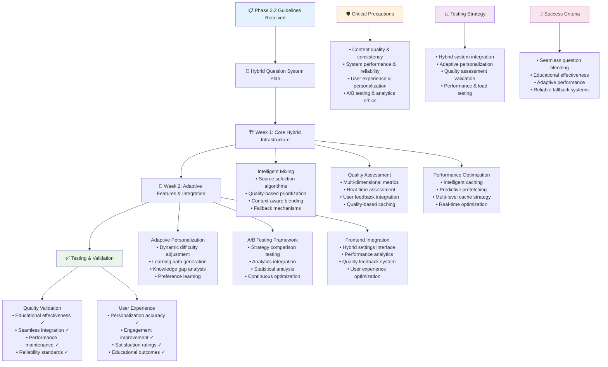

# QuizMaster Pro - Phase 3.2 Instructions & Guidelines

## 🎯 Phase 3.2 Objective
**Goal**: Build a comprehensive Hybrid Question System that intelligently blends database-stored questions with AI-generated content. This system must provide seamless question delivery, adaptive difficulty, personalized experiences, and robust fallback mechanisms while maintaining educational quality and user engagement.

**Duration**: 2 Weeks (14 days)  
**Success Metric**: Intelligent hybrid system delivering personalized question experiences with 95% seamless blending between AI and database sources, adaptive difficulty adjustment, and transparent fallback capabilities

**Prerequisites**: Phase 1.1, 1.2, 1.3, 2.1, 2.2, 2.3, and 3.1 must be 100% complete and functional

---

## 📋 FEATURES TO IMPLEMENT

### **Intelligent Question Mixing System**
- **Smart Blend Algorithm**: Dynamically mix AI and database questions based on availability and quality
- **Content Source Optimization**: Automatically choose optimal question source for each request
- **Quality-Based Selection**: Prioritize high-quality questions regardless of source
- **Topic Coverage Analysis**: Ensure comprehensive topic coverage across mixed sources
- **Difficulty Distribution**: Maintain appropriate difficulty curves with mixed content
- **Performance-Based Mixing**: Adjust mixing ratios based on user performance and engagement
- **Contextual Relevance**: Ensure question sequence maintains educational flow and context

### **Context-Aware AI Generation**
- **Game History Analysis**: AI considers previous questions and answers for context
- **Player Performance Tracking**: Generate questions based on user's knowledge gaps and strengths
- **Session Context Maintenance**: Maintain context throughout entire quiz sessions
- **Topic Progression Logic**: Create logical progression of topics and difficulty levels
- **Learning Path Integration**: Generate questions that support personalized learning objectives
- **Multi-Player Context**: Consider group performance in multiplayer contexts
- **Educational Objectives Alignment**: Ensure AI-generated content aligns with educational goals

### **Advanced Quality Scoring System**
- **Multi-Dimensional Quality Metrics**: Rate questions on accuracy, clarity, engagement, and educational value
- **Real-Time Quality Assessment**: Evaluate question quality during gameplay and generation
- **User Feedback Integration**: Incorporate player ratings and feedback into quality scores
- **Comparative Quality Analysis**: Compare quality across different sources and generation methods
- **Quality Trend Tracking**: Monitor quality changes over time and adjust accordingly
- **Expert Review Integration**: Include educator and subject matter expert assessments
- **Automated Quality Validation**: Use AI to validate factual accuracy and appropriateness

### **Robust Fallback & Recovery System**
- **Multi-Level Fallback Strategy**: Implement cascading fallback from AI to database to cached content
- **Intelligent Fallback Selection**: Choose most appropriate fallback content based on context
- **Seamless Source Switching**: Switch between sources without disrupting user experience
- **Failure Detection & Recovery**: Quickly detect AI failures and implement recovery procedures
- **Quality-Based Fallbacks**: Fall back to database when AI quality drops below thresholds
- **Performance-Based Switching**: Switch sources based on response times and availability
- **Emergency Content Reserves**: Maintain emergency question pools for critical failures

### **Advanced Caching & Performance System**
- **Intelligent Content Caching**: Cache popular AI-generated questions with quality-based TTL
- **Predictive Caching**: Pre-generate and cache likely-needed questions based on patterns
- **Context-Aware Cache**: Maintain cache organized by topics, difficulty, and user preferences
- **Cache Quality Management**: Implement cache eviction based on quality degradation
- **Multi-Level Cache Strategy**: Implement memory, Redis, and database caching layers
- **Cache Warming**: Pre-populate cache with high-quality questions during off-peak times
- **Performance-Based Cache Optimization**: Optimize cache based on access patterns and performance metrics

### **Comprehensive A/B Testing Framework**
- **Source Performance Comparison**: Compare user engagement and learning outcomes between sources
- **Quality Metric Validation**: Test different quality assessment methods and metrics
- **User Experience Testing**: A/B test different mixing strategies and user interfaces
- **Learning Outcome Analysis**: Measure educational effectiveness of different question sources
- **Engagement Metric Tracking**: Track user engagement across different question types and sources
- **Statistical Significance Testing**: Ensure A/B test results are statistically significant
- **Continuous Optimization**: Use A/B test results to continuously improve the hybrid system

### **Adaptive Difficulty & Personalization**
- **Dynamic Difficulty Adjustment**: Real-time adjustment based on user performance and confidence
- **Personalized Learning Paths**: Create individualized question sequences based on learning goals
- **Knowledge Gap Analysis**: Identify and target specific areas where users need improvement
- **Preference Learning**: Learn user preferences for question types, topics, and difficulty levels
- **Adaptive Content Selection**: Select optimal question mix based on individual user profiles
- **Performance-Based Recommendations**: Recommend optimal challenge levels for continued engagement
- **Learning Style Adaptation**: Adapt question presentation to different learning styles and preferences

### **Frontend Integration & User Experience**
- **Source Transparency Interface**: Clear indicators of question source without disrupting flow
- **Hybrid Settings Dashboard**: User controls for AI/database question ratios and preferences
- **Quality Feedback System**: Intuitive rating system for questions during and after gameplay
- **Performance Analytics Display**: Show comparative performance across different question sources
- **Smart Recommendation Engine**: AI-powered suggestions for optimal question mixes and settings
- **Educational Progress Tracking**: Visual progress indicators for learning objectives and skill development
- **Accessibility-First Design**: Ensure all hybrid features work with assistive technologies

---

## ⚠️ CRITICAL PRECAUTIONS

### **Content Quality & Consistency Precautions**
1. **Quality Threshold Enforcement**: Strict minimum quality standards for all questions regardless of source
2. **Educational Standards Compliance**: Ensure all content meets established educational and pedagogical standards
3. **Source Consistency**: Maintain consistent question format and quality across different sources
4. **Bias Prevention**: Monitor and prevent biased content from any source, especially AI-generated
5. **Factual Accuracy Validation**: Implement comprehensive fact-checking for all question content
6. **Content Appropriateness**: Ensure all content is appropriate for target age groups and contexts
7. **Copyright Compliance**: Verify that all content respects copyright and intellectual property rights

### **System Performance & Reliability Precautions**
1. **Fallback System Reliability**: Ensure fallback systems are always available and properly tested
2. **Performance Impact Monitoring**: Monitor system performance impact of hybrid processing
3. **Cache Coherency**: Maintain cache consistency across all sources and quality updates
4. **Resource Management**: Prevent resource exhaustion from complex hybrid processing
5. **Scalability Constraints**: Ensure system scales properly with increased complexity
6. **Response Time Maintenance**: Maintain acceptable response times despite increased processing
7. **Memory Management**: Prevent memory leaks from complex caching and processing systems

### **User Experience & Personalization Precautions**
1. **Privacy Protection**: Protect user data used for personalization and adaptive features
2. **Personalization Balance**: Balance personalization with content diversity and educational objectives
3. **User Control**: Provide users appropriate control over personalization and mixing preferences
4. **Transparency**: Maintain transparency about how the hybrid system works without overwhelming users
5. **Accessibility Compliance**: Ensure all adaptive features work with accessibility technologies
6. **Cultural Sensitivity**: Consider cultural differences in personalization and content adaptation
7. **Learning Objective Alignment**: Ensure personalization doesn't compromise educational objectives

### **A/B Testing & Analytics Precautions**
1. **Ethical Testing**: Ensure A/B testing doesn't negatively impact user learning or experience
2. **Data Privacy**: Protect user data collected for testing and analytics purposes
3. **Statistical Validity**: Ensure A/B tests are statistically sound and properly interpreted
4. **Testing Impact**: Minimize negative impact of testing on user experience and learning
5. **Bias Prevention**: Prevent testing biases that could skew results or harm user groups
6. **Consent Management**: Obtain appropriate consent for testing and data collection
7. **Results Application**: Apply A/B test results responsibly and ethically

---

## 🚫 COMMON ERRORS TO PREVENT

### **Question Mixing & Blending Errors**
- **Source Imbalance**: Over-relying on one source creating poor question diversity
- **Quality Degradation**: Mixing causing overall quality decline compared to single sources
- **Context Breaks**: Switching sources mid-session causing contextual discontinuity
- **Performance Penalties**: Hybrid processing causing unacceptable response time delays
- **Cache Inconsistency**: Cached content becoming stale or inconsistent with live sources
- **Mixing Logic Failures**: Algorithm failures causing inappropriate question selection
- **Fallback Cascade Failures**: Multiple fallback systems failing simultaneously

### **Adaptive System Errors**
- **Over-Personalization**: Creating filter bubbles that limit educational breadth
- **Adaptation Loops**: Personalization algorithms getting stuck in suboptimal patterns
- **Performance Misinterpretation**: Incorrectly interpreting user performance for adaptations
- **Difficulty Spiral**: Adaptive difficulty creating impossible or trivial question sequences
- **Context Loss**: Adaptive system losing important educational context during adjustments
- **Preference Mislearning**: System learning incorrect user preferences from noisy data
- **Cold Start Problems**: Poor performance for new users without established preferences

### **Quality Assessment Errors**
- **Quality Metric Gaming**: Users or systems gaming quality metrics for favorable results
- **Bias in Quality Scoring**: Quality assessment systems exhibiting systematic biases
- **Quality Threshold Drift**: Quality standards gradually degrading over time
- **False Quality Signals**: Mistaking popularity or engagement for educational quality
- **Quality Assessment Delays**: Slow quality assessment causing poor real-time decisions
- **Inconsistent Quality Standards**: Different quality standards across sources or time periods
- **Quality Feedback Loops**: Quality assessments creating negative feedback loops

### **Fallback System Errors**
- **Fallback Detection Delays**: Too slow detection of primary system failures
- **Inappropriate Fallback Selection**: Choosing poor fallback content for given context
- **Fallback Quality Issues**: Fallback content having lower quality than failed primary content
- **Cascade Failure Propagation**: Fallback failures causing cascade of system failures
- **Recovery Timing Issues**: Poor timing of recovery from fallback to primary systems
- **User Experience Disruption**: Fallback transitions causing jarring user experience changes
- **Fallback Resource Exhaustion**: Fallback systems being overwhelmed during primary failures

### **Caching & Performance Errors**
- **Cache Stampede**: Multiple requests overwhelming cache rebuild processes
- **Stale Content Delivery**: Delivering outdated cached content during high traffic
- **Cache Memory Leaks**: Caching systems consuming increasing amounts of memory
- **Cache Consistency Problems**: Different cache layers becoming inconsistent
- **Performance Regression**: Caching overhead causing worse performance than no caching
- **Cache Eviction Issues**: Important content being evicted prematurely from cache
- **Cache Size Management**: Cache growing beyond system memory capacity

---

## 🏗️ BEST IMPLEMENTATION PRACTICES

### **Hybrid System Architecture Best Practices**
1. **Microservice Design**: Design hybrid system as composable, independent services
2. **Event-Driven Architecture**: Use events to coordinate between different question sources
3. **Circuit Breaker Pattern**: Implement circuit breakers for each question source and processing stage
4. **Async Processing**: Handle all question generation and processing asynchronously
5. **Quality-First Design**: Design all components with quality as the primary consideration
6. **Graceful Degradation**: Each component should degrade gracefully under various failure conditions
7. **Monitoring Integration**: Build comprehensive monitoring into every component

### **Intelligent Mixing Algorithm Best Practices**
1. **Machine Learning Integration**: Use ML algorithms to optimize question mixing strategies
2. **Multi-Objective Optimization**: Balance quality, diversity, performance, and educational objectives
3. **Contextual Decision Making**: Make mixing decisions based on rich contextual information
4. **Feedback Loop Integration**: Continuously improve mixing based on user feedback and outcomes
5. **A/B Testing Integration**: Build A/B testing capabilities into mixing algorithm core
6. **Explainable Decisions**: Ensure mixing decisions can be explained and audited
7. **Performance Optimization**: Optimize mixing algorithms for real-time performance requirements

### **Adaptive Personalization Best Practices**
1. **Privacy by Design**: Build privacy protection into personalization from the ground up
2. **Incremental Learning**: Gradually improve personalization without disrupting user experience
3. **Multi-Modal Data**: Use diverse data sources for robust personalization
4. **Bias Detection**: Continuously monitor for and correct personalization biases
5. **User Control**: Provide users meaningful control over personalization settings
6. **Transparency**: Make personalization decisions transparent and understandable
7. **Ethical Guidelines**: Follow established ethical guidelines for personalization systems

### **Quality Assessment Best Practices**
1. **Multi-Stakeholder Validation**: Include diverse stakeholders in quality standard development
2. **Continuous Calibration**: Regularly calibrate quality metrics against human expert assessment
3. **Automated Validation**: Use automated tools to catch common quality issues quickly
4. **Feedback Integration**: Integrate user feedback systematically into quality assessments
5. **Quality Trend Analysis**: Monitor quality trends to detect and address degradation early
6. **Expert Review Workflows**: Establish efficient workflows for expert quality review
7. **Quality Documentation**: Maintain comprehensive documentation of quality standards and processes

### **Caching & Performance Best Practices**
1. **Cache Strategy Hierarchy**: Implement multiple cache levels with appropriate TTLs
2. **Intelligent Prefetching**: Pre-generate and cache likely-needed content based on patterns
3. **Quality-Aware Caching**: Cache content based on quality scores and user preferences
4. **Performance Monitoring**: Monitor cache performance and optimize based on real usage patterns
5. **Memory Management**: Implement sophisticated memory management for large-scale caching
6. **Cache Warming**: Implement cache warming strategies for optimal performance
7. **Distributed Caching**: Design caching to work effectively in distributed environments

---

## 🧪 COMPREHENSIVE TESTING STRATEGY

### **Hybrid System Integration Testing**

**Unit Testing:**
- Question source selection algorithm accuracy
- Quality scoring mechanism validation
- Fallback system trigger conditions and responses
- Cache management and eviction policies
- Adaptive algorithm decision making logic
- A/B testing framework functionality

**Integration Testing:**
- End-to-end hybrid question delivery workflow
- Source switching during active quiz sessions
- Quality assessment integration with question selection
- Personalization system integration with question delivery
- Cache consistency across all system components
- Performance impact measurement of hybrid processing

### **Adaptive Personalization Testing**

**Unit Testing:**
- User preference learning algorithm accuracy
- Difficulty adjustment algorithm effectiveness
- Knowledge gap identification accuracy
- Learning path generation logic
- Performance-based adaptation algorithms
- Privacy protection mechanism validation

**Integration Testing:**
- Complete personalization workflow from data collection to question selection
- Integration with user authentication and profile systems
- Real-time adaptation during active quiz sessions
- Cross-session learning and adaptation continuity
- Multi-user personalization in multiplayer contexts
- Performance impact of personalization processing

### **Quality Assessment Testing**

**Unit Testing:**
- Individual quality metric calculation accuracy
- Quality threshold enforcement mechanisms
- Expert feedback integration processing
- Automated quality validation algorithms
- Quality trend analysis and reporting
- Bias detection in quality assessments

**Integration Testing:**
- Complete quality assessment workflow from question generation to scoring
- Integration with question source selection systems
- Real-time quality assessment during active gameplay
- Quality-based caching and cache eviction
- A/B testing integration with quality metrics
- Performance impact of quality assessment processing

### **Performance & Load Testing**

**Load Testing:**
- Hybrid system performance with 1000+ concurrent users
- Question generation and mixing under peak load
- Cache performance with high request volume
- Database performance with complex hybrid queries
- AI service integration under sustained load
- Real-time adaptation system performance

**Stress Testing:**
- Maximum concurrent hybrid request handling capacity
- System behavior when all question sources are under stress
- Memory usage during extended hybrid processing operations
- Recovery behavior after various types of system stress
- Performance degradation patterns under extreme load
- Fallback system performance under primary system stress

### **Security & Privacy Testing**

**Privacy Testing:**
- User data protection during personalization processing
- GDPR compliance for adaptive and personalization features
- Data anonymization effectiveness for quality assessment
- Cross-user data isolation verification
- Consent management for personalization and A/B testing
- Data retention policy compliance for hybrid system data

**Security Testing:**
- Input validation for all hybrid system endpoints
- Authentication and authorization for quality feedback systems
- API security for A/B testing and analytics endpoints
- Protection against quality metric manipulation
- Secure handling of user preference and performance data
- Audit trail completeness for all hybrid system decisions

---

## 📊 TESTING CHECKLIST

### **Hybrid Question System Testing**
- [ ] AI and database questions are seamlessly blended without user awareness
- [ ] Question quality is maintained or improved through hybrid approach
- [ ] Source switching happens transparently during active sessions
- [ ] Fallback systems activate quickly and provide appropriate alternative content
- [ ] Question mixing ratios can be configured and adjusted in real-time
- [ ] System performance is not degraded by hybrid processing complexity
- [ ] All question sources integrate properly with existing quiz systems

### **Adaptive Personalization Testing**
- [ ] Difficulty adjustment responds appropriately to user performance
- [ ] Personalization improves user engagement and learning outcomes
- [ ] System learns user preferences accurately over time
- [ ] Knowledge gap identification leads to targeted question selection
- [ ] Learning paths are educationally sound and engaging
- [ ] Personalization works effectively for new users with limited data
- [ ] Privacy controls for personalization features function correctly

### **Quality Assessment Testing**
- [ ] Quality metrics accurately reflect educational value and user experience
- [ ] Quality scores are consistent across different question sources
- [ ] User feedback is properly integrated into quality assessments
- [ ] Quality-based selection improves overall question experience
- [ ] Quality trends are tracked and analyzed effectively
- [ ] Expert review processes function smoothly and efficiently
- [ ] Automated quality validation catches common quality issues

### **Caching & Performance Testing**
- [ ] Popular questions are cached effectively reducing response times
- [ ] Cache hit rates are optimized for typical usage patterns
- [ ] Cache eviction policies maintain quality while managing memory usage
- [ ] Cached content remains fresh and relevant
- [ ] Cache warming improves cold start performance
- [ ] Distributed caching works correctly across multiple servers
- [ ] Cache performance monitoring provides actionable insights

### **A/B Testing & Analytics Testing**
- [ ] A/B testing framework can test different hybrid strategies effectively
- [ ] Statistical analysis of A/B tests is mathematically sound
- [ ] User segmentation for testing is fair and representative
- [ ] Test results lead to actionable improvements in the hybrid system
- [ ] Analytics provide insights into question source performance
- [ ] User privacy is protected during testing and analytics collection
- [ ] Testing and analytics systems scale with user growth

### **Fallback System Testing**
- [ ] Primary system failures are detected quickly and accurately
- [ ] Fallback content is appropriate for the original request context
- [ ] Fallback activation doesn't disrupt user experience
- [ ] Multiple simultaneous failures are handled gracefully
- [ ] Recovery to primary systems happens smoothly when available
- [ ] Fallback systems can handle sustained load during primary outages
- [ ] All fallback scenarios are tested and validated regularly

### **User Experience Testing**
- [ ] Question source indicators are informative but not distracting
- [ ] Hybrid settings interface is intuitive and effective
- [ ] Quality feedback system encourages user participation
- [ ] Performance comparison displays provide valuable insights
- [ ] Smart recommendations are helpful and accurate
- [ ] Mobile interface works properly for all hybrid features
- [ ] Accessibility features work with all hybrid system components

---

## 🎯 SUCCESS VALIDATION

### **Acceptance Criteria**
1. **Seamless Integration**: Users cannot easily distinguish between AI and database questions during normal gameplay
2. **Quality Maintenance**: Overall question quality is maintained or improved through intelligent mixing
3. **Adaptive Performance**: System effectively adapts to individual user needs and performance levels
4. **Reliable Fallbacks**: Fallback systems activate transparently and provide appropriate alternative content
5. **Performance Standards**: Hybrid processing does not negatively impact system response times or user experience
6. **Educational Effectiveness**: Mixed question approach improves learning outcomes compared to single-source
7. **User Satisfaction**: Users report high satisfaction with personalized and adaptive question experiences
8. **System Reliability**: Hybrid system maintains reliability and stability under various conditions

### **Quality Gates**
- All automated tests pass (unit, integration, load, security, personalization)
- Manual testing validates complete hybrid system functionality
- Performance benchmarks maintained with hybrid processing complexity
- Security and privacy validation confirms compliance with data protection standards
- A/B testing validates improved user outcomes from hybrid approach
- Educational expert review confirms pedagogical effectiveness
- User experience testing confirms intuitive and engaging interaction

### **Performance Benchmarks**
- **Question Selection**: < 500ms for complex hybrid selection decisions
- **Quality Assessment**: < 200ms for real-time quality scoring
- **Adaptive Adjustment**: < 300ms for personalization-based question selection
- **Cache Performance**: >80% hit rate for frequently requested question types
- **Fallback Activation**: < 1 second from failure detection to alternative content
- **Personalization Processing**: < 400ms for real-time user preference updates
- **A/B Test Processing**: < 100ms overhead for test assignment and tracking

### **Educational Effectiveness Standards**
- **Learning Outcome Improvement**: 15% improvement in user learning outcomes vs single-source
- **Engagement Enhancement**: 20% increase in user engagement and session duration
- **Knowledge Retention**: 10% improvement in long-term knowledge retention rates
- **Personalization Accuracy**: 85% accuracy in predicting user preferences and difficulty needs
- **Content Diversity**: Maintain 95% topic coverage while optimizing for user preferences
- **Accessibility**: All personalization features work effectively with assistive technologies
- **Educational Standards**: 100% compliance with established educational and pedagogical standards

### **User Experience Standards**
- **Transparency**: 90% of users understand how hybrid system enhances their experience
- **Control**: Users can effectively manage their personalization and mixing preferences
- **Satisfaction**: >4.6/5 user satisfaction rating for hybrid question experience
- **Learning Progression**: Users report clear sense of educational progress and achievement
- **Engagement**: 25% increase in voluntary quiz completion rates
- **Quality Perception**: Users rate hybrid content quality equal to or better than single-source
- **Trust**: 85% of users trust the system's personalization and content recommendations

### **Documentation Requirements**
- **Hybrid System Architecture**: Complete documentation of intelligent mixing algorithms and implementation
- **Personalization Framework**: Comprehensive guide to adaptive difficulty and personalization systems
- **Quality Assessment Standards**: Detailed documentation of quality metrics and assessment procedures
- **A/B Testing Framework**: Complete guide to testing different hybrid strategies and configurations
- **Fallback System Procedures**: Documentation of all fallback scenarios and recovery procedures
- **Performance Optimization**: Guide to optimizing hybrid system performance and caching strategies
- **Educational Guidelines**: Documentation aligning hybrid system with educational best practices and standards

---

## ⚡ IMPLEMENTATION TIMELINE

**Week 1 - Core Hybrid Infrastructure**

**Day 1-2**: Intelligent Mixing System Development
- Design and implement question source selection algorithms
- Build quality-based content selection and prioritization
- Create context-aware question blending logic
- Implement basic fallback and recovery mechanisms

**Day 3-4**: Quality Assessment & Scoring Framework
- Build multi-dimensional quality metric system
- Implement real-time quality assessment during gameplay
- Create user feedback integration and processing
- Develop quality-based caching and selection logic

**Day 5-7**: Caching & Performance Optimization
- Implement intelligent content caching with quality-based TTL
- Build predictive caching and cache warming systems
- Create multi-level cache strategy and management
- Optimize hybrid processing for real-time performance

**Week 2 - Adaptive Features & Integration**

**Day 8-10**: Adaptive Personalization System
- Implement dynamic difficulty adjustment algorithms
- Build personalized learning path generation
- Create knowledge gap analysis and targeting
- Develop user preference learning and application

**Day 11-12**: A/B Testing & Analytics Framework
- Build comprehensive A/B testing system for hybrid strategies
- Implement analytics and performance comparison tools
- Create user segmentation and statistical analysis capabilities
- Develop continuous optimization based on A/B test results

**Day 13-14**: Frontend Integration & Testing
- Implement user interface for hybrid settings and feedback
- Build performance analytics and source comparison displays
- Create quality rating and feedback systems
- Conduct comprehensive testing and optimization

---

## 🚨 CRITICAL SUCCESS FACTORS

1. **Educational Quality Maintenance**: Hybrid system must maintain or improve educational quality and effectiveness
2. **Seamless User Experience**: Users should benefit from hybrid approach without complexity or confusion
3. **Performance Optimization**: Complex hybrid processing must not impact system responsiveness or user experience
4. **Reliable Fallback Systems**: Fallback mechanisms must be robust and provide appropriate alternative content
5. **Privacy and Ethics Compliance**: Personalization and adaptive features must respect user privacy and ethical guidelines
6. **Scalable Architecture**: System must scale effectively with increased complexity and user growth
7. **Continuous Improvement**: A/B testing and analytics must drive continuous optimization and enhancement
8. **Educational Standards Alignment**: All hybrid features must align with established educational and pedagogical standards

**Quality Foundation**: This phase builds on the AI service foundation from Phase 3.1 to create an intelligent, adaptive question delivery system that enhances educational outcomes while maintaining system reliability and user satisfaction.

**Future Enhancement Platform**: The hybrid question system creates the foundation for advanced educational features in subsequent phases, including sophisticated learning analytics, personalized curricula, and intelligent tutoring capabilities.

---

