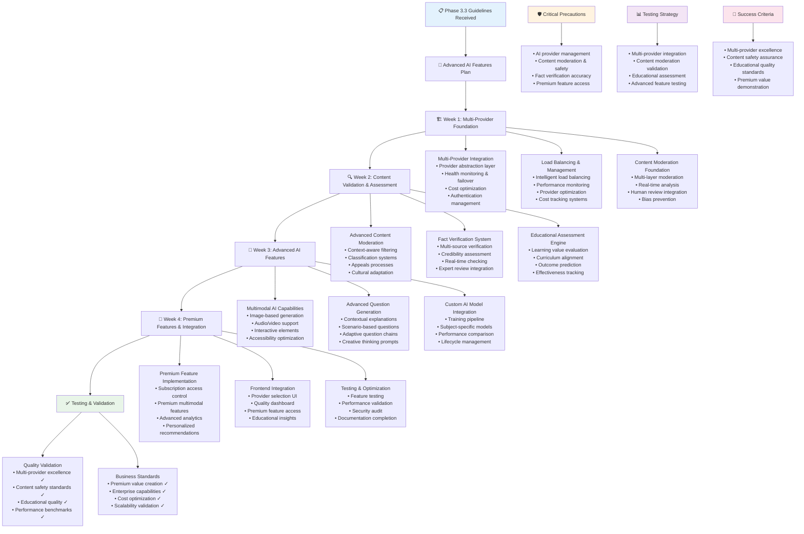

# QuizMaster Pro - Phase 3.3 Instructions & Guidelines

## 🎯 Phase 3.3 Objective
**Goal**: Build comprehensive Advanced AI Features including multi-provider support, content moderation, fact verification, educational assessment, multimodal questions, and premium AI capabilities. This system must provide enterprise-grade AI functionality with sophisticated content validation, educational insights, and advanced question generation capabilities.

**Duration**: 4 Weeks (28 days)  
**Success Metric**: Enterprise-grade AI platform supporting multiple providers with advanced content validation, educational assessment, multimodal generation, and premium features delivering measurably improved educational outcomes

**Prerequisites**: Phase 1.1, 1.2, 1.3, 2.1, 2.2, 2.3, 3.1, and 3.2 must be 100% complete and functional

---

## 📋 FEATURES TO IMPLEMENT

### **Multi-Provider AI Integration & Management**
- **Universal Provider Support**: OpenAI GPT-4, Anthropic Claude, Google Gemini, Cohere, Hugging Face, local models
- **Provider Load Balancing**: Intelligent distribution across providers for cost and performance optimization
- **Provider Health Monitoring**: Real-time monitoring and health checks for all AI service providers
- **Automatic Failover**: Seamless switching between providers during outages or performance issues
- **Cost-Performance Optimization**: Dynamic provider selection based on cost, quality, and speed requirements
- **Provider-Specific Optimization**: Tailored request handling for each provider's strengths and limitations
- **Regional Provider Selection**: Geographic optimization for latency and compliance requirements

### **Advanced Prompt Engineering System**
- **Question Type Specialization**: Specialized prompts optimized for different question types and formats
- **Subject Matter Expertise**: Domain-specific prompts for various academic and professional subjects
- **Difficulty Level Optimization**: Prompt engineering for precise difficulty control across different topics
- **Cultural Context Integration**: Prompts adapted for different cultural and linguistic contexts
- **Educational Objective Alignment**: Prompts designed to meet specific learning objectives and standards
- **Dynamic Prompt Generation**: AI-generated prompts optimized for specific contexts and requirements
- **Prompt Performance Analytics**: Continuous monitoring and optimization of prompt effectiveness

### **Comprehensive Content Moderation System**
- **Multi-Layer Content Filtering**: Automated screening for inappropriate, biased, or harmful content
- **Real-Time Moderation**: Instant content validation during question generation and gameplay
- **Context-Aware Moderation**: Intelligent filtering that considers educational context and age appropriateness
- **Bias Detection & Mitigation**: Advanced algorithms to detect and prevent various forms of bias
- **Community Standards Enforcement**: Automated enforcement of community guidelines and educational standards
- **Human Review Integration**: Seamless workflows for human moderator review of flagged content
- **Moderation Analytics**: Comprehensive analytics and reporting on content moderation effectiveness

### **Advanced Fact Verification System**
- **Multi-Source Fact Checking**: Cross-reference information across multiple authoritative sources
- **Real-Time Verification**: Instant fact-checking during question generation and review
- **Source Credibility Assessment**: Evaluate and score the credibility of information sources
- **Temporal Fact Validation**: Verify that facts are current and haven't been superseded
- **Expert Review Integration**: Connect with subject matter experts for complex fact verification
- **Fact Database Maintenance**: Maintain and update comprehensive fact databases
- **Verification Confidence Scoring**: Provide confidence scores for fact verification results

### **Educational Assessment & Analytics Engine**
- **Learning Value Evaluation**: Assess the educational value and effectiveness of AI-generated questions
- **Curriculum Alignment Analysis**: Verify alignment with educational standards and curricula
- **Learning Outcome Prediction**: Predict learning outcomes based on question characteristics
- **Knowledge Gap Analysis**: Identify areas where questions are needed for comprehensive coverage
- **Difficulty Calibration**: Precise calibration of question difficulty based on educational psychology
- **Assessment Quality Metrics**: Comprehensive metrics for evaluating question quality from educational perspective
- **Pedagogical Effectiveness Tracking**: Monitor and analyze the pedagogical effectiveness of AI-generated content

### **Premium Multimodal AI Features**
- **Image-Based Question Generation**: AI generates questions incorporating images, diagrams, and visual content
- **Audio Question Support**: Generate questions with audio components for language learning and accessibility
- **Video Content Integration**: Create questions based on video content and multimedia materials
- **Interactive Question Elements**: Generate questions with interactive components and simulations
- **3D Model Integration**: Questions incorporating 3D models and spatial reasoning elements
- **Mixed Media Synthesis**: Combine text, images, audio, and video in sophisticated question formats
- **Accessibility Optimization**: Ensure multimodal content is accessible to users with disabilities

### **Advanced Question Generation Capabilities**
- **Contextual Explanations**: AI generates detailed explanations for answers and concepts
- **Scenario-Based Questions**: Complex, multi-part questions based on realistic scenarios
- **Debate Mode Questions**: Generate questions promoting critical thinking and multiple perspectives
- **Adaptive Question Chains**: Sequential questions that build upon previous responses
- **Case Study Generation**: Create comprehensive case studies with associated question sets
- **Problem-Solving Sequences**: Generate multi-step problem-solving question chains
- **Creative Thinking Prompts**: Questions designed to promote creativity and innovative thinking

### **Custom AI Model Integration**
- **Fine-Tuned Model Support**: Integration with custom fine-tuned models for specific subjects or organizations
- **Model Training Pipeline**: System for training and deploying custom AI models
- **Subject-Specific Models**: Specialized models optimized for particular academic disciplines
- **Organization-Specific Training**: Custom models trained on organization's specific content and standards
- **Continuous Model Improvement**: Ongoing refinement of custom models based on usage and feedback
- **Model Performance Comparison**: A/B testing and comparison of different AI models
- **Custom Model Management**: Complete lifecycle management for custom AI models

### **Advanced Frontend Integration**
- **Provider Selection Interface**: User-friendly interface for AI provider selection and preferences
- **Advanced AI Settings Panel**: Comprehensive controls for fine-tuning AI parameters and behaviors
- **Content Quality Dashboard**: Real-time monitoring and analytics for AI content quality
- **Educational Insights Display**: Visualization of learning analytics and educational recommendations
- **Topic Mastery Tracking**: Visual representation of knowledge strengths and areas for improvement
- **Multimodal Content Interface**: Optimized interface for displaying and interacting with multimedia questions
- **Premium Feature Access**: Subscription-based access controls for premium AI features

---

## ⚠️ CRITICAL PRECAUTIONS

### **AI Provider Management Precautions**
1. **Provider Reliability**: Ensure robust fallback systems for provider outages and performance issues
2. **Cost Control**: Implement strict cost controls and monitoring across all premium AI providers
3. **Data Privacy**: Ensure compliance with data privacy regulations across all AI service providers
4. **API Security**: Secure management of API keys and authentication across multiple providers
5. **Quality Consistency**: Maintain consistent quality standards across different AI providers
6. **Vendor Lock-in Prevention**: Design architecture to prevent dependency on any single AI provider
7. **Compliance Management**: Ensure all providers meet regulatory and compliance requirements

### **Content Moderation & Safety Precautions**
1. **False Positive Management**: Balance content safety with avoiding over-censorship of educational content
2. **Cultural Sensitivity**: Ensure moderation systems respect cultural differences while maintaining safety
3. **Educational Context**: Consider educational context in moderation decisions to avoid blocking valid content
4. **Transparency**: Provide clear explanations for content moderation decisions and appeals processes
5. **Human Oversight**: Maintain appropriate human oversight for complex moderation decisions
6. **Bias Prevention**: Continuously monitor and prevent bias in content moderation algorithms
7. **Emergency Response**: Implement rapid response systems for critical content safety issues

### **Fact Verification Precautions**
1. **Source Reliability**: Ensure fact-checking sources are credible, authoritative, and up-to-date
2. **Verification Accuracy**: Implement multiple verification methods to ensure factual accuracy
3. **Subject Matter Expertise**: Ensure fact verification systems have appropriate domain expertise
4. **Temporal Validity**: Account for changes in factual information over time
5. **Verification Transparency**: Provide clear information about fact verification sources and confidence levels
6. **Dispute Resolution**: Implement processes for handling disputes about fact verification results
7. **Continuous Updates**: Maintain current and accurate fact databases and verification sources

### **Premium Feature Precautions**
1. **Access Control**: Implement robust access controls for premium AI features and content
2. **Subscription Management**: Ensure reliable billing and subscription management for premium features
3. **Feature Parity**: Maintain appropriate feature balance between free and premium tiers
4. **Performance Impact**: Ensure premium features don't negatively impact overall system performance
5. **Content Quality**: Maintain high quality standards for premium AI-generated content
6. **Fair Use**: Implement fair use policies to prevent abuse of premium AI features
7. **Value Demonstration**: Clearly demonstrate value proposition of premium features to users

---

## 🚫 COMMON ERRORS TO PREVENT

### **Multi-Provider Integration Errors**
- **API Inconsistencies**: Failing to handle differences in API structures and response formats across providers
- **Authentication Failures**: Provider authentication issues causing service interruptions
- **Rate Limit Violations**: Exceeding rate limits on any provider causing cascading failures
- **Cost Overruns**: Uncontrolled usage of expensive premium providers leading to budget overruns
- **Quality Inconsistencies**: Inconsistent quality standards across different AI providers
- **Failover Failures**: Provider failover systems not working correctly during outages
- **Configuration Drift**: Provider configurations becoming inconsistent over time

### **Content Moderation Errors**
- **Over-Moderation**: Blocking legitimate educational content due to overly aggressive filtering
- **Under-Moderation**: Failing to catch inappropriate or harmful content that should be blocked
- **Bias in Moderation**: Moderation systems exhibiting systematic bias against certain topics or perspectives
- **Cultural Insensitivity**: Moderation failing to account for cultural differences in educational content
- **Context Misunderstanding**: Moderation systems not understanding educational context of content
- **False Flag Issues**: Users gaming moderation systems to flag legitimate content inappropriately
- **Performance Impact**: Content moderation causing significant delays in question generation

### **Fact Verification Errors**
- **Source Bias**: Relying on biased or unreliable sources for fact verification
- **Outdated Information**: Using outdated information that no longer reflects current facts
- **Domain Expertise Gaps**: Lack of appropriate subject matter expertise for specialized topics
- **Verification Delays**: Fact verification taking too long and impacting user experience
- **False Confidence**: Providing high confidence scores for inaccurate fact verifications
- **Source Conflicts**: Handling conflicting information from different authoritative sources
- **Verification Scope Creep**: Fact verification systems attempting to verify opinions or subjective content

### **Advanced AI Feature Errors**
- **Multimodal Integration Issues**: Problems integrating multimedia elements with text content
- **Custom Model Performance**: Custom AI models performing poorly compared to general models
- **Explanation Quality Issues**: AI-generated explanations being inaccurate or confusing
- **Scenario Complexity Problems**: Scenario-based questions being too complex or unrealistic
- **Premium Feature Access**: Access control issues for premium features and content
- **Model Training Failures**: Custom model training processes failing or producing poor results
- **Resource Allocation Issues**: Premium features consuming excessive system resources

### **Educational Assessment Errors**
- **Learning Value Misjudgment**: Incorrectly assessing the educational value of questions
- **Curriculum Misalignment**: Questions not properly aligned with stated educational standards
- **Difficulty Miscalibration**: Questions assigned incorrect difficulty levels for target audiences
- **Assessment Bias**: Educational assessments exhibiting bias towards certain learning styles or backgrounds
- **Outcome Prediction Failures**: Inaccurate predictions of learning outcomes from question characteristics
- **Standards Interpretation**: Misinterpreting educational standards and curriculum requirements
- **Pedagogical Effectiveness Issues**: Questions not effectively supporting intended learning objectives

---

## 🏗️ BEST IMPLEMENTATION PRACTICES

### **Multi-Provider Architecture Best Practices**
1. **Abstraction Layer Design**: Create comprehensive abstraction layer that normalizes different provider APIs
2. **Circuit Breaker Implementation**: Implement circuit breakers for each provider with intelligent failover logic
3. **Cost Optimization Strategy**: Develop sophisticated algorithms for cost-effective provider selection
4. **Performance Monitoring**: Implement comprehensive monitoring and analytics for all provider interactions
5. **Configuration Management**: Centralize and automate configuration management for all AI providers
6. **Security Best Practices**: Implement consistent security practices across all provider integrations
7. **Quality Assurance**: Establish quality benchmarks and monitoring across all providers

### **Content Moderation Best Practices**
1. **Layered Defense Strategy**: Implement multiple layers of content moderation with different detection methods
2. **Machine Learning Integration**: Use advanced ML models specifically trained for educational content moderation
3. **Human-AI Collaboration**: Design efficient workflows combining AI automation with human oversight
4. **Context-Aware Processing**: Develop moderation systems that understand educational context and nuance
5. **Continuous Learning**: Implement feedback loops to continuously improve moderation accuracy
6. **Transparency and Appeals**: Provide clear moderation decisions with appeals processes
7. **Cultural Adaptation**: Design moderation systems that can adapt to different cultural contexts

### **Educational Assessment Integration Best Practices**
1. **Pedagogical Expertise**: Collaborate with educational experts to ensure sound pedagogical principles
2. **Standards Alignment**: Develop comprehensive mapping to educational standards and curricula
3. **Learning Science Integration**: Base assessment algorithms on established learning science research
4. **Adaptive Assessment**: Create assessment systems that adapt to different learning contexts
5. **Outcome Validation**: Continuously validate assessment predictions against actual learning outcomes
6. **Bias Prevention**: Implement systematic bias detection and prevention in educational assessments
7. **Accessibility Compliance**: Ensure all educational assessments work with assistive technologies

### **Advanced AI Feature Development Best Practices**
1. **Multimodal Integration**: Design seamless integration between different media types and AI capabilities
2. **Custom Model Lifecycle**: Implement complete lifecycle management for custom AI model development and deployment
3. **Quality Benchmarking**: Establish clear quality benchmarks for all advanced AI features
4. **User Experience Focus**: Prioritize user experience in the design of complex AI features
5. **Performance Optimization**: Optimize advanced features for production-scale performance
6. **Educational Effectiveness**: Validate that advanced features actually improve educational outcomes
7. **Accessibility First**: Design all advanced features with accessibility as a primary consideration

### **Premium Feature Strategy Best Practices**
1. **Value Proposition Clarity**: Clearly articulate the value proposition of premium features
2. **Tiered Access Model**: Design logical and fair tiered access to different levels of AI features
3. **Usage Analytics**: Implement comprehensive analytics to understand premium feature usage and value
4. **Fair Use Policies**: Develop and enforce reasonable fair use policies for premium features
5. **Customer Success Focus**: Design premium features to ensure customer success and satisfaction
6. **Competitive Differentiation**: Use premium features to create clear competitive advantages
7. **Sustainable Economics**: Ensure premium features create sustainable economic value

---

## 🧪 COMPREHENSIVE TESTING STRATEGY

### **Multi-Provider Integration Testing**

**Unit Testing:**
- Individual provider API integration accuracy
- Provider failover and recovery logic
- Cost calculation and optimization algorithms
- Authentication and authorization for each provider
- Request/response transformation and normalization
- Provider-specific error handling and recovery

**Integration Testing:**
- End-to-end workflows across multiple providers
- Provider switching during active operations
- Load balancing effectiveness across providers
- Cost optimization performance under real conditions
- Quality consistency across different providers
- System behavior during provider outages

### **Content Moderation Testing**

**Unit Testing:**
- Individual moderation algorithm accuracy
- Bias detection and prevention mechanisms
- Content classification accuracy across categories
- Performance impact of moderation processing
- False positive and false negative rates
- Moderation confidence scoring accuracy

**Integration Testing:**
- Complete content moderation pipeline from generation to approval
- Integration with human review workflows
- Real-time moderation during active question generation
- Moderation system performance under high load
- Appeals process functionality and effectiveness
- Cross-cultural content moderation accuracy

### **Educational Assessment Testing**

**Unit Testing:**
- Learning value assessment algorithm accuracy
- Curriculum alignment validation logic
- Difficulty calibration accuracy
- Knowledge gap identification effectiveness
- Outcome prediction model accuracy
- Assessment bias detection and prevention

**Integration Testing:**
- Complete educational assessment workflow
- Integration with question generation and selection systems
- Real-time assessment during active gameplay
- Assessment accuracy validation against expert evaluation
- Long-term learning outcome prediction validation
- Cross-subject and cross-level assessment consistency

### **Advanced Feature Testing**

**Unit Testing:**
- Multimodal content generation quality
- Custom model training and deployment accuracy
- Explanation generation quality and accuracy
- Scenario-based question complexity and realism
- Premium feature access controls and billing
- Advanced AI feature performance optimization

**Integration Testing:**
- Complete multimodal question generation and display workflow
- Custom model integration with existing systems
- Premium feature billing and subscription management
- Advanced feature impact on overall system performance
- Cross-platform compatibility for advanced features
- Educational effectiveness of advanced AI features

---

## 📊 TESTING CHECKLIST

### **Multi-Provider Integration Testing**
- [ ] All supported AI providers integrate correctly and consistently
- [ ] Provider failover works seamlessly without user impact
- [ ] Cost optimization selects most cost-effective providers appropriately
- [ ] Provider load balancing distributes requests effectively
- [ ] Quality standards are maintained across all providers
- [ ] Authentication and API key management works for all providers
- [ ] System handles provider outages and recovers automatically

### **Content Moderation Testing**
- [ ] Inappropriate content is consistently detected and blocked
- [ ] Educational content is not incorrectly flagged or blocked
- [ ] Moderation systems show no systematic bias
- [ ] Human review workflows function efficiently and effectively
- [ ] Appeals processes provide fair resolution of moderation disputes
- [ ] Real-time moderation performance meets user experience requirements
- [ ] Moderation accuracy meets or exceeds established benchmarks

### **Fact Verification Testing**
- [ ] Facts are verified against authoritative and current sources
- [ ] Verification confidence scores accurately reflect verification quality
- [ ] Fact verification processing time meets user experience requirements
- [ ] Complex or specialized facts are handled with appropriate expertise
- [ ] Conflicting source information is resolved appropriately
- [ ] Fact databases are kept current and accurate
- [ ] Verification systems handle edge cases and unusual content appropriately

### **Educational Assessment Testing**
- [ ] Learning value assessments correlate with expert educational evaluations
- [ ] Questions are properly aligned with specified educational standards
- [ ] Difficulty calibration produces appropriate challenge levels for target audiences
- [ ] Assessment systems show no bias against any learner groups
- [ ] Learning outcome predictions are validated against actual outcomes
- [ ] Assessment processing time is acceptable for real-time applications
- [ ] Assessment quality remains consistent across different subjects and levels

### **Advanced AI Features Testing**
- [ ] Multimodal questions display and function correctly across all platforms
- [ ] AI-generated explanations are accurate and educationally valuable
- [ ] Scenario-based questions are realistic and appropriately complex
- [ ] Custom AI models perform comparably to or better than general models
- [ ] Premium features provide clear value over free alternatives
- [ ] Advanced features integrate seamlessly with existing quiz systems
- [ ] Performance impact of advanced features is acceptable

### **Premium Feature Access Testing**
- [ ] Subscription and billing systems work accurately and reliably
- [ ] Access controls properly restrict premium features to authorized users
- [ ] Premium feature usage is tracked accurately for billing purposes
- [ ] Fair use policies are enforced appropriately
- [ ] Premium feature performance meets or exceeds free feature performance
- [ ] Value proposition of premium features is clearly demonstrated
- [ ] Customer support systems work effectively for premium feature issues

---

## 🎯 SUCCESS VALIDATION

### **Acceptance Criteria**
1. **Multi-Provider Excellence**: Seamless integration with 3+ major AI providers with automatic failover and cost optimization
2. **Content Safety**: Comprehensive content moderation preventing inappropriate content while preserving educational value
3. **Educational Quality**: AI-generated content consistently meets educational standards and shows measurable learning improvements
4. **Advanced Capabilities**: Multimodal questions and advanced features provide clear educational advantages over basic features
5. **Premium Value**: Premium features demonstrate clear ROI and user satisfaction improvements
6. **Performance Standards**: All advanced features maintain system performance and user experience standards
7. **Scalability**: System scales effectively with increased complexity and feature usage
8. **Accessibility**: All advanced features work effectively with assistive technologies

### **Quality Gates**
- All automated tests pass (unit, integration, load, security, educational effectiveness)
- Manual testing validates complete advanced AI system functionality
- Educational expert review confirms pedagogical effectiveness
- Performance benchmarks maintained with advanced feature complexity
- Security and privacy validation confirms compliance across all providers
- Cost management validation confirms budget control effectiveness
- User experience testing confirms intuitive interaction with advanced features

### **Performance Benchmarks**
- **Multi-Provider Operations**: < 200ms overhead for provider selection and load balancing
- **Content Moderation**: < 500ms for comprehensive content analysis and approval
- **Fact Verification**: < 2 seconds for complex fact verification across multiple sources
- **Educational Assessment**: < 300ms for comprehensive educational quality assessment
- **Multimodal Generation**: < 10 seconds for complex multimodal question generation
- **Custom Model Operations**: < 5 seconds for custom model inference
- **Premium Feature Performance**: ≤ 20% performance difference from free features

### **Educational Effectiveness Standards**
- **Learning Outcome Improvement**: 25% improvement in learning outcomes vs Phase 3.2 baseline
- **Content Quality Consistency**: 95% consistency in educational quality across all providers
- **Expert Validation**: >90% approval rate from subject matter experts
- **Curriculum Alignment**: 98% accuracy in curriculum and standards alignment
- **Assessment Effectiveness**: 85% accuracy in predicting learning outcomes
- **Multimodal Learning**: 30% improvement in engagement with multimodal content
- **Advanced Feature Value**: 40% improvement in learning effectiveness with premium features

### **Business & User Standards**
- **Provider Reliability**: 99.95% uptime across all AI provider integrations
- **Premium Subscription**: >20% premium feature adoption rate among active users
- **User Satisfaction**: >4.7/5 rating for advanced AI features
- **Cost Efficiency**: 15% reduction in per-question AI costs through optimization
- **Content Safety**: <0.1% inappropriate content reaching users
- **Feature Utilization**: >60% of users actively use advanced AI features
- **Educational Impact**: Measurable improvement in standardized test scores where applicable

### **Documentation Requirements**
- **Multi-Provider Integration Guide**: Complete documentation for adding and managing AI providers
- **Content Moderation Framework**: Comprehensive guide to content safety systems and processes
- **Educational Assessment Standards**: Documentation of educational quality metrics and standards
- **Advanced Feature Development**: Guide to developing and deploying advanced AI features
- **Premium Feature Management**: Complete guide to premium feature lifecycle and management
- **API Documentation**: Comprehensive API documentation for all advanced AI endpoints
- **Troubleshooting Guide**: Complete troubleshooting guide for advanced AI features and integrations

---

## ⚡ IMPLEMENTATION TIMELINE

**Week 1 - Multi-Provider Foundation**

**Day 1-3**: Multi-Provider Integration Architecture
- Design and implement abstraction layer for multiple AI providers
- Build provider health monitoring and automatic failover systems
- Create cost optimization and provider selection algorithms
- Implement comprehensive authentication and API key management

**Day 4-5**: Provider Load Balancing & Management
- Build intelligent load balancing across multiple providers
- Implement provider performance monitoring and analytics
- Create provider-specific optimization and configuration systems
- Develop cost tracking and budget management across providers

**Day 6-7**: Content Moderation Foundation
- Design and implement multi-layer content moderation system
- Build real-time content analysis and filtering capabilities
- Create human review integration and workflow systems
- Implement bias detection and prevention mechanisms

**Week 2 - Content Validation & Assessment**

**Day 8-10**: Advanced Content Moderation
- Implement context-aware educational content moderation
- Build comprehensive content classification and scoring systems
- Create appeals process and moderation transparency features
- Develop cultural sensitivity and adaptation capabilities

**Day 11-12**: Fact Verification System
- Build multi-source fact verification and validation system
- Implement source credibility assessment and scoring
- Create real-time fact checking during question generation
- Develop expert review integration for complex verifications

**Day 13-14**: Educational Assessment Engine
- Implement learning value evaluation and curriculum alignment systems
- Build difficulty calibration and knowledge gap analysis
- Create learning outcome prediction and tracking capabilities
- Develop pedagogical effectiveness measurement and optimization

**Week 3 - Advanced AI Features**

**Day 15-17**: Multimodal AI Capabilities
- Implement image-based question generation and integration
- Build audio and video content support for questions
- Create interactive question elements and multimedia synthesis
- Develop accessibility optimization for multimodal content

**Day 18-19**: Advanced Question Generation
- Build contextual explanation generation for all answers
- Implement scenario-based and debate mode question creation
- Create adaptive question chains and problem-solving sequences
- Develop creative thinking and case study generation capabilities

**Day 20-21**: Custom AI Model Integration
- Build custom model training pipeline and deployment system
- Implement subject-specific and organization-specific model support
- Create model performance comparison and A/B testing capabilities
- Develop custom model lifecycle management and optimization

**Week 4 - Premium Features & Integration**

**Day 22-24**: Premium Feature Implementation
- Build subscription-based access control for premium features
- Implement premium multimodal question generation capabilities
- Create advanced analytics and educational insights features
- Develop topic mastery tracking and personalized recommendations

**Day 25-26**: Frontend Integration & User Experience
- Build advanced AI provider selection and configuration interfaces
- Implement content quality dashboard and monitoring displays
- Create premium feature access and subscription management UI
- Develop educational insights and analytics visualization

**Day 27-28**: Testing, Optimization & Documentation
- Comprehensive testing of all advanced AI features and integrations
- Performance optimization and scalability validation
- Security audit and compliance verification across all providers
- Complete documentation and deployment preparation

---

## 🚨 CRITICAL SUCCESS FACTORS

1. **Multi-Provider Reliability**: Seamless operation across multiple AI providers with intelligent failover and cost optimization
2. **Content Safety Excellence**: Comprehensive content moderation that maintains safety while preserving educational value
3. **Educational Quality Assurance**: Consistent high-quality educational content that measurably improves learning outcomes
4. **Advanced Feature Value**: Premium and advanced features that provide clear, demonstrable value to users and organizations
5. **Performance Maintenance**: All advanced features maintain system performance and user experience standards
6. **Scalable Architecture**: System architecture that scales effectively with increased AI complexity and feature usage
7. **Cost Management**: Effective cost control and optimization across premium AI providers and services
8. **Educational Standards Compliance**: All AI features align with educational standards and pedagogical best practices

**Enterprise Foundation**: This phase creates enterprise-grade AI capabilities that position the platform for educational institution adoption and premium market segments.

**Quality Assurance Focus**: Advanced content validation and educational assessment systems ensure consistent high-quality educational experiences across all AI-generated content.

**Premium Value Creation**: Advanced features and multimodal capabilities create clear differentiation and value proposition for premium subscriptions and enterprise customers.

**Future Platform**: The advanced AI infrastructure built here enables future innovations in personalized learning, intelligent tutoring, and sophisticated educational analytics.

---

