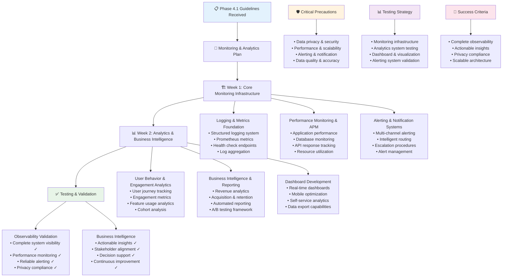

# QuizMaster Pro - Phase 4.1 Instructions & Guidelines

## 🎯 Phase 4.1 Objective
**Goal**: Build comprehensive monitoring, analytics, and observability infrastructure that provides real-time insights into system performance, user behavior, business metrics, and educational effectiveness. This system must enable data-driven decision making, proactive issue detection, and continuous optimization of the quiz platform.

**Duration**: 2 Weeks (14 days)  
**Success Metric**: Production-ready monitoring and analytics platform providing 360-degree visibility into system health, user engagement, educational outcomes, and business performance with real-time alerting and actionable insights

**Prerequisites**: Phase 1.1, 1.2, 1.3, 2.1, 2.2, 2.3, 3.1, 3.2, and 3.3 must be 100% complete and functional

---

## 📋 FEATURES TO IMPLEMENT

### **Comprehensive Logging Infrastructure**
- **Structured Logging System**: Winston/Pino-based logging with consistent structure and format
- **Log Aggregation**: Centralized log collection from all services and components
- **Log Level Management**: Dynamic log level configuration across different environments
- **Performance Logging**: Detailed performance metrics and timing information
- **Error Logging**: Comprehensive error tracking with stack traces and context
- **Audit Logging**: Complete audit trails for security and compliance purposes
- **Log Retention Management**: Automated log rotation and archival based on policies
- **Real-Time Log Streaming**: Live log streaming for debugging and monitoring purposes

### **Advanced Metrics Collection System**
- **Prometheus Integration**: Comprehensive metrics collection using Prometheus
- **Custom Metrics**: Business and application-specific metric definitions
- **Performance Metrics**: Response time, throughput, and resource utilization tracking
- **User Engagement Metrics**: Detailed user interaction and engagement measurements
- **Educational Metrics**: Learning outcomes, quiz completion, and knowledge retention tracking
- **AI Service Metrics**: AI provider performance, costs, and quality measurements
- **Infrastructure Metrics**: Server performance, database efficiency, and resource consumption
- **Real-Time Metric Streaming**: Live metric updates for dashboards and alerting

### **Performance Monitoring & APM**
- **Application Performance Monitoring**: End-to-end application performance tracking
- **Database Performance Monitoring**: Query performance, connection pooling, and optimization insights
- **API Response Time Tracking**: Detailed API endpoint performance analysis
- **WebSocket Performance**: Real-time communication performance and latency monitoring
- **AI Service Performance**: AI provider response times, success rates, and cost efficiency
- **Cache Performance**: Cache hit rates, eviction patterns, and optimization opportunities
- **Resource Utilization**: CPU, memory, disk, and network usage across all services
- **User Experience Monitoring**: Real user experience tracking and optimization

### **Health Check & Service Discovery**
- **Comprehensive Health Endpoints**: Detailed health checks for all services and dependencies
- **Service Dependency Mapping**: Real-time service dependency tracking and visualization
- **Health Status Aggregation**: Overall system health based on individual service health
- **Custom Health Checks**: Application-specific health validations and business logic checks
- **Health History Tracking**: Historical health data for trend analysis
- **Automated Recovery Actions**: Automatic remediation actions based on health check failures
- **Health Dashboard**: Real-time health status visualization for operations teams
- **Integration Testing Health**: Continuous validation of service integrations

### **Alerting & Notification System**
- **Multi-Channel Alerting**: Email, SMS, Slack, PagerDuty, and webhook notifications
- **Intelligent Alert Routing**: Context-aware alert routing to appropriate team members
- **Alert Escalation**: Automated escalation procedures for unacknowledged critical alerts
- **Alert Suppression**: Smart alert suppression to prevent notification flooding
- **Custom Alert Rules**: Business-specific alerting rules and thresholds
- **Alert Analytics**: Alert frequency analysis and alert fatigue prevention
- **Recovery Notifications**: Automatic notifications when issues are resolved
- **Alert Dashboard**: Centralized alert management and acknowledgment interface

### **Distributed Tracing System**
- **Request Tracing**: Complete request journey tracking across all microservices
- **Performance Bottleneck Identification**: Automatic identification of slow components
- **Error Correlation**: Correlation of errors across distributed service calls
- **Service Map Generation**: Automatic generation of service interaction maps
- **Trace Sampling**: Intelligent sampling strategies for high-volume environments
- **Custom Span Creation**: Application-specific tracing for business logic
- **Trace Analysis**: Deep analysis of trace data for optimization opportunities
- **Integration Testing Tracing**: Distributed tracing for integration test validation

### **User Behavior Analytics**
- **User Journey Tracking**: Complete user interaction flows and behavior patterns
- **Engagement Analytics**: Session duration, page views, interaction rates, and user retention
- **Feature Usage Analytics**: Detailed analytics on feature adoption and usage patterns
- **Quiz Performance Analytics**: Question difficulty analysis, completion rates, and learning outcomes
- **Multiplayer Analytics**: Room creation, participation rates, and social interaction metrics
- **AI Feature Analytics**: AI question usage, quality ratings, and user preferences
- **Conversion Funnel Analysis**: User progression through onboarding and engagement funnels
- **Cohort Analysis**: User behavior analysis across different user segments and time periods

### **Business Intelligence & Reporting**
- **Revenue Analytics**: Subscription revenue, conversion rates, and lifetime value tracking
- **User Acquisition Analytics**: Registration sources, conversion rates, and acquisition costs
- **Retention Analysis**: User retention rates, churn prediction, and retention improvement strategies
- **Educational Outcome Tracking**: Learning effectiveness, knowledge retention, and educational ROI
- **Market Analytics**: Competitor analysis, market trends, and positioning insights
- **Custom Business Reports**: Configurable reports for different business stakeholders
- **Automated Reporting**: Scheduled report generation and distribution
- **Executive Dashboards**: High-level business metrics for leadership and stakeholders

### **A/B Testing & Feature Flag Framework**
- **Experiment Management**: Complete A/B testing framework with statistical analysis
- **Feature Flag System**: Dynamic feature enablement and rollback capabilities
- **User Segmentation**: Advanced user segmentation for targeted experiments
- **Statistical Analysis**: Rigorous statistical analysis of experiment results
- **Gradual Rollout**: Controlled feature rollout with automatic rollback on issues
- **Experiment Analytics**: Comprehensive analytics on experiment performance and outcomes
- **Multi-Variant Testing**: Support for complex multi-variant experiments
- **Integration with Analytics**: Seamless integration with user behavior and business analytics

### **Real-Time Dashboard & Visualization**
- **Executive Dashboards**: High-level KPIs and business metrics for leadership
- **Operations Dashboards**: Real-time system health and performance for operations teams
- **Analytics Dashboards**: User behavior, engagement, and educational effectiveness metrics
- **Custom Dashboard Builder**: Self-service dashboard creation for different stakeholders
- **Mobile Dashboard Access**: Mobile-optimized dashboards for on-the-go monitoring
- **Alert Integration**: Dashboard integration with alerting and notification systems
- **Historical Analysis**: Time-series analysis and trending capabilities
- **Data Export**: Export capabilities for offline analysis and reporting

---

## ⚠️ CRITICAL PRECAUTIONS

### **Data Privacy & Security Precautions**
1. **Personal Data Protection**: Ensure all user analytics comply with GDPR, CCPA, and other privacy regulations
2. **Data Anonymization**: Implement proper data anonymization and pseudonymization techniques
3. **Consent Management**: Obtain appropriate consent for analytics data collection and processing
4. **Data Retention**: Implement appropriate data retention policies and automatic deletion
5. **Access Controls**: Restrict analytics data access based on roles and business needs
6. **Data Encryption**: Encrypt analytics data both at rest and in transit
7. **Audit Compliance**: Maintain comprehensive audit trails for all analytics data access

### **Performance & Scalability Precautions**
1. **Monitoring Overhead**: Ensure monitoring systems don't impact application performance
2. **Data Volume Management**: Handle large volumes of metrics and logs efficiently
3. **Storage Optimization**: Implement efficient storage strategies for long-term data retention
4. **Query Performance**: Optimize analytics queries to prevent system performance degradation
5. **Resource Allocation**: Allocate appropriate resources for monitoring and analytics infrastructure
6. **Scalability Planning**: Design monitoring systems to scale with application growth
7. **Cost Management**: Monitor and control costs associated with analytics and monitoring infrastructure

### **Alerting & Notification Precautions**
1. **Alert Fatigue Prevention**: Implement intelligent alerting to prevent notification overload
2. **False Positive Minimization**: Tune alert thresholds to minimize false positive alerts
3. **Critical Alert Prioritization**: Ensure critical alerts are properly prioritized and routed
4. **Alert Response Procedures**: Establish clear procedures for responding to different types of alerts
5. **Escalation Management**: Implement appropriate escalation procedures for unacknowledged alerts
6. **Alert Testing**: Regularly test alerting systems to ensure they work correctly
7. **Communication Redundancy**: Implement redundant communication channels for critical alerts

### **Data Quality & Accuracy Precautions**
1. **Data Validation**: Implement comprehensive data validation for all collected metrics
2. **Metric Definition**: Ensure consistent metric definitions across all systems and teams
3. **Data Consistency**: Maintain data consistency across different analytics systems
4. **Quality Monitoring**: Monitor data quality and implement corrective actions for issues
5. **Calculation Accuracy**: Ensure mathematical accuracy in all analytics calculations
6. **Sampling Bias Prevention**: Prevent sampling bias in data collection and analysis
7. **Historical Data Integrity**: Maintain integrity of historical data for trend analysis

---

## 🚫 COMMON ERRORS TO PREVENT

### **Logging & Metrics Collection Errors**
- **Log Volume Overwhelming**: Excessive logging overwhelming storage and processing capabilities
- **Inconsistent Log Formats**: Different log formats making aggregation and analysis difficult
- **Missing Context Information**: Logs missing critical context needed for debugging
- **Performance Impact**: Logging and metrics collection impacting application performance
- **Sensitive Data Exposure**: Accidentally logging sensitive user data or credentials
- **Log Loss**: Lost logs due to buffer overflows or system failures
- **Metric Definition Inconsistencies**: Same metrics defined differently across services

### **Dashboard & Visualization Errors**
- **Information Overload**: Dashboards displaying too much information without clear focus
- **Misleading Visualizations**: Charts and graphs that misrepresent data or trends
- **Performance Issues**: Slow dashboard loading affecting user experience
- **Data Freshness Problems**: Displaying stale data without clear time indicators
- **Mobile Responsiveness Issues**: Dashboards not working properly on mobile devices
- **Access Control Problems**: Users seeing data they shouldn't have access to
- **Export Functionality Failures**: Data export features not working correctly

### **Alerting System Errors**
- **Alert Storm**: Too many alerts firing simultaneously overwhelming response teams
- **False Positive Alerts**: Alerts firing for non-issues causing alert fatigue
- **Missed Critical Alerts**: Critical issues not triggering appropriate alerts
- **Notification Delivery Failures**: Alerts not reaching intended recipients
- **Alert Acknowledgment Issues**: Problems acknowledging or managing alert status
- **Escalation Failures**: Alert escalation procedures not working correctly
- **Recovery Notification Problems**: Not notifying when issues are resolved

### **Analytics & Reporting Errors**
- **Data Accuracy Issues**: Incorrect calculations or data processing leading to wrong insights
- **Sampling Bias**: Non-representative sampling affecting analysis accuracy
- **Statistical Misinterpretation**: Incorrectly interpreting statistical significance or trends
- **Data Privacy Violations**: Analytics exposing personally identifiable information
- **Performance Degradation**: Analytics queries impacting application performance
- **Report Generation Failures**: Automated reports failing to generate or deliver
- **Cross-System Data Inconsistencies**: Different systems reporting different values for same metrics

### **A/B Testing & Experimentation Errors**
- **Insufficient Sample Sizes**: Running experiments without adequate statistical power
- **Biased User Segmentation**: Non-representative user groups affecting experiment validity
- **Multiple Testing Issues**: Running multiple tests without proper statistical corrections
- **Early Stopping**: Stopping experiments too early before reaching statistical significance
- **Implementation Bugs**: Feature flags or experiments not working as intended
- **Data Collection Issues**: Incomplete or incorrect data collection affecting experiment results
- **Effect Size Misinterpretation**: Misunderstanding practical significance of experiment results

---

## 🏗️ BEST IMPLEMENTATION PRACTICES

### **Observability Architecture Best Practices**
1. **Three Pillars Approach**: Implement comprehensive logging, metrics, and tracing
2. **Service-Oriented Design**: Design observability around service boundaries and interactions
3. **Context Propagation**: Ensure proper context propagation across all system components
4. **Standardization**: Standardize observability practices across all services and teams
5. **Automation**: Automate observability setup and configuration as much as possible
6. **Cost-Effectiveness**: Balance observability needs with cost and performance considerations
7. **Tool Integration**: Choose tools that integrate well with each other and existing infrastructure

### **Metrics & Monitoring Best Practices**
1. **Golden Signals**: Focus on latency, traffic, errors, and saturation as primary metrics
2. **Business Metrics**: Include business-relevant metrics alongside technical metrics
3. **SLA/SLI Definition**: Define clear Service Level Indicators and Objectives
4. **Metric Naming**: Use consistent, hierarchical naming conventions for all metrics
5. **Cardinality Management**: Control metric cardinality to prevent performance issues
6. **Alerting on Symptoms**: Alert on user-visible symptoms rather than just technical issues
7. **Continuous Improvement**: Regularly review and improve monitoring based on incidents

### **Analytics Implementation Best Practices**
1. **Privacy by Design**: Build privacy protection into analytics from the ground up
2. **Data Minimization**: Collect only the data necessary for business objectives
3. **Real-Time Processing**: Implement real-time analytics for immediate insights
4. **Data Pipeline Reliability**: Build robust data pipelines with error handling and recovery
5. **Schema Evolution**: Design analytics schemas to handle data structure changes
6. **Quality Assurance**: Implement comprehensive data quality monitoring and validation
7. **Self-Service Analytics**: Enable stakeholders to create their own reports and analyses

### **Dashboard Design Best Practices**
1. **User-Centric Design**: Design dashboards for specific user roles and use cases
2. **Information Hierarchy**: Organize information by importance and relevance
3. **Performance Optimization**: Optimize dashboard loading and responsiveness
4. **Mobile-First**: Design dashboards to work effectively on mobile devices
5. **Real-Time Updates**: Provide real-time or near-real-time data updates
6. **Actionable Insights**: Focus on providing actionable insights rather than just data
7. **Accessibility**: Ensure dashboards are accessible to users with disabilities

### **Alerting Strategy Best Practices**
1. **Alert on User Impact**: Focus alerts on issues that affect users or business outcomes
2. **Runbook Integration**: Link alerts to clear runbooks and resolution procedures
3. **Alert Ownership**: Assign clear ownership and responsibility for each type of alert
4. **Continuous Tuning**: Regularly tune alert thresholds based on historical data
5. **Context Enrichment**: Provide rich context in alert notifications
6. **Testing and Validation**: Regularly test alerting systems to ensure reliability
7. **Post-Incident Review**: Conduct reviews to improve alerting based on incidents

---

## 🧪 COMPREHENSIVE TESTING STRATEGY

### **Monitoring Infrastructure Testing**

**Unit Testing:**
- Logging framework functionality and performance
- Metric collection accuracy and consistency
- Health check endpoint reliability
- Alert rule logic and threshold validation
- Dashboard component functionality
- Data processing pipeline accuracy

**Integration Testing:**
- End-to-end logging from application to storage
- Metric aggregation and visualization pipelines
- Alert notification delivery across all channels
- Dashboard data accuracy and real-time updates
- Cross-service monitoring and correlation
- Performance impact of monitoring on application

### **Analytics System Testing**

**Unit Testing:**
- Analytics data processing accuracy
- Statistical calculation correctness
- User segmentation logic validation
- Report generation functionality
- Data privacy and anonymization effectiveness
- A/B testing statistical analysis accuracy

**Integration Testing:**
- Complete analytics pipeline from data collection to insights
- Cross-system data consistency validation
- Real-time analytics processing and delivery
- Integration with business intelligence tools
- Analytics performance under high data volumes
- Data retention and archival processes

### **Dashboard & Visualization Testing**

**Unit Testing:**
- Individual dashboard component functionality
- Data visualization accuracy and formatting
- User access control and permissions
- Mobile responsiveness and usability
- Export functionality and data integrity
- Real-time update mechanisms

**Integration Testing:**
- Complete dashboard workflow from data to display
- Multi-user concurrent dashboard access
- Dashboard performance under high load
- Integration with alerting and notification systems
- Cross-browser and cross-device compatibility
- Dashboard customization and configuration

### **Alerting System Testing**

**Unit Testing:**
- Alert rule evaluation accuracy
- Notification delivery mechanisms
- Alert escalation logic and timing
- Alert suppression and grouping
- Recovery notification functionality
- Alert acknowledgment and management

**Integration Testing:**
- End-to-end alerting workflow from trigger to resolution
- Multi-channel notification delivery
- Alert correlation and context aggregation
- Performance impact of alerting system
- Integration with incident management systems
- Alert testing and validation procedures

---

## 📊 TESTING CHECKLIST

### **Logging & Metrics Infrastructure Testing**
- [ ] Structured logging is consistent across all services and components
- [ ] Log aggregation collects logs from all sources without loss
- [ ] Metrics are accurately collected and properly formatted
- [ ] Performance logging provides useful optimization insights
- [ ] Error logging captures sufficient context for debugging
- [ ] Log retention policies are enforced automatically
- [ ] Monitoring infrastructure doesn't impact application performance

### **Health Monitoring & Service Discovery Testing**
- [ ] Health checks accurately reflect service and dependency status
- [ ] Service dependency mapping is accurate and up-to-date
- [ ] Health status aggregation provides useful overall system health
- [ ] Custom health checks validate business logic and functionality
- [ ] Health history tracking enables trend analysis
- [ ] Automated recovery actions work correctly when triggered
- [ ] Health dashboards provide clear visibility into system status

### **Performance & APM Testing**
- [ ] Application performance monitoring captures all critical metrics
- [ ] Database performance monitoring identifies optimization opportunities
- [ ] API response time tracking is accurate and actionable
- [ ] WebSocket performance monitoring works in real-time scenarios
- [ ] AI service performance monitoring tracks costs and quality effectively
- [ ] Cache performance monitoring enables optimization decisions
- [ ] Resource utilization monitoring prevents capacity issues

### **User Behavior Analytics Testing**
- [ ] User journey tracking captures complete interaction flows
- [ ] Engagement analytics provide actionable insights for improvement
- [ ] Feature usage analytics enable data-driven product decisions
- [ ] Quiz performance analytics support educational effectiveness
- [ ] Multiplayer analytics track social interaction and engagement
- [ ] AI feature analytics measure user satisfaction and adoption
- [ ] Cohort analysis provides insights into user behavior patterns

### **Business Intelligence & Reporting Testing**
- [ ] Revenue analytics accurately track subscription and business metrics
- [ ] User acquisition analytics provide insights into growth strategies
- [ ] Retention analysis enables churn prediction and prevention
- [ ] Educational outcome tracking validates learning effectiveness
- [ ] Custom business reports meet stakeholder requirements
- [ ] Automated reporting delivers reports reliably on schedule
- [ ] Executive dashboards provide clear business performance visibility

### **Alerting & Notification Testing**
- [ ] Multi-channel alerting reaches appropriate team members
- [ ] Alert routing delivers notifications to correct recipients
- [ ] Alert escalation procedures work correctly for critical issues
- [ ] Alert suppression prevents notification flooding
- [ ] Custom alert rules fire appropriately for business-specific conditions
- [ ] Recovery notifications confirm when issues are resolved
- [ ] Alert dashboard enables effective alert management

### **A/B Testing & Analytics Testing**
- [ ] Experiment management supports proper statistical analysis
- [ ] Feature flag system enables safe gradual rollouts
- [ ] User segmentation creates representative test groups
- [ ] Statistical analysis provides reliable experiment results
- [ ] Gradual rollout can automatically rollback on issues
- [ ] Experiment analytics measure impact on key metrics
- [ ] Integration with analytics enables comprehensive experiment evaluation

---

## 🎯 SUCCESS VALIDATION

### **Acceptance Criteria**
1. **Complete Observability**: 360-degree visibility into system health, performance, and user behavior
2. **Actionable Insights**: Analytics provide clear, actionable insights for business and technical decisions
3. **Proactive Issue Detection**: Monitoring systems detect and alert on issues before user impact
4. **Real-Time Performance**: Dashboards and analytics provide real-time or near-real-time data
5. **Privacy Compliance**: All analytics comply with data privacy regulations and user expectations
6. **Scalable Architecture**: Monitoring and analytics systems scale with application growth
7. **User-Friendly Interfaces**: Dashboards and reports are intuitive for different stakeholder roles
8. **Reliable Alerting**: Alert systems are reliable, relevant, and don't create alert fatigue

### **Quality Gates**
- All automated tests pass (unit, integration, performance, privacy)
- Manual testing validates complete monitoring and analytics functionality
- Performance benchmarks maintained with monitoring overhead
- Security and privacy validation confirms compliance with regulations
- Stakeholder validation confirms dashboards and reports meet requirements
- Load testing validates monitoring system performance under high volume
- Alert testing confirms reliable notification delivery and escalation

### **Performance Benchmarks**
- **Monitoring Overhead**: < 5% impact on application performance
- **Dashboard Loading**: < 3 seconds for complex dashboards
- **Alert Delivery**: < 1 minute for critical alerts
- **Data Processing**: < 5 minutes for real-time analytics
- **Query Performance**: < 2 seconds for standard analytics queries
- **Report Generation**: < 10 minutes for complex automated reports
- **System Recovery**: < 30 seconds for monitoring system recovery

### **Observability Standards**
- **Metric Coverage**: 100% of critical system components monitored
- **Log Coverage**: Complete log coverage for all services and errors
- **Trace Coverage**: Distributed tracing for all user-facing workflows
- **Alert Coverage**: Alerts for all user-impacting issues
- **Dashboard Coverage**: Dashboards for all key stakeholder needs
- **SLA Monitoring**: 100% of SLAs monitored with appropriate alerts
- **Data Quality**: 99.9% accuracy in all collected metrics and analytics

### **Business Impact Standards**
- **Decision Making**: Analytics directly support 80% of product decisions
- **Issue Resolution**: 50% reduction in mean time to resolution
- **User Experience**: 25% improvement in user experience metrics
- **Educational Effectiveness**: Clear measurement of educational outcomes
- **Business Growth**: Analytics drive 20% improvement in key business metrics
- **Cost Optimization**: Monitoring enables 15% reduction in infrastructure costs
- **User Retention**: Analytics-driven improvements increase retention by 10%

### **Documentation Requirements**
- **Monitoring Architecture**: Complete documentation of monitoring and observability infrastructure
- **Metrics Dictionary**: Comprehensive documentation of all metrics and their meanings
- **Dashboard User Guides**: User guides for all dashboard types and stakeholder roles
- **Alert Runbooks**: Complete runbooks for all alert types and response procedures
- **Analytics Guide**: User guide for self-service analytics and reporting
- **Privacy Documentation**: Complete documentation of privacy protections and compliance measures
- **Troubleshooting Guide**: Comprehensive troubleshooting guide for monitoring and analytics issues

---

## ⚡ IMPLEMENTATION TIMELINE

**Week 1 - Core Monitoring Infrastructure**

**Day 1-2**: Logging & Metrics Foundation
- Implement structured logging with Winston/Pino across all services
- Set up Prometheus metrics collection and aggregation
- Create comprehensive health check endpoints for all services
- Build log aggregation and centralized logging infrastructure

**Day 3-4**: Performance Monitoring & APM
- Implement application performance monitoring and distributed tracing
- Build database performance monitoring and query optimization insights
- Create API response time tracking and WebSocket performance monitoring
- Set up resource utilization monitoring and capacity planning

**Day 5-7**: Alerting & Notification Systems
- Build multi-channel alerting system with intelligent routing
- Implement alert escalation and suppression mechanisms
- Create custom alert rules for business-specific conditions
- Set up alert dashboard and management interface

**Week 2 - Analytics & Business Intelligence**

**Day 8-10**: User Behavior & Engagement Analytics
- Implement comprehensive user journey and interaction tracking
- Build engagement analytics and feature usage measurement
- Create quiz performance and educational effectiveness analytics
- Set up cohort analysis and user segmentation capabilities

**Day 11-12**: Business Intelligence & Reporting
- Build revenue analytics and business metrics tracking
- Implement user acquisition and retention analysis
- Create automated reporting and executive dashboard systems
- Set up A/B testing framework and statistical analysis

**Day 13-14**: Dashboard Development & Integration
- Build real-time dashboards for different stakeholder roles
- Create mobile-optimized dashboard interfaces
- Implement data export and self-service analytics capabilities
- Conduct comprehensive testing and performance optimization

---

## 🚨 CRITICAL SUCCESS FACTORS

1. **Complete Observability**: System must provide comprehensive visibility into all aspects of platform performance and user experience
2. **Actionable Insights**: Analytics must directly support business and technical decision making
3. **Privacy Compliance**: All monitoring and analytics must comply with data privacy regulations
4. **Performance Optimization**: Monitoring infrastructure must not negatively impact application performance
5. **Reliable Alerting**: Alert systems must be reliable and provide appropriate notification without fatigue
6. **Scalable Design**: Monitoring and analytics systems must scale with platform growth
7. **Stakeholder Alignment**: Dashboards and reports must meet diverse stakeholder needs effectively
8. **Continuous Improvement**: Analytics must enable continuous optimization of the platform

**Operational Excellence Foundation**: This phase creates the observability foundation essential for production operations and continuous improvement.

**Data-Driven Culture**: Comprehensive analytics enable data-driven decision making across all aspects of the business and product development.

**Scalability Preparation**: The monitoring and analytics infrastructure built here supports the platform's growth and evolution through subsequent phases.

**Business Intelligence Platform**: Advanced analytics and reporting capabilities position the platform for sophisticated business intelligence and optimization.

---

