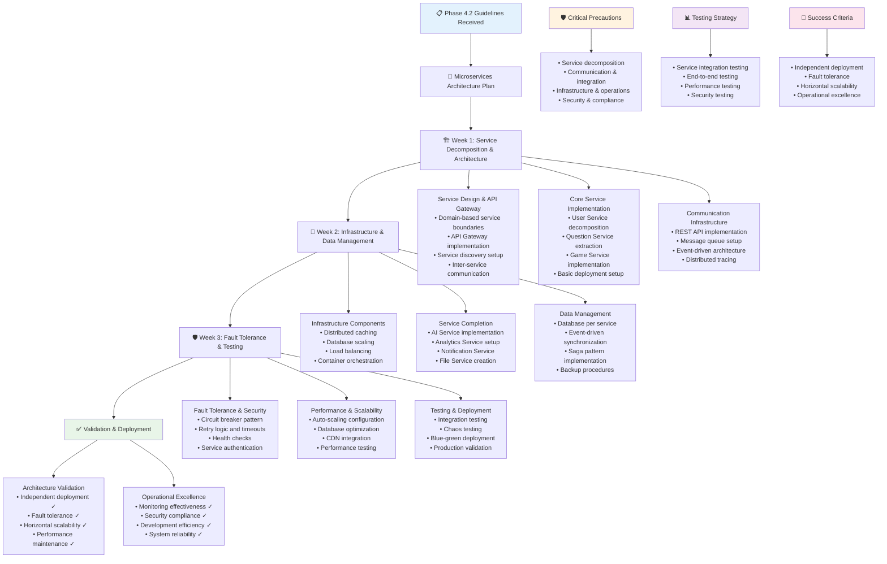

# QuizMaster Pro - Phase 4.2 Instructions & Guidelines

## 🎯 Phase 4.2 Objective
**Goal**: Transform the QuizMaster Pro platform into a scalable microservices architecture with proper service decomposition, inter-service communication, load balancing, and infrastructure components. This architecture must support independent deployment, fault tolerance, and horizontal scaling while maintaining system reliability and performance.

**Duration**: 3 Weeks (21 days)  
**Success Metric**: Production-ready microservices architecture supporting independent service deployment, automatic scaling, fault tolerance, and 99.99% uptime with no single points of failure

**Prerequisites**: Phase 1.1, 1.2, 1.3, 2.1, 2.2, 2.3, 3.1, 3.2, 3.3, and 4.1 must be 100% complete and functional

---

## 📋 FEATURES TO IMPLEMENT

### **Service Decomposition & Architecture**
- **API Gateway Service**: Centralized request routing, authentication, rate limiting, and protocol translation
- **User Service**: Authentication, authorization, user profiles, preferences, and session management
- **Game Service**: Room management, game logic, real-time WebSocket handling, and multiplayer coordination
- **Question Service**: Question CRUD operations, search, categorization, and content management
- **AI Service**: AI question generation, provider management, cost tracking, and content validation
- **Analytics Service**: Data collection, processing, reporting, and business intelligence
- **Notification Service**: Email, SMS, push notifications, and in-app messaging
- **File Service**: Static asset management, image processing, and CDN integration

### **API Gateway Implementation**
- **Request Routing**: Intelligent routing to appropriate microservices based on request patterns
- **Authentication & Authorization**: Centralized authentication with JWT token validation and refresh
- **Rate Limiting**: Per-user, per-service, and global rate limiting with multiple algorithms
- **Request/Response Transformation**: Protocol adaptation and data format transformation
- **Load Balancing**: Intelligent load balancing with health-aware routing
- **API Versioning**: Support for multiple API versions with backward compatibility
- **Monitoring Integration**: Comprehensive request tracking, logging, and performance metrics
- **Circuit Breaker**: Protection against cascading failures with automatic recovery

### **Service Discovery & Registration**
- **Service Registry**: Central registry for service locations and health status
- **Health Check Integration**: Continuous health monitoring and service availability tracking
- **Load Balancer Integration**: Dynamic service discovery for load balancing decisions
- **Configuration Management**: Centralized configuration with dynamic updates
- **Service Metadata**: Rich metadata including version, capabilities, and resource requirements
- **Multi-Environment Support**: Service discovery across development, staging, and production
- **DNS Integration**: DNS-based service discovery with automatic record management
- **Container Orchestration**: Integration with Kubernetes or Docker Swarm for container management

### **Inter-Service Communication**
- **REST API Design**: Comprehensive REST APIs for synchronous communication between services
- **Event-Driven Architecture**: Asynchronous communication using message queues and event streams
- **Message Queue Integration**: Redis Bull/RabbitMQ integration for background job processing
- **Event Streaming**: Real-time event streaming for data synchronization and reactive processing
- **Request Correlation**: Request tracing and correlation across service boundaries
- **Timeout Management**: Appropriate timeouts and retry logic for service calls
- **Data Consistency**: Eventual consistency patterns and distributed transaction management
- **Protocol Flexibility**: Support for multiple communication protocols (HTTP, gRPC, WebSocket)

### **Infrastructure Components**
- **Message Queue System**: Redis Bull for background jobs, task queues, and async processing
- **Distributed Caching**: Redis cluster for session management, game state, and performance caching
- **Database Scaling**: Read replicas, connection pooling, and database sharding strategies
- **Load Balancing**: NGINX or cloud-native load balancers with health checks and automatic failover
- **CDN Integration**: Content delivery network for static assets and global performance optimization
- **Container Orchestration**: Kubernetes deployment with auto-scaling and rolling updates
- **Service Mesh**: Optional service mesh implementation for advanced traffic management
- **Secrets Management**: Secure credential storage and rotation for all microservices

### **Fault Tolerance & Resilience**
- **Circuit Breaker Pattern**: Prevent cascading failures with intelligent failure detection
- **Retry Logic**: Exponential backoff retry mechanisms for transient failures
- **Bulkhead Pattern**: Resource isolation to prevent resource exhaustion
- **Timeout Management**: Appropriate timeouts for all inter-service communication
- **Graceful Degradation**: Maintain core functionality when dependent services fail
- **Health Check Implementation**: Comprehensive health checks for all services and dependencies
- **Disaster Recovery**: Automated backup and recovery procedures for all services
- **Chaos Engineering**: Controlled failure injection to test system resilience

### **Deployment & DevOps**
- **Containerization**: Docker containers for all microservices with optimized images
- **Kubernetes Deployment**: Full Kubernetes deployment with ConfigMaps, Secrets, and Persistent Volumes
- **CI/CD Pipeline**: Independent deployment pipelines for each microservice
- **Blue-Green Deployment**: Zero-downtime deployments with automatic rollback capabilities
- **Auto-Scaling**: Horizontal Pod Autoscaling based on CPU, memory, and custom metrics
- **Rolling Updates**: Gradual service updates with health checks and automatic rollback
- **Environment Management**: Consistent deployment across development, staging, and production
- **Infrastructure as Code**: Terraform or similar tools for infrastructure management

### **Data Management & Persistence**
- **Database Per Service**: Independent databases for each microservice to ensure loose coupling
- **Data Synchronization**: Event-driven data synchronization between services
- **Distributed Transactions**: Saga pattern for managing distributed transactions
- **Data Consistency**: Eventual consistency with conflict resolution strategies
- **Database Connection Pooling**: Efficient database connection management for each service
- **Database Migration**: Independent database migration strategies for each service
- **Backup and Recovery**: Service-specific backup and recovery procedures
- **Data Privacy**: Service-level data privacy and compliance management

### **Security & Compliance**
- **Service-to-Service Authentication**: mTLS or JWT-based authentication between services
- **Network Security**: Service mesh security with encrypted inter-service communication
- **Secret Management**: Centralized secret storage with automatic rotation
- **API Security**: OAuth 2.0/OpenID Connect integration with proper scopes and permissions
- **Network Policies**: Kubernetes network policies for service isolation
- **Security Scanning**: Automated security scanning for containers and dependencies
- **Compliance Monitoring**: Continuous compliance monitoring across all services
- **Audit Logging**: Comprehensive audit trails for all inter-service communications

---

## ⚠️ CRITICAL PRECAUTIONS

### **Service Decomposition Precautions**
1. **Domain Boundaries**: Ensure service boundaries align with business domains and capabilities
2. **Data Consistency**: Carefully manage data consistency across service boundaries
3. **Service Dependencies**: Minimize coupling between services to maintain independence
4. **Transaction Management**: Handle distributed transactions appropriately with saga patterns
5. **Testing Complexity**: Account for increased testing complexity with service interactions
6. **Deployment Coordination**: Manage deployment dependencies between services
7. **Performance Impact**: Monitor performance impact of service decomposition

### **Communication & Integration Precautions**
1. **Network Latency**: Account for increased network latency in service-to-service calls
2. **Failure Propagation**: Prevent failures from cascading across multiple services
3. **Message Ordering**: Handle message ordering and delivery guarantees appropriately
4. **Protocol Compatibility**: Ensure backward compatibility in API changes
5. **Rate Limiting**: Implement appropriate rate limiting to prevent service overload
6. **Circuit Breaker Tuning**: Properly tune circuit breakers to balance availability and reliability
7. **Monitoring Overhead**: Minimize monitoring overhead while maintaining observability

### **Infrastructure & Operations Precautions**
1. **Operational Complexity**: Manage increased operational complexity with proper tooling
2. **Service Discovery**: Ensure reliable service discovery under various failure conditions
3. **Load Balancing**: Implement proper load balancing that accounts for service health
4. **Resource Management**: Prevent resource starvation and ensure fair resource allocation
5. **Configuration Management**: Manage configuration consistency across all services
6. **Monitoring and Alerting**: Implement comprehensive monitoring without overwhelming operations
7. **Disaster Recovery**: Ensure disaster recovery procedures work for distributed architecture

### **Security & Compliance Precautions**
1. **Service Authentication**: Implement robust authentication between all services
2. **Network Security**: Secure all inter-service communication channels
3. **Secret Distribution**: Securely distribute and rotate secrets across all services
4. **Access Control**: Implement fine-grained access control for service operations
5. **Data Privacy**: Ensure data privacy compliance across distributed data stores
6. **Audit Requirements**: Maintain comprehensive audit trails for compliance
7. **Vulnerability Management**: Manage security vulnerabilities across multiple services

---

## 🚫 COMMON ERRORS TO PREVENT

### **Service Architecture Errors**
- **Chatty Service Communication**: Too many small service calls creating performance problems
- **Distributed Monolith**: Creating services that are too tightly coupled, losing benefits of microservices
- **Data Inconsistency**: Poor handling of data consistency across service boundaries
- **Service Boundary Problems**: Incorrectly defined service boundaries causing coupling issues
- **Shared Database Anti-Pattern**: Multiple services sharing the same database
- **Synchronous Communication Overuse**: Over-relying on synchronous calls instead of async patterns
- **God Service**: Creating services that do too much, violating single responsibility

### **Inter-Service Communication Errors**
- **Timeout Configuration Issues**: Inappropriate timeout settings causing cascading failures
- **Retry Storm**: Excessive retry attempts overwhelming failing services
- **Circuit Breaker Misconfiguration**: Circuit breakers that trip too easily or not at all
- **Message Loss**: Lost messages in async communication causing data inconsistency
- **Dead Letter Queue Issues**: Improper handling of failed messages and poison messages
- **Event Ordering Problems**: Race conditions and ordering issues in event-driven systems
- **API Version Compatibility**: Breaking changes causing service integration failures

### **Infrastructure & Deployment Errors**
- **Service Discovery Failures**: Service discovery not working properly causing routing failures
- **Load Balancer Misconfiguration**: Incorrect load balancing causing uneven load distribution
- **Container Resource Issues**: Inappropriate resource limits causing performance problems
- **Deployment Dependency Issues**: Services deployed in wrong order causing startup failures
- **Configuration Drift**: Configuration inconsistencies across environments
- **Health Check Failures**: Health checks not accurately reflecting service health
- **Auto-scaling Issues**: Inappropriate scaling triggers causing resource waste or performance issues

### **Data Management Errors**
- **Distributed Transaction Failures**: Saga patterns not handling failure scenarios correctly
- **Data Duplication Issues**: Inconsistent data replication across services
- **Database Connection Issues**: Connection pool exhaustion or configuration problems
- **Backup Strategy Problems**: Inadequate backup strategies for distributed data
- **Migration Coordination Issues**: Database migrations not coordinated properly across services
- **Data Privacy Violations**: Personal data crossing service boundaries inappropriately
- **Cache Inconsistency**: Distributed cache becoming inconsistent with source data

### **Monitoring & Operations Errors**
- **Observability Gaps**: Missing monitoring and logging in distributed system
- **Alert Fatigue**: Too many alerts from distributed system overwhelming operations
- **Log Correlation Issues**: Difficulty correlating logs across multiple services
- **Performance Monitoring Gaps**: Missing performance metrics for service interactions
- **Capacity Planning Issues**: Inadequate capacity planning for distributed services
- **Incident Response Problems**: Difficulty troubleshooting issues across multiple services
- **Deployment Pipeline Issues**: Complex deployment pipelines causing deployment failures

---

## 🏗️ BEST IMPLEMENTATION PRACTICES

### **Service Design Best Practices**
1. **Domain-Driven Design**: Use DDD principles to define clear service boundaries
2. **Single Responsibility**: Each service should have a single, well-defined responsibility
3. **Loose Coupling**: Design services to minimize dependencies and coupling
4. **High Cohesion**: Keep related functionality together within service boundaries
5. **API-First Design**: Design APIs before implementation with clear contracts
6. **Backward Compatibility**: Maintain backward compatibility in API evolution
7. **Stateless Design**: Design services to be stateless for better scalability

### **Communication Pattern Best Practices**
1. **Async-First**: Prefer asynchronous communication patterns where possible
2. **Event-Driven Architecture**: Use events for loose coupling between services
3. **Circuit Breaker Implementation**: Implement circuit breakers for all external dependencies
4. **Timeout and Retry**: Implement appropriate timeout and retry mechanisms
5. **Idempotency**: Design operations to be idempotent for safe retries
6. **Message Patterns**: Use appropriate message patterns (request-reply, publish-subscribe)
7. **Error Handling**: Implement comprehensive error handling and propagation

### **Infrastructure Management Best Practices**
1. **Container Orchestration**: Use Kubernetes for container management and orchestration
2. **Service Mesh**: Consider service mesh for advanced traffic management and security
3. **Infrastructure as Code**: Manage all infrastructure through code for consistency
4. **Auto-Scaling**: Implement horizontal auto-scaling based on appropriate metrics
5. **Resource Management**: Set appropriate resource requests and limits for all services
6. **Health Checks**: Implement comprehensive health checks for all services
7. **Configuration Management**: Externalize configuration for easy management

### **Data Management Best Practices**
1. **Database Per Service**: Each service should own its data and database
2. **Event Sourcing**: Consider event sourcing for complex domain logic
3. **CQRS Pattern**: Separate read and write models where appropriate
4. **Saga Pattern**: Use saga pattern for distributed transactions
5. **Data Synchronization**: Use events for data synchronization between services
6. **Eventual Consistency**: Accept eventual consistency and design for it
7. **Data Migration**: Plan and coordinate data migrations carefully

### **Security Implementation Best Practices**
1. **Defense in Depth**: Implement multiple layers of security controls
2. **Zero Trust Network**: Don't trust network-level security alone
3. **Service-to-Service Auth**: Implement authentication between all services
4. **Encryption**: Encrypt data in transit and at rest
5. **Secret Management**: Use centralized secret management with rotation
6. **Least Privilege**: Grant minimum necessary permissions to each service
7. **Security Scanning**: Implement automated security scanning in CI/CD

---

## 🧪 COMPREHENSIVE TESTING STRATEGY

### **Service Integration Testing**

**Unit Testing:**
- Individual service functionality and business logic
- Service API contract validation
- Data access layer functionality
- Configuration and dependency injection
- Error handling and edge cases
- Security controls and validation

**Integration Testing:**
- Service-to-service communication
- Database integration and data consistency
- Message queue and event handling
- External API integration
- Authentication and authorization flows
- Performance under expected load

### **End-to-End Testing**

**System Testing:**
- Complete user workflows across multiple services
- Data consistency across service boundaries
- Error propagation and recovery
- Performance under realistic load
- Security integration across all services
- Deployment and configuration validation

**Chaos Testing:**
- Service failure scenarios and recovery
- Network partition and timeout handling
- Resource exhaustion and recovery
- Dependency failure cascades
- Data corruption and recovery
- Performance degradation scenarios

### **Performance Testing**

**Load Testing:**
- Individual service performance under load
- Inter-service communication performance
- Database and cache performance
- Message queue throughput and latency
- Auto-scaling behavior validation
- Resource utilization optimization

**Stress Testing:**
- Maximum service capacity testing
- Graceful degradation under extreme load
- Resource exhaustion scenarios
- Recovery after system stress
- Performance bottleneck identification
- System stability under sustained load

### **Security Testing**

**Service Security:**
- Authentication and authorization controls
- API security and input validation
- Inter-service communication security
- Secret management and rotation
- Network security and isolation
- Compliance with security standards

**Infrastructure Security:**
- Container and orchestration security
- Network policies and segmentation
- Secret distribution and access controls
- Audit logging and monitoring
- Vulnerability scanning and remediation
- Incident response procedures

---

## 📊 TESTING CHECKLIST

### **Service Decomposition Testing**
- [ ] Each service has clear, well-defined responsibilities
- [ ] Service boundaries align with business domains
- [ ] Services can be deployed and scaled independently
- [ ] Data consistency is maintained across service boundaries
- [ ] Service dependencies are minimized and well-managed
- [ ] Inter-service contracts are clearly defined and versioned
- [ ] Services handle failures gracefully without affecting others

### **API Gateway Testing**
- [ ] Request routing works correctly for all service endpoints
- [ ] Authentication and authorization are enforced consistently
- [ ] Rate limiting prevents abuse and overload
- [ ] Request/response transformation works correctly
- [ ] Load balancing distributes traffic effectively
- [ ] Circuit breakers protect against service failures
- [ ] Monitoring and logging capture all gateway activity

### **Inter-Service Communication Testing**
- [ ] REST APIs provide reliable synchronous communication
- [ ] Event-driven architecture enables loose coupling
- [ ] Message queues handle background processing effectively
- [ ] Request correlation works across service boundaries
- [ ] Timeout and retry mechanisms prevent cascading failures
- [ ] Data consistency is maintained in distributed transactions
- [ ] Communication protocols work reliably under load

### **Infrastructure Components Testing**
- [ ] Message queue system handles high-volume job processing
- [ ] Distributed caching improves performance and reduces database load
- [ ] Database scaling maintains performance and consistency
- [ ] Load balancers distribute traffic and handle failures
- [ ] CDN integration delivers static assets efficiently
- [ ] Container orchestration manages services reliably
- [ ] Service discovery and registration work correctly

### **Fault Tolerance Testing**
- [ ] Circuit breakers prevent cascading failures effectively
- [ ] Retry logic handles transient failures appropriately
- [ ] Bulkhead pattern prevents resource exhaustion
- [ ] Timeouts are configured appropriately for all operations
- [ ] Graceful degradation maintains core functionality
- [ ] Health checks accurately reflect service status
- [ ] Disaster recovery procedures work correctly

### **Security & Compliance Testing**
- [ ] Service-to-service authentication works correctly
- [ ] Network security protects inter-service communication
- [ ] Secret management distributes and rotates credentials securely
- [ ] API security prevents unauthorized access
- [ ] Network policies enforce service isolation
- [ ] Security scanning identifies and addresses vulnerabilities
- [ ] Audit logging captures all security-relevant events

### **Performance & Scalability Testing**
- [ ] Services scale horizontally based on demand
- [ ] Auto-scaling responds appropriately to load changes
- [ ] Performance is maintained under high load
- [ ] Resource utilization is optimized across all services
- [ ] Database performance scales with increased load
- [ ] Cache performance improves overall system response times
- [ ] Network performance is optimized for service communication

---

## 🎯 SUCCESS VALIDATION

### **Acceptance Criteria**
1. **Independent Deployment**: Each service can be deployed independently without affecting others
2. **Fault Tolerance**: System gracefully handles individual service failures
3. **Horizontal Scalability**: Services can scale horizontally based on demand
4. **Performance Maintenance**: Microservices architecture maintains or improves performance
5. **Operational Excellence**: Monitoring and operations work effectively across distributed services
6. **Security Compliance**: All services maintain security and compliance standards
7. **Development Efficiency**: Development teams can work independently on different services
8. **System Reliability**: Overall system reliability is maintained or improved

### **Quality Gates**
- All automated tests pass (unit, integration, end-to-end, performance, security)
- Manual testing validates complete microservices functionality
- Performance benchmarks maintained or improved with new architecture
- Security audit confirms no vulnerabilities introduced by microservices
- Operations validation confirms effective monitoring and management
- Chaos testing validates system resilience and fault tolerance
- Load testing confirms scalability and performance under high load

### **Performance Benchmarks**
- **Service Response Time**: < 100ms for 95% of service-to-service calls
- **API Gateway Latency**: < 50ms additional latency for routing
- **Database Performance**: < 200ms for 95% of database queries
- **Message Queue Throughput**: Handle 10,000+ messages per second
- **Auto-scaling Response**: Scale within 2 minutes of load changes
- **System Recovery**: < 30 seconds recovery from service failures
- **Deployment Time**: < 10 minutes for rolling deployments

### **Reliability Standards**
- **System Uptime**: 99.99% uptime with no single points of failure
- **Service Availability**: 99.9% availability for each individual service
- **Fault Recovery**: Automatic recovery from 95% of transient failures
- **Data Consistency**: 99.99% consistency across distributed data
- **Security Compliance**: 100% compliance with security standards
- **Monitoring Coverage**: 100% observability across all services
- **Incident Response**: < 5 minutes mean time to detection for critical issues

### **Operational Standards**
- **Deployment Frequency**: Multiple deployments per day without issues
- **Change Failure Rate**: < 5% of deployments require rollback
- **Mean Time to Recovery**: < 1 hour for service recovery
- **Operational Overhead**: Operations team can manage system effectively
- **Developer Productivity**: No reduction in development velocity
- **Service Independence**: Teams can work independently without coordination
- **Configuration Management**: Consistent configuration across all environments

### **Documentation Requirements**
- **Microservices Architecture Guide**: Complete architecture documentation with service boundaries
- **API Documentation**: Comprehensive API documentation for all services
- **Deployment Guide**: Step-by-step deployment procedures for each service
- **Operations Manual**: Complete operations guide for monitoring and managing services
- **Security Guide**: Security implementation and compliance procedures
- **Troubleshooting Guide**: Service-specific troubleshooting procedures
- **Developer Guide**: Guide for developing and testing microservices

---

## ⚡ IMPLEMENTATION TIMELINE

**Week 1 - Service Decomposition & Architecture**

**Day 1-3**: Service Design & API Gateway
- Design service boundaries and responsibilities based on domain analysis
- Implement API Gateway with routing, authentication, and rate limiting
- Create service discovery and registration infrastructure
- Set up basic inter-service communication patterns

**Day 4-5**: Core Service Implementation
- Decompose User Service with authentication and profile management
- Extract Question Service with CRUD operations and search functionality
- Begin Game Service implementation with room management
- Set up basic service deployment and configuration

**Day 6-7**: Communication Infrastructure
- Implement REST API communication between services
- Set up message queue system for asynchronous processing
- Create event-driven architecture for loose coupling
- Implement request correlation and distributed tracing

**Week 2 - Infrastructure & Data Management**

**Day 8-10**: Infrastructure Components
- Set up distributed caching with Redis cluster
- Implement database scaling with read replicas
- Configure load balancing with health checks
- Set up container orchestration with Kubernetes

**Day 11-12**: Service Completion
- Complete AI Service implementation with provider management
- Implement Analytics Service with data collection and processing
- Create Notification Service for email, SMS, and push notifications
- Set up File Service for static asset management

**Day 13-14**: Data Management & Consistency
- Implement database per service pattern
- Create data synchronization using event-driven patterns
- Implement saga pattern for distributed transactions
- Set up backup and recovery procedures for all services

**Week 3 - Fault Tolerance & Testing**

**Day 15-17**: Fault Tolerance & Security
- Implement circuit breaker pattern across all services
- Set up retry logic and timeout management
- Create comprehensive health checks for all services
- Implement service-to-service authentication and network security

**Day 18-19**: Performance & Scalability
- Configure auto-scaling for all services
- Optimize database and cache performance
- Implement CDN integration for static assets
- Conduct performance testing and optimization

**Day 20-21**: Testing & Deployment
- Comprehensive integration and end-to-end testing
- Chaos testing for fault tolerance validation
- Blue-green deployment setup with rollback capabilities
- Final production deployment and monitoring validation

---

## 🚨 CRITICAL SUCCESS FACTORS

1. **Service Boundary Design**: Properly designed service boundaries are critical for avoiding distributed monolith
2. **Data Consistency Management**: Proper handling of data consistency across service boundaries without compromising performance
3. **Fault Tolerance Implementation**: Robust fault tolerance mechanisms to prevent cascading failures
4. **Operational Readiness**: Operations team must be prepared for increased complexity of distributed systems
5. **Performance Optimization**: Microservices overhead must not degrade overall system performance
6. **Security Architecture**: Comprehensive security across all service interactions and data flows
7. **Testing Strategy**: Thorough testing of service interactions and failure scenarios
8. **Monitoring and Observability**: Complete visibility into distributed system behavior and performance

**Architectural Foundation**: This phase creates the scalable architecture foundation that supports all future growth and innovation.

**Operational Excellence**: Microservices architecture requires operational excellence and sophisticated monitoring and management capabilities.

**Team Independence**: Properly implemented microservices enable development teams to work independently and deploy frequently.

**Scalability Enablement**: The microservices architecture built here enables horizontal scaling and global deployment capabilities.

---

