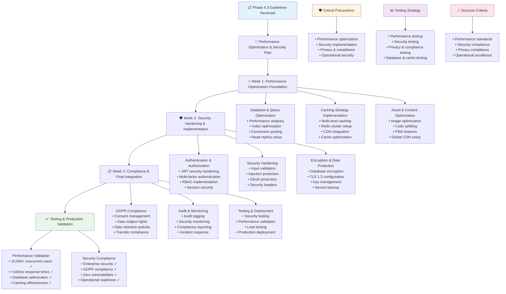

# QuizMaster Pro - Phase 4.3 Instructions & Guidelines

## 🎯 Phase 4.3 Objective
**Goal**: Implement comprehensive performance optimization and enterprise-grade security measures to achieve production-ready scalability, sub-100ms response times, GDPR compliance, and robust protection against security threats. This phase focuses on optimization, hardening, and compliance to ensure the platform can handle 10,000+ concurrent users securely.

**Duration**: 3 Weeks (21 days)  
**Success Metric**: Production-hardened platform supporting 10,000+ concurrent users with <100ms response times, enterprise-grade security, full GDPR compliance, and 99.99% uptime under security stress testing

**Prerequisites**: Phase 1.1, 1.2, 1.3, 2.1, 2.2, 2.3, 3.1, 3.2, 3.3, 4.1, and 4.2 must be 100% complete and functional

---

## 📋 FEATURES TO IMPLEMENT

### **Database Optimization & Performance**
- **Query Optimization**: Comprehensive analysis and optimization of all database queries
- **Index Strategy**: Strategic indexing for all frequently accessed data patterns
- **Query Performance Monitoring**: Real-time query performance tracking and alerting
- **Database Connection Pooling**: Optimized connection pool configuration for all services
- **Read Replica Implementation**: Strategic read replica deployment for read-heavy operations
- **Database Sharding**: Horizontal database scaling for high-volume data
- **Query Caching**: Intelligent query result caching with appropriate TTL strategies
- **Database Maintenance**: Automated maintenance tasks for optimal performance

### **Multi-Level Caching Strategy**
- **Application-Level Caching**: In-memory caching for frequently accessed application data
- **Redis Cluster Caching**: Distributed caching for session data, game state, and shared content
- **Database Query Caching**: Query result caching to reduce database load
- **CDN Caching**: Global content delivery network for static assets and dynamic content
- **API Response Caching**: Intelligent API response caching with cache invalidation
- **AI Content Caching**: Caching of AI-generated questions and content with quality-based TTL
- **Cache Warming**: Proactive cache population based on usage patterns
- **Cache Consistency**: Strategies for maintaining cache consistency across distributed systems

### **Asset Optimization & CDN**
- **Image Optimization**: Automatic image compression, resizing, and format conversion
- **Lazy Loading**: Progressive loading of images and content to improve perceived performance
- **Code Splitting**: JavaScript and CSS code splitting for faster page loads
- **Minification & Compression**: Asset minification and gzip/brotli compression
- **Global CDN Implementation**: Multi-region CDN deployment for optimal global performance
- **Edge Caching**: Intelligent edge caching strategies for dynamic and static content
- **Progressive Web App**: PWA implementation for improved mobile performance
- **Resource Optimization**: Optimal resource loading strategies and bundle optimization

### **WebSocket & Real-Time Optimization**
- **Connection Pooling**: Efficient WebSocket connection pooling and management
- **Message Batching**: Intelligent message batching to reduce network overhead
- **Compression**: WebSocket message compression for bandwidth optimization
- **Connection Load Balancing**: Smart load balancing for WebSocket connections
- **Heartbeat Optimization**: Optimized heartbeat mechanisms for connection health
- **Regional WebSocket Servers**: Geographically distributed WebSocket servers
- **Connection Scaling**: Dynamic scaling of WebSocket connections based on demand
- **Real-Time Performance Monitoring**: Comprehensive WebSocket performance tracking

### **Authentication & Authorization Security**
- **JWT Security Hardening**: Enhanced JWT implementation with proper validation and rotation
- **Refresh Token Rotation**: Automatic refresh token rotation for enhanced security
- **Multi-Factor Authentication**: Optional MFA implementation for enhanced account security
- **OAuth 2.0/OIDC Integration**: Secure third-party authentication with major providers
- **Role-Based Access Control**: Granular RBAC implementation with fine-grained permissions
- **Session Management**: Secure session handling with proper invalidation and timeouts
- **Account Security**: Advanced account protection features and suspicious activity detection
- **API Key Management**: Secure API key generation, rotation, and access control

### **Input Validation & Security Hardening**
- **Comprehensive Input Validation**: Server-side validation for all user inputs and API endpoints
- **SQL Injection Prevention**: Parameterized queries and ORM-based protection
- **XSS Protection**: Content Security Policy and input sanitization
- **CSRF Protection**: Anti-CSRF tokens and SameSite cookie configuration
- **Clickjacking Protection**: X-Frame-Options and frame-ancestors CSP directives
- **Rate Limiting**: Sophisticated rate limiting for APIs and user actions
- **Request Size Limiting**: Protection against oversized requests and DoS attacks
- **File Upload Security**: Secure file upload validation and scanning

### **DDoS Protection & Network Security**
- **Cloudflare Integration**: Comprehensive DDoS protection and traffic filtering
- **Rate Limiting**: Multi-layer rate limiting at network, application, and user levels
- **IP Reputation**: Automated blocking of malicious IP addresses and bot traffic
- **Geographic Filtering**: Optional geographic access controls and filtering
- **Bot Protection**: Advanced bot detection and mitigation strategies
- **Traffic Analysis**: Real-time traffic analysis and anomaly detection
- **Emergency Response**: Automated emergency response procedures for attacks
- **Network Monitoring**: Comprehensive network security monitoring and alerting

### **GDPR Compliance & Privacy**
- **Data Protection by Design**: Privacy-first architecture and data handling
- **Consent Management**: Granular consent collection and management system
- **Data Subject Rights**: Implementation of GDPR data subject rights (access, rectification, erasure)
- **Data Processing Documentation**: Comprehensive documentation of data processing activities
- **Privacy Impact Assessments**: Systematic privacy impact assessment procedures
- **Data Retention Policies**: Automated data retention and deletion policies
- **Cross-Border Data Transfer**: GDPR-compliant international data transfer mechanisms
- **Breach Response**: Automated breach detection and regulatory notification procedures

### **Data Encryption & Protection**
- **Encryption at Rest**: Database and file system encryption using industry-standard algorithms
- **Encryption in Transit**: TLS 1.3 for all communications with perfect forward secrecy
- **Key Management**: Secure cryptographic key generation, storage, and rotation
- **Data Anonymization**: Advanced anonymization techniques for analytics and testing
- **Secure Backup**: Encrypted backup storage with secure access controls
- **Certificate Management**: Automated SSL/TLS certificate management and renewal
- **Hardware Security**: Integration with hardware security modules where appropriate
- **Cryptographic Standards**: Implementation of current cryptographic best practices

### **Audit Logging & Compliance**
- **Comprehensive Audit Trails**: Complete logging of all security-relevant actions
- **Tamper-Proof Logging**: Cryptographically signed logs with integrity verification
- **Log Retention**: Long-term log retention for compliance and forensic analysis
- **Security Event Monitoring**: Real-time monitoring and alerting for security events
- **Compliance Reporting**: Automated compliance reporting for various standards
- **Access Logging**: Detailed logging of all data access and administrative actions
- **Change Management**: Comprehensive change tracking and approval workflows
- **Incident Documentation**: Systematic incident documentation and response tracking

---

## ⚠️ CRITICAL PRECAUTIONS

### **Performance Optimization Precautions**
1. **Cache Consistency**: Ensure cache invalidation strategies maintain data consistency
2. **Over-Optimization**: Avoid premature optimization that increases system complexity
3. **Resource Allocation**: Prevent resource starvation in optimization efforts
4. **Monitoring Impact**: Ensure performance monitoring doesn't negatively impact performance
5. **Scalability Trade-offs**: Balance optimization with horizontal scalability requirements
6. **User Experience**: Ensure optimizations improve rather than degrade user experience
7. **Backward Compatibility**: Maintain compatibility while implementing performance improvements

### **Security Implementation Precautions**
1. **Security vs. Usability**: Balance security measures with user experience and accessibility
2. **Performance Impact**: Ensure security measures don't significantly impact system performance
3. **False Positives**: Prevent security systems from blocking legitimate users
4. **Key Management**: Implement robust key management and rotation procedures
5. **Attack Surface**: Minimize attack surface while maintaining required functionality
6. **Security Testing**: Implement comprehensive security testing without exposing vulnerabilities
7. **Incident Response**: Prepare incident response procedures without creating security risks

### **Privacy & Compliance Precautions**
1. **Data Minimization**: Collect and process only necessary personal data
2. **Consent Validity**: Ensure all data processing has valid legal basis
3. **Cross-Border Compliance**: Handle international data transfers in compliance with regulations
4. **Data Accuracy**: Maintain accuracy of personal data and correction mechanisms
5. **Retention Compliance**: Implement proper data retention and deletion procedures
6. **Third-Party Integration**: Ensure third-party integrations comply with privacy requirements
7. **Documentation Requirements**: Maintain comprehensive privacy documentation and records

### **Operational Security Precautions**
1. **Access Control**: Implement least privilege access for all system components
2. **Change Management**: Control and audit all system changes and deployments
3. **Backup Security**: Secure backup and recovery procedures and data
4. **Monitoring Blind Spots**: Ensure comprehensive monitoring coverage without gaps
5. **Incident Response**: Prepare effective incident response without creating vulnerabilities
6. **Compliance Drift**: Prevent gradual drift from compliance requirements
7. **Training Requirements**: Ensure team members understand security and compliance requirements

---

## 🚫 COMMON ERRORS TO PREVENT

### **Database Performance Errors**
- **Query N+1 Problems**: Inefficient query patterns causing excessive database calls
- **Missing Index Issues**: Slow queries due to missing or inappropriate database indexes
- **Connection Pool Exhaustion**: Database connection pools not sized appropriately
- **Lock Contention**: Database locking issues causing performance degradation
- **Inefficient Pagination**: Poor pagination implementation causing performance issues
- **Query Plan Regression**: Database query plans becoming inefficient over time
- **Connection Leak**: Database connections not being properly closed or returned

### **Caching Implementation Errors**
- **Cache Stampede**: Multiple processes simultaneously rebuilding the same cache entry
- **Cache Inconsistency**: Cached data becoming out of sync with source data
- **Cache Key Collisions**: Different data sharing the same cache key
- **Memory Leaks**: Cache consuming increasing amounts of memory without bounds
- **Hot Key Problems**: Popular cache keys causing uneven load distribution
- **Cache Eviction Issues**: Important data being evicted prematurely from cache
- **TTL Configuration Problems**: Inappropriate cache TTL settings causing stale or excessive data

### **Security Implementation Errors**
- **Authentication Bypass**: Flaws in authentication logic allowing unauthorized access
- **Authorization Issues**: Users gaining access to resources they shouldn't have
- **Session Fixation**: Session management vulnerabilities allowing session hijacking
- **Cryptographic Weaknesses**: Using weak or outdated cryptographic algorithms
- **Key Management Failures**: Poor key storage, rotation, or access control
- **Input Validation Bypass**: Malicious input bypassing validation mechanisms
- **Information Disclosure**: Sensitive information exposed through error messages or logs

### **Privacy & GDPR Errors**
- **Consent Violations**: Processing personal data without proper consent
- **Data Retention Violations**: Keeping personal data longer than legally permitted
- **Cross-Border Transfer Issues**: Transferring data internationally without proper safeguards
- **Data Subject Rights Failures**: Not properly responding to data subject requests
- **Breach Notification Failures**: Not meeting regulatory notification requirements
- **Documentation Gaps**: Insufficient documentation of data processing activities
- **Third-Party Compliance**: Third-party services not meeting privacy requirements

### **Performance Optimization Errors**
- **Premature Optimization**: Optimizing code before identifying actual bottlenecks
- **Resource Over-Allocation**: Allocating excessive resources without corresponding benefits
- **Optimization Conflicts**: Different optimizations working against each other
- **Monitoring Overhead**: Performance monitoring consuming significant system resources
- **Cache Miss Penalties**: Cache misses causing worse performance than no caching
- **CDN Misconfiguration**: CDN settings not optimized for actual usage patterns
- **Load Balancer Issues**: Load balancing not distributing traffic optimally

---

## 🏗️ BEST IMPLEMENTATION PRACTICES

### **Database Performance Best Practices**
1. **Query Analysis**: Regularly analyze and optimize slow queries using profiling tools
2. **Index Strategy**: Implement strategic indexing based on actual query patterns
3. **Connection Management**: Optimize connection pool sizing and configuration
4. **Read Replica Usage**: Use read replicas strategically for read-heavy workloads
5. **Query Optimization**: Use EXPLAIN plans and query optimization techniques
6. **Database Monitoring**: Implement comprehensive database performance monitoring
7. **Maintenance Automation**: Automate routine database maintenance tasks

### **Caching Strategy Best Practices**
1. **Cache Hierarchy**: Implement multi-level caching with appropriate TTL strategies
2. **Cache Key Design**: Design cache keys to minimize collisions and maximize efficiency
3. **Invalidation Strategy**: Implement intelligent cache invalidation and refresh strategies
4. **Memory Management**: Monitor and manage cache memory usage effectively
5. **Cache Warming**: Implement proactive cache warming for critical data
6. **Distributed Caching**: Use distributed caching for multi-server deployments
7. **Cache Monitoring**: Monitor cache hit rates and performance continuously

### **Security Implementation Best Practices**
1. **Defense in Depth**: Implement multiple layers of security controls
2. **Least Privilege**: Grant minimum necessary permissions for all access
3. **Security by Design**: Build security considerations into system architecture
4. **Regular Updates**: Keep all security components and dependencies updated
5. **Security Testing**: Implement automated security testing in CI/CD pipelines
6. **Incident Response**: Prepare comprehensive incident response procedures
7. **Security Training**: Ensure team members are trained in security best practices

### **Privacy & Compliance Best Practices**
1. **Privacy by Design**: Build privacy considerations into system architecture
2. **Data Minimization**: Collect and process only necessary personal data
3. **Consent Management**: Implement clear and granular consent mechanisms
4. **Documentation**: Maintain comprehensive privacy and compliance documentation
5. **Regular Audits**: Conduct regular privacy and compliance audits
6. **Staff Training**: Train all staff on privacy and compliance requirements
7. **Continuous Monitoring**: Monitor compliance continuously and address issues promptly

### **Performance Monitoring Best Practices**
1. **Baseline Establishment**: Establish performance baselines for all critical metrics
2. **Real User Monitoring**: Monitor actual user experience and performance
3. **Synthetic Monitoring**: Implement synthetic monitoring for proactive issue detection
4. **Performance Budgets**: Set and enforce performance budgets for all components
5. **Continuous Optimization**: Regularly review and optimize based on monitoring data
6. **Alert Tuning**: Tune performance alerts to minimize false positives
7. **Capacity Planning**: Use monitoring data for effective capacity planning

---

## 🧪 COMPREHENSIVE TESTING STRATEGY

### **Performance Testing**

**Load Testing:**
- Database performance under realistic query loads
- Cache performance with high hit/miss ratios
- API response times under concurrent load
- WebSocket performance with thousands of connections
- CDN performance across global regions
- Auto-scaling behavior under varying loads

**Stress Testing:**
- Maximum system capacity and breaking points
- Resource exhaustion and recovery scenarios
- Database connection limit testing
- Cache memory exhaustion handling
- Network bandwidth and latency stress
- System stability under sustained high load

### **Security Testing**

**Penetration Testing:**
- Authentication and authorization bypass attempts
- Input validation and injection attack testing
- Session management and token security
- API security and rate limiting effectiveness
- Network security and DDoS protection
- Social engineering and phishing resistance

**Vulnerability Assessment:**
- Automated vulnerability scanning of all components
- Dependency vulnerability assessment
- Configuration security review
- Code security analysis and review
- Infrastructure security assessment
- Third-party integration security validation

### **Privacy & Compliance Testing**

**GDPR Compliance Testing:**
- Data subject rights implementation validation
- Consent management system testing
- Data processing documentation accuracy
- Data retention and deletion policy enforcement
- Cross-border data transfer compliance
- Breach detection and notification procedures

**Privacy Impact Testing:**
- Personal data collection and processing validation
- Data anonymization effectiveness testing
- Third-party data sharing compliance
- User privacy control functionality
- Data accuracy and correction mechanisms
- Privacy policy implementation verification

### **Database & Cache Performance Testing**

**Database Testing:**
- Query performance under various load conditions
- Index effectiveness and optimization validation
- Connection pooling and resource management
- Read replica consistency and performance
- Database backup and recovery procedures
- Data integrity under concurrent access

**Cache Testing:**
- Cache hit ratio optimization across different scenarios
- Cache invalidation and consistency validation
- Cache performance under high throughput
- Distributed cache synchronization
- Memory usage and eviction policy testing
- Cache warming and population strategies

---

## 📊 TESTING CHECKLIST

### **Performance Optimization Testing**
- [ ] Database queries are optimized and perform within acceptable limits
- [ ] Indexes are properly configured for all frequent query patterns
- [ ] Database connection pooling is optimized for all services
- [ ] Multi-level caching reduces database load and improves response times
- [ ] CDN delivers static and dynamic content efficiently globally
- [ ] API response times are consistently under 100ms for 95% of requests
- [ ] WebSocket performance supports 10,000+ concurrent connections

### **Security Implementation Testing**
- [ ] Authentication mechanisms prevent unauthorized access effectively
- [ ] Authorization controls enforce proper access to resources
- [ ] Input validation prevents injection attacks and malicious input
- [ ] Rate limiting protects against abuse and DoS attacks
- [ ] Encryption protects data at rest and in transit
- [ ] Security headers provide protection against common web vulnerabilities
- [ ] DDoS protection systems effectively mitigate attack attempts

### **Privacy & GDPR Compliance Testing**
- [ ] Consent management system provides granular consent control
- [ ] Data subject rights are properly implemented and accessible
- [ ] Data retention policies are enforced automatically
- [ ] Personal data processing is documented and justified
- [ ] Cross-border data transfers comply with legal requirements
- [ ] Breach detection and notification procedures work correctly
- [ ] Privacy impact assessments are conducted for new features

### **Database & Cache Performance Testing**
- [ ] Database performance meets requirements under realistic load
- [ ] Query optimization reduces response times significantly
- [ ] Connection pooling prevents connection exhaustion
- [ ] Read replicas improve performance for read-heavy operations
- [ ] Cache hit rates exceed 80% for frequently accessed data
- [ ] Cache invalidation maintains data consistency
- [ ] Distributed caching scales with system growth

### **Asset & Content Optimization Testing**
- [ ] Image optimization reduces file sizes without quality loss
- [ ] Code splitting improves page load times
- [ ] Lazy loading improves perceived performance
- [ ] CDN caching reduces global latency
- [ ] Progressive Web App features enhance mobile performance
- [ ] Resource bundling and minification optimize delivery
- [ ] Content compression reduces bandwidth usage

### **Monitoring & Alerting Testing**
- [ ] Performance monitoring provides comprehensive system visibility
- [ ] Security monitoring detects and alerts on suspicious activities
- [ ] Privacy monitoring ensures ongoing compliance
- [ ] Alert thresholds are tuned to minimize false positives
- [ ] Incident response procedures are tested and effective
- [ ] Audit logging captures all required security and compliance events
- [ ] Monitoring systems themselves perform efficiently

---

## 🎯 SUCCESS VALIDATION

### **Acceptance Criteria**
1. **Performance Standards**: System supports 10,000+ concurrent users with <100ms API response times
2. **Security Compliance**: Enterprise-grade security with zero critical vulnerabilities
3. **Privacy Compliance**: Full GDPR compliance with automated data subject rights
4. **Scalability**: Linear performance scaling with horizontal infrastructure growth
5. **Reliability**: 99.99% uptime with graceful handling of security events
6. **User Experience**: Security measures don't negatively impact user experience
7. **Operational Excellence**: Security and performance monitoring enable proactive management
8. **Compliance Documentation**: Complete documentation for all compliance requirements

### **Quality Gates**
- All automated tests pass (performance, security, privacy, compliance)
- Penetration testing confirms no exploitable vulnerabilities
- Load testing validates 10,000+ concurrent user capacity
- Security audit confirms enterprise-grade security implementation
- Privacy audit confirms GDPR compliance
- Performance benchmarks exceeded under realistic load conditions
- Documentation reviewed and approved by security and compliance experts

### **Performance Benchmarks**
- **API Response Time**: <100ms for 95% of API requests
- **Database Query Time**: <200ms for 95% of database queries
- **Cache Hit Rate**: >80% for frequently accessed data
- **Page Load Time**: <2 seconds for 95% of page loads
- **WebSocket Latency**: <50ms for real-time communications
- **CDN Performance**: <1 second global asset delivery
- **System Recovery**: <30 seconds recovery from performance degradation

### **Security Standards**
- **Vulnerability Score**: Zero critical and high vulnerabilities
- **Penetration Testing**: Pass comprehensive penetration testing
- **Security Compliance**: Compliance with OWASP Top 10 and security frameworks
- **Incident Response**: <5 minutes detection and <15 minutes response time
- **Authentication Security**: Multi-factor authentication and secure session management
- **Data Protection**: Advanced encryption and secure key management
- **Access Control**: Role-based access with least privilege implementation

### **Privacy & Compliance Standards**
- **GDPR Compliance**: 100% compliance with GDPR requirements
- **Data Subject Rights**: <30 days response time for data subject requests
- **Consent Management**: Granular consent with easy withdrawal mechanisms
- **Data Retention**: Automated enforcement of data retention policies
- **Breach Response**: <72 hours regulatory notification for data breaches
- **Privacy Impact**: Completed privacy impact assessments for all data processing
- **Documentation**: Complete and current privacy and compliance documentation

### **Operational Standards**
- **Monitoring Coverage**: 100% monitoring coverage for security and performance
- **Alert Response**: <5 minutes response time for critical security alerts
- **Change Management**: Security review for 100% of system changes
- **Backup Security**: Encrypted and tested backup and recovery procedures
- **Training Compliance**: 100% team completion of security and privacy training
- **Audit Readiness**: Ready for external security and compliance audits
- **Incident Documentation**: Complete documentation for all security incidents

### **Documentation Requirements**
- **Performance Optimization Guide**: Complete documentation of all performance optimizations
- **Security Implementation Guide**: Comprehensive security architecture and implementation documentation
- **Privacy and GDPR Compliance Guide**: Complete privacy protection and GDPR compliance procedures
- **Database Optimization Manual**: Database performance optimization and maintenance procedures
- **Caching Strategy Documentation**: Multi-level caching implementation and management
- **Security Operations Playbook**: Security monitoring, incident response, and recovery procedures
- **Compliance Audit Guide**: Procedures for security and privacy compliance audits

---

## ⚡ IMPLEMENTATION TIMELINE

**Week 1 - Performance Optimization Foundation**

**Day 1-3**: Database & Query Optimization
- Comprehensive database performance analysis and query optimization
- Strategic index creation and database configuration tuning
- Connection pooling optimization and read replica implementation
- Database monitoring and automated maintenance setup

**Day 4-5**: Caching Strategy Implementation
- Multi-level caching architecture implementation
- Redis cluster configuration and cache optimization
- CDN integration and edge caching setup
- Cache warming and invalidation strategy implementation

**Day 6-7**: Asset & Content Optimization
- Image optimization and lazy loading implementation
- Code splitting and resource bundling optimization
- Progressive Web App features and mobile optimization
- Global CDN configuration and performance tuning

**Week 2 - Security Hardening & Implementation**

**Day 8-10**: Authentication & Authorization Security
- JWT security hardening and refresh token rotation
- Multi-factor authentication implementation
- Role-based access control with granular permissions
- Session security and account protection features

**Day 11-12**: Input Validation & Security Hardening
- Comprehensive input validation and sanitization
- SQL injection, XSS, and CSRF protection implementation
- DDoS protection and rate limiting systems
- Security header configuration and network security

**Day 13-14**: Encryption & Data Protection
- Database and file system encryption implementation
- TLS 1.3 configuration and certificate management
- Cryptographic key management and rotation
- Secure backup and data anonymization

**Week 3 - Compliance & Final Integration**

**Day 15-17**: GDPR Compliance Implementation
- Consent management system and data subject rights
- Data retention policies and automated deletion
- Privacy impact assessment procedures
- Cross-border data transfer compliance

**Day 18-19**: Audit Logging & Monitoring
- Comprehensive audit logging and tamper-proof logs
- Security event monitoring and alerting
- Compliance reporting and documentation
- Incident response procedures and testing

**Day 20-21**: Testing, Validation & Production Deployment
- Comprehensive security and performance testing
- Penetration testing and vulnerability assessment
- Load testing with 10,000+ concurrent users
- Production deployment and monitoring validation

---

## 🚨 CRITICAL SUCCESS FACTORS

1. **Performance Excellence**: Achieving <100ms response times with 10,000+ concurrent users is critical for user experience
2. **Security Robustness**: Enterprise-grade security implementation without compromising usability or performance
3. **Privacy Compliance**: Full GDPR compliance with automated enforcement is essential for global operations
4. **Operational Readiness**: Security and performance monitoring must enable proactive issue detection and response
5. **Scalability Maintenance**: Optimizations must not compromise the system's ability to scale horizontally
6. **Testing Thoroughness**: Comprehensive testing of security, performance, and compliance under realistic conditions
7. **Documentation Excellence**: Complete documentation for security, compliance, and operational procedures
8. **Team Readiness**: Operations and development teams must be prepared for production security and performance requirements

**Production Readiness**: This phase creates production-ready performance and security that enables global enterprise deployment.

**Compliance Foundation**: GDPR compliance and security hardening position the platform for enterprise and educational institution adoption.

**Operational Excellence**: Comprehensive monitoring and optimization enable reliable production operations at scale.

**Security Maturity**: Enterprise-grade security implementation provides foundation for handling sensitive educational and user data.

---

