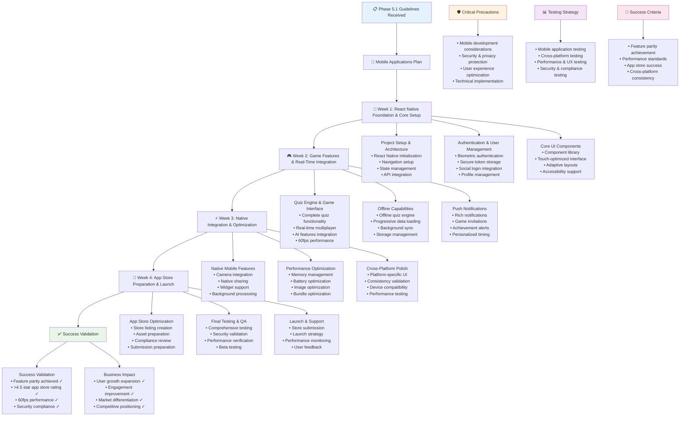

# QuizMaster Pro - Phase 5.1 Instructions & Guidelines

## 🎯 Phase 5.1 Objective
**Goal**: Develop comprehensive native mobile applications for iOS and Android using React Native, providing full feature parity with the web platform while leveraging native mobile capabilities. The apps must deliver exceptional mobile user experience, offline functionality, push notifications, and achieve 4.5+ star ratings in app stores.

**Duration**: 4 Weeks (28 days)  
**Success Metric**: Production-ready mobile applications published on App Store and Google Play with >4.5 star ratings, full feature parity, offline capabilities, and 60fps performance matching web experience quality

**Prerequisites**: Phase 1.1, 1.2, 1.3, 2.1, 2.2, 2.3, 3.1, 3.2, 3.3, 4.1, 4.2, and 4.3 must be 100% complete and functional

---

## 📋 FEATURES TO IMPLEMENT

### **React Native Core Architecture**
- **Cross-Platform Foundation**: Unified React Native codebase supporting both iOS and Android
- **Navigation System**: React Navigation with deep linking and state management
- **State Management**: Redux/Zustand integration optimized for mobile performance
- **Component Architecture**: Reusable component library following native design patterns
- **API Integration**: Seamless integration with existing microservices architecture
- **Performance Optimization**: Native module integration for performance-critical operations
- **Platform-Specific Implementations**: iOS and Android specific features and optimizations
- **Code Sharing**: Maximum code sharing while respecting platform differences

### **Authentication & User Management**
- **Biometric Authentication**: Face ID, Touch ID, and fingerprint authentication
- **Secure Token Storage**: Keychain/Keystore integration for secure credential storage
- **Social Login Integration**: Native SDK integration for Google, Apple, Facebook authentication
- **Multi-Factor Authentication**: Mobile-optimized MFA with SMS and authenticator app support
- **Account Management**: Complete profile management with native photo capture
- **Session Management**: Secure session handling with automatic renewal
- **Account Recovery**: Mobile-optimized password recovery and account restoration
- **Privacy Controls**: Granular privacy settings with native permission management

### **Game Interface & Experience**
- **Touch-Optimized Quiz Interface**: Native touch interactions and gesture recognition
- **Real-Time Multiplayer**: WebSocket integration for live multiplayer games
- **Offline Quiz Mode**: Cached questions for offline gameplay with sync capabilities
- **Adaptive UI**: Dynamic UI adaptation based on screen size and device orientation
- **Performance Optimization**: 60fps animations with smooth scrolling and transitions
- **Native Components**: Platform-specific UI components following design guidelines
- **Accessibility Support**: Full accessibility support with screen reader compatibility
- **Haptic Feedback**: Contextual haptic feedback for better user engagement

### **Push Notifications & Engagement**
- **Rich Push Notifications**: Media-rich notifications with custom actions
- **Game Invitations**: Direct game invitation system with deep linking
- **Achievement Notifications**: Celebration notifications for milestones and achievements
- **Educational Reminders**: Smart study reminders and learning streak notifications
- **Social Notifications**: Friend requests, messages, and social interaction alerts
- **Personalized Notifications**: AI-powered personalized notification timing and content
- **Notification Preferences**: Granular notification control and scheduling
- **Background Sync**: Silent background sync for notifications and content updates

### **Offline Capabilities & Sync**
- **Offline Quiz Engine**: Complete offline quiz functionality with cached questions
- **Progressive Data Loading**: Intelligent data prefetching and caching strategies
- **Offline-First Architecture**: App functionality maintained during network interruptions
- **Background Sync**: Automatic data synchronization when network becomes available
- **Conflict Resolution**: Smart conflict resolution for offline/online data inconsistencies
- **Storage Management**: Efficient local storage with cache size management
- **Sync Status Indicators**: Clear visual indicators for sync status and offline availability
- **Selective Sync**: User-controlled sync preferences for data and battery optimization

### **Native Mobile Features**
- **Camera Integration**: Native camera access for profile pictures and content creation
- **Photo Gallery Integration**: Access to device photo library for profile and content
- **Share Integration**: Native sharing capabilities for achievements and content
- **Deep Linking**: Comprehensive deep linking for all app features and content
- **Widget Support**: Home screen widgets for quick access and engagement
- **Shortcuts Integration**: iOS Shortcuts and Android App Shortcuts integration
- **Background Processing**: Background tasks for sync and maintenance
- **Device Integration**: Calendar integration for scheduling and reminders

### **Performance & Battery Optimization**
- **Memory Management**: Efficient memory usage with automatic cleanup
- **Battery Optimization**: CPU and network usage optimization for extended battery life
- **Image Optimization**: Automatic image resizing and caching for performance
- **Network Efficiency**: Optimized API calls and data compression
- **Startup Performance**: Fast app startup and initial content loading
- **Animation Performance**: Hardware-accelerated animations maintaining 60fps
- **Bundle Optimization**: Code splitting and lazy loading for smaller app bundles
- **Performance Monitoring**: Real-time performance monitoring and optimization

### **Cross-Platform Optimization**
- **Responsive Design**: Adaptive layouts for phones, tablets, and foldable devices
- **Platform Design Compliance**: iOS Human Interface Guidelines and Material Design adherence
- **Native Feel**: Platform-specific navigation patterns and interaction paradigms
- **Performance Parity**: Consistent performance across iOS and Android platforms
- **Feature Parity**: Identical functionality and capabilities on both platforms
- **Quality Assurance**: Platform-specific testing and optimization
- **App Store Compliance**: Full compliance with App Store and Google Play guidelines
- **Update Management**: Seamless app updates with rollback capabilities

### **App Store Optimization**
- **Store Listing Optimization**: Compelling app descriptions, keywords, and metadata
- **Screenshot & Video Creation**: High-quality screenshots and promotional videos
- **App Icon Design**: Platform-specific app icons following design guidelines
- **Rating & Review Management**: Strategies for encouraging positive ratings and reviews
- **App Store Analytics**: Integration with App Store Connect and Google Play Console analytics
- **A/B Testing**: Store listing A/B testing for optimization
- **Launch Strategy**: Coordinated launch strategy for maximum visibility
- **Post-Launch Support**: Ongoing optimization based on user feedback and analytics

---

## ⚠️ CRITICAL PRECAUTIONS

### **Mobile Development Precautions**
1. **Platform Differences**: Account for iOS and Android differences in implementation
2. **Performance Impact**: Ensure React Native performance matches native expectations
3. **Memory Management**: Prevent memory leaks and optimize for mobile memory constraints
4. **Battery Consumption**: Optimize battery usage to prevent excessive drain
5. **Network Efficiency**: Minimize data usage and optimize for mobile networks
6. **Storage Limitations**: Manage local storage efficiently within device constraints
7. **Update Management**: Handle app updates smoothly without data loss

### **Security & Privacy Precautions**
1. **Mobile Security**: Implement mobile-specific security measures and protections
2. **Biometric Security**: Securely implement biometric authentication with fallbacks
3. **Data Protection**: Encrypt sensitive data stored locally on devices
4. **Network Security**: Secure all network communications with certificate pinning
5. **Permission Management**: Request only necessary permissions with clear explanations
6. **Privacy Compliance**: Ensure mobile app complies with privacy regulations
7. **App Store Security**: Meet security requirements for app store approval

### **User Experience Precautions**
1. **Touch Interface Design**: Ensure touch targets are appropriately sized and positioned
2. **Loading States**: Provide clear feedback during loading and network operations
3. **Error Handling**: Handle errors gracefully with helpful recovery options
4. **Accessibility**: Ensure app works with screen readers and accessibility features
5. **Performance Expectations**: Meet user expectations for mobile app performance
6. **Battery Impact**: Minimize impact on device battery life
7. **Data Usage**: Be transparent about and minimize data usage

### **Technical Implementation Precautions**
1. **Code Sharing**: Balance code sharing with platform-specific optimizations
2. **Native Modules**: Implement native modules only when necessary for performance
3. **Third-Party Dependencies**: Carefully evaluate and maintain third-party packages
4. **App Size**: Keep app size reasonable for download and installation
5. **Testing Coverage**: Ensure comprehensive testing across devices and OS versions
6. **Deployment Pipeline**: Implement reliable CI/CD pipeline for mobile releases
7. **Monitoring Integration**: Integrate crash reporting and performance monitoring

---

## 🚫 COMMON ERRORS TO PREVENT

### **React Native Implementation Errors**
- **Performance Bottlenecks**: JavaScript bridge overuse causing performance issues
- **Memory Leaks**: Components not properly unmounting or cleaning up resources
- **Platform Inconsistencies**: Different behavior between iOS and Android implementations
- **Bundle Size Issues**: Large bundle sizes causing slow startup and poor performance
- **State Management Problems**: Inefficient state management causing re-render issues
- **Native Module Integration**: Improper native module implementation causing crashes
- **Version Compatibility**: React Native and dependency version conflicts

### **Mobile UX/UI Errors**
- **Touch Target Issues**: Touch targets too small or inappropriately positioned
- **Navigation Problems**: Confusing navigation patterns or broken deep linking
- **Loading State Issues**: Missing or unclear loading indicators
- **Performance Perception**: Slow animations or transitions affecting perceived performance
- **Accessibility Failures**: App not working with screen readers or accessibility features
- **Platform Design Violations**: Not following iOS HIG or Material Design guidelines
- **Responsive Design Issues**: Poor layouts on different screen sizes and orientations

### **Offline & Sync Errors**
- **Data Consistency Issues**: Conflicts between offline and online data not properly resolved
- **Storage Overflow**: Offline data consuming excessive device storage
- **Sync Failures**: Background sync not working properly or causing data loss
- **Network State Handling**: Poor handling of network state changes
- **Cache Invalidation**: Outdated cached data causing incorrect app behavior
- **Offline Functionality Gaps**: Critical features not working in offline mode
- **Conflict Resolution Failures**: User data conflicts not properly handled

### **Push Notification Errors**
- **Permission Issues**: Not properly requesting or handling notification permissions
- **Delivery Failures**: Push notifications not reaching users reliably
- **Deep Link Issues**: Notifications not properly opening relevant app content
- **Timing Problems**: Notifications sent at inappropriate times for users
- **Content Issues**: Notification content not properly localized or relevant
- **Badge Management**: App badge counts not properly updated
- **Background Processing**: Background notification handling causing crashes

### **Security & Authentication Errors**
- **Biometric Implementation**: Biometric authentication not working properly or securely
- **Token Storage**: Insecure storage of authentication tokens or sensitive data
- **Certificate Pinning Issues**: SSL certificate pinning causing connectivity problems
- **Permission Over-Request**: Requesting unnecessary permissions affecting user trust
- **Data Encryption**: Sensitive data not properly encrypted on device
- **Social Login Problems**: Third-party authentication integration issues
- **Session Management**: Poor session handling causing security vulnerabilities

---

## 🏗️ BEST IMPLEMENTATION PRACTICES

### **React Native Architecture Best Practices**
1. **Component Reusability**: Create reusable components following atomic design principles
2. **Performance Optimization**: Use FlatList, optimize re-renders, and implement lazy loading
3. **State Management**: Use appropriate state management solutions for different data types
4. **Code Organization**: Organize code with clear separation of concerns and modularity
5. **Platform-Specific Code**: Use platform-specific code only when necessary
6. **Error Boundaries**: Implement error boundaries to prevent app crashes
7. **Testing Strategy**: Implement comprehensive unit, integration, and E2E testing

### **Mobile UX/UI Best Practices**
1. **Touch-First Design**: Design for touch interactions with appropriate target sizes
2. **Native Patterns**: Follow platform-specific navigation and interaction patterns
3. **Performance Perception**: Optimize perceived performance with loading states and transitions
4. **Accessibility First**: Build accessibility support from the beginning
5. **Responsive Design**: Design for various screen sizes and orientations
6. **Visual Consistency**: Maintain visual consistency while respecting platform conventions
7. **User Feedback**: Provide immediate feedback for all user actions

### **Offline & Sync Best Practices**
1. **Offline-First Design**: Design app to work offline by default
2. **Progressive Enhancement**: Add online features as enhancements to offline core
3. **Smart Caching**: Implement intelligent caching strategies for better performance
4. **Conflict Resolution**: Design clear conflict resolution strategies for sync
5. **Storage Management**: Implement efficient local storage with cleanup strategies
6. **Sync Indicators**: Provide clear indicators for sync status and data freshness
7. **Background Sync**: Implement background sync with proper battery optimization

### **Security Implementation Best Practices**
1. **Defense in Depth**: Implement multiple layers of security controls
2. **Biometric Integration**: Use native biometric APIs with proper fallback mechanisms
3. **Secure Storage**: Use platform keychain/keystore for sensitive data storage
4. **Certificate Pinning**: Implement certificate pinning for API communications
5. **Permission Minimization**: Request only necessary permissions with clear explanations
6. **Data Encryption**: Encrypt sensitive data stored locally
7. **Security Monitoring**: Implement security monitoring and threat detection

### **Performance Optimization Best Practices**
1. **Memory Management**: Implement proper memory management and cleanup
2. **Battery Optimization**: Optimize CPU usage and background processing
3. **Network Efficiency**: Minimize network requests and implement intelligent caching
4. **Image Optimization**: Optimize images for mobile devices and networks
5. **Bundle Optimization**: Use code splitting and tree shaking to reduce bundle size
6. **Animation Performance**: Use native animations and hardware acceleration
7. **Monitoring Integration**: Implement performance monitoring and crash reporting

---

## 🧪 COMPREHENSIVE TESTING STRATEGY

### **Mobile Application Testing**

**Unit Testing:**
- React Native component functionality
- Business logic and utility functions
- State management and data flow
- API integration and error handling
- Offline functionality and data sync
- Authentication and security features

**Integration Testing:**
- Component interaction and data flow
- API integration with backend services
- Push notification delivery and handling
- Deep linking and navigation
- Biometric authentication integration
- Social login and third-party integrations

### **Cross-Platform Testing**

**Device Testing:**
- Testing across multiple iOS and Android devices
- Different screen sizes and orientations
- Various OS versions and device capabilities
- Performance testing on low-end devices
- Battery usage and optimization validation
- Network condition testing (3G, 4G, WiFi, offline)

**Platform-Specific Testing:**
- iOS-specific features and behaviors
- Android-specific features and behaviors
- Platform design guideline compliance
- App store compliance and requirements
- Platform permission handling
- Native integration functionality

### **Performance & User Experience Testing**

**Performance Testing:**
- App startup time and initial loading
- Navigation and transition smoothness
- Memory usage and leak detection
- Battery consumption optimization
- Network efficiency and data usage
- Offline performance and sync speed

**User Experience Testing:**
- Touch interaction responsiveness
- Navigation flow and usability
- Loading states and error handling
- Accessibility testing with assistive technologies
- Localization and internationalization
- User onboarding and engagement flows

### **Security & Compliance Testing**

**Security Testing:**
- Authentication and authorization flows
- Biometric security implementation
- Data encryption and secure storage
- Network security and certificate pinning
- Permission handling and privacy protection
- Third-party integration security

**Compliance Testing:**
- App store compliance requirements
- Privacy policy implementation
- COPPA and child protection compliance
- Accessibility standards compliance
- Regional compliance requirements
- Platform-specific guideline adherence

---

## 📊 TESTING CHECKLIST

### **Core Functionality Testing**
- [ ] All web platform features work correctly on mobile
- [ ] User authentication including biometric login functions properly
- [ ] Quiz gameplay provides smooth 60fps performance
- [ ] Real-time multiplayer features work reliably on mobile networks
- [ ] AI-powered features integrate seamlessly with mobile interface
- [ ] Offline mode provides full quiz functionality without network
- [ ] Data synchronization works correctly between offline and online modes

### **Mobile-Specific Features Testing**
- [ ] Push notifications deliver reliably and open correct app content
- [ ] Camera integration works for profile pictures and content creation
- [ ] Native sharing functionality works across different platforms and apps
- [ ] Deep linking opens appropriate app content from external sources
- [ ] Biometric authentication provides secure and convenient access
- [ ] Background sync maintains data consistency without user intervention
- [ ] App widgets and shortcuts provide quick access to key features

### **Performance & Optimization Testing**
- [ ] App startup time is under 3 seconds on average devices
- [ ] Navigation and transitions maintain 60fps performance
- [ ] Memory usage remains stable during extended app usage
- [ ] Battery consumption is optimized for typical usage patterns
- [ ] App works smoothly on low-end devices and slow networks
- [ ] Image loading and caching optimize performance and data usage
- [ ] Bundle size is optimized for quick download and installation

### **Cross-Platform Compatibility Testing**
- [ ] App behavior is consistent between iOS and Android platforms
- [ ] Design follows platform-specific guidelines and conventions
- [ ] Touch interactions work appropriately on different screen sizes
- [ ] App adapts properly to different orientations and device types
- [ ] Performance is comparable across iOS and Android devices
- [ ] Platform-specific features integrate correctly with app functionality
- [ ] App store requirements are met for both iOS and Android

### **Security & Privacy Testing**
- [ ] User data is encrypted and stored securely on device
- [ ] Network communications use certificate pinning and encryption
- [ ] Biometric authentication includes proper fallback mechanisms
- [ ] App permissions are requested appropriately with clear explanations
- [ ] Privacy settings provide granular control over data sharing
- [ ] Social login integrations maintain security and privacy standards
- [ ] Security vulnerabilities are addressed through testing and review

### **User Experience Testing**
- [ ] Onboarding process is intuitive and engaging for new users
- [ ] Navigation is intuitive and follows platform conventions
- [ ] Error states provide helpful recovery options and guidance
- [ ] Loading states provide clear feedback about app status
- [ ] Accessibility features work with screen readers and assistive technology
- [ ] App provides clear feedback for all user actions and states
- [ ] User interface adapts appropriately to different accessibility needs

---

## 🎯 SUCCESS VALIDATION

### **Acceptance Criteria**
1. **Feature Parity**: Complete feature parity with web platform including all AI and multiplayer features
2. **Performance Standards**: 60fps performance with <3 second startup time on average devices
3. **App Store Success**: Apps published and approved on both App Store and Google Play
4. **User Satisfaction**: >4.5 star average rating with positive user feedback
5. **Offline Functionality**: Full quiz functionality available offline with seamless sync
6. **Native Integration**: Seamless integration of native mobile features and capabilities
7. **Security Compliance**: Enterprise-grade security appropriate for mobile environment
8. **Cross-Platform Consistency**: Consistent experience and performance across iOS and Android

### **Quality Gates**
- All automated tests pass (unit, integration, UI, performance, security)
- Manual testing validates complete mobile app functionality
- Performance benchmarks met on range of devices from low-end to high-end
- Security audit confirms mobile app meets security standards
- Accessibility testing confirms compliance with accessibility guidelines
- App store review process completed successfully for both platforms
- Beta testing confirms user satisfaction and app stability

### **Performance Benchmarks**
- **App Startup Time**: <3 seconds cold start, <1 second warm start
- **Navigation Performance**: 60fps maintained during all transitions
- **Quiz Performance**: <200ms response time for question loading
- **Sync Performance**: <5 seconds for typical data synchronization
- **Memory Usage**: <100MB for typical usage, <150MB peak usage
- **Battery Impact**: <5% battery drain per hour of active usage
- **Network Efficiency**: <1MB data usage per quiz session

### **User Experience Standards**
- **App Store Rating**: >4.5 stars average rating on both platforms
- **User Retention**: 70% weekly retention, 40% monthly retention
- **Feature Adoption**: >80% of users use mobile-specific features
- **Engagement**: 25% increase in user engagement compared to web-only users
- **Accessibility**: 100% compatibility with screen readers and assistive technology
- **Platform Guidelines**: 100% compliance with iOS HIG and Material Design
- **User Feedback**: Positive sentiment in 85%+ of user reviews

### **Technical Standards**
- **Cross-Platform Parity**: 100% feature and performance parity between iOS and Android
- **Offline Capability**: 90% of app functionality available offline
- **Security Compliance**: Zero critical security vulnerabilities
- **Performance Stability**: <1% crash rate across all devices and OS versions
- **Update Success**: 99%+ successful app update rate
- **API Integration**: 100% compatibility with existing microservices architecture
- **Monitoring Coverage**: Complete crash reporting and performance monitoring

### **Business Impact Standards**
- **User Growth**: 40% increase in total active users from mobile app launch
- **Engagement**: 30% increase in average session duration
- **Retention**: 20% improvement in user retention rates
- **Revenue Impact**: 25% increase in subscription conversions from mobile users
- **Market Expansion**: Access to mobile-first user segments
- **Competitive Position**: Mobile app competitiveness with leading quiz platforms
- **App Store Visibility**: Top rankings in relevant app store categories

### **Documentation Requirements**
- **Mobile Development Guide**: Complete guide for mobile app development and maintenance
- **User Guide**: Comprehensive user guide for mobile app features and functionality
- **Security Implementation**: Mobile-specific security implementation documentation
- **Performance Optimization**: Mobile performance optimization and monitoring guide
- **App Store Management**: Guide for app store submission, updates, and optimization
- **Platform Integration**: Documentation for native feature integration and platform-specific implementations
- **Troubleshooting Guide**: Comprehensive troubleshooting guide for common mobile app issues

---

## ⚡ IMPLEMENTATION TIMELINE

**Week 1 - React Native Foundation & Core Setup**

**Day 1-3**: Project Setup & Architecture
- React Native project initialization with platform-specific configurations
- Navigation system setup with React Navigation and deep linking
- State management integration with Redux/Zustand
- API integration layer with existing microservices architecture

**Day 4-5**: Authentication & User Management
- Biometric authentication implementation (Face ID, Touch ID, Fingerprint)
- Secure token storage with Keychain/Keystore integration
- Social login integration with native SDKs
- User profile management with native camera integration

**Day 6-7**: Core UI Components & Design System
- Platform-specific component library following design guidelines
- Touch-optimized quiz interface with gesture recognition
- Adaptive layouts for different screen sizes and orientations
- Accessibility implementation with screen reader support

**Week 2 - Game Features & Real-Time Integration**

**Day 8-10**: Quiz Engine & Game Interface
- Complete quiz functionality with touch-optimized interactions
- Real-time multiplayer integration with WebSocket connections
- AI-powered features integration with mobile-optimized UI
- Performance optimization for 60fps gameplay experience

**Day 11-12**: Offline Capabilities & Data Management
- Offline quiz engine with cached questions and sync capabilities
- Progressive data loading and intelligent caching strategies
- Background sync implementation with conflict resolution
- Local storage management and optimization

**Day 13-14**: Push Notifications & Engagement
- Rich push notification system with custom actions and media
- Game invitation system with deep linking integration
- Achievement and social interaction notifications
- Personalized notification timing and content optimization

**Week 3 - Native Integration & Optimization**

**Day 15-17**: Native Mobile Features
- Camera and photo gallery integration for profiles and content
- Native sharing capabilities across platforms and applications
- Widget support and home screen shortcuts implementation
- Background processing for sync and maintenance tasks

**Day 18-19**: Performance & Battery Optimization
- Memory management optimization and leak prevention
- Battery usage optimization with CPU and network efficiency
- Image optimization and caching for performance
- Bundle optimization with code splitting and lazy loading

**Day 20-21**: Cross-Platform Polish & Testing
- Platform-specific UI polish following iOS HIG and Material Design
- Cross-platform consistency validation and optimization
- Comprehensive device and OS version compatibility testing
- Performance testing across range of devices

**Week 4 - App Store Preparation & Launch**

**Day 22-24**: App Store Optimization & Preparation
- App store listing creation with optimized descriptions and keywords
- High-quality screenshots and promotional video creation
- Platform-specific app icon design and asset preparation
- App store compliance review and submission preparation

**Day 25-26**: Final Testing & Quality Assurance
- Comprehensive testing across devices, OS versions, and network conditions
- Security testing and vulnerability assessment
- Performance validation under realistic usage conditions
- Beta testing with real users for feedback and bug identification

**Day 27-28**: Launch & Post-Launch Support
- App store submission and approval process management
- Launch strategy execution and marketing support
- Post-launch monitoring and performance tracking
- User feedback collection and rapid issue resolution

---

## 🚨 CRITICAL SUCCESS FACTORS

1. **Performance Excellence**: Mobile apps must match web platform performance expectations with 60fps smoothness
2. **Feature Parity**: Complete feature parity with web platform while leveraging mobile-native capabilities
3. **App Store Success**: Successful publication and positive reception in both App Store and Google Play
4. **User Experience Quality**: Intuitive, native-feeling experience following platform-specific design guidelines
5. **Offline Functionality**: Robust offline capabilities enabling full quiz experience without network connectivity
6. **Security Implementation**: Mobile-appropriate security measures protecting user data and maintaining trust
7. **Cross-Platform Consistency**: Consistent experience and performance between iOS and Android platforms
8. **Market Differentiation**: Mobile apps provide competitive advantages and expand market reach significantly

**Mobile-First Strategy**: Mobile apps are essential for reaching mobile-native user segments and providing convenient access to quiz platform.

**Platform Excellence**: Success requires excellence in both iOS and Android implementations with platform-specific optimizations and native feel.

**User Engagement**: Mobile apps enable higher engagement through push notifications, offline access, and mobile-native features.

**Market Expansion**: Mobile applications open access to global mobile-first markets and educational segments requiring mobile accessibility.

---

