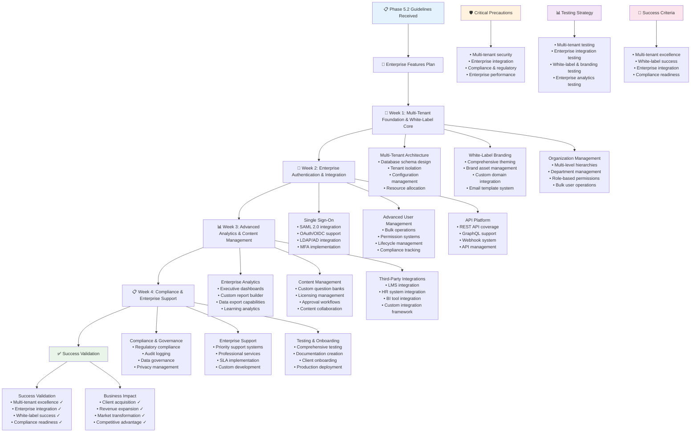

# QuizMaster Pro - Phase 5.2 Instructions & Guidelines

## 🎯 Phase 5.2 Objective
**Goal**: Transform QuizMaster Pro into an enterprise-ready platform with white-label solutions, multi-tenant architecture, advanced admin features, and enterprise integrations. The system must support large organizations with custom branding, SSO integration, advanced analytics, and compliance features while maintaining performance and scalability.

**Duration**: 4 Weeks (28 days)  
**Success Metric**: Enterprise-grade platform supporting multi-tenant deployments with white-label customization, enterprise SSO integration, advanced analytics, and successful acquisition of first enterprise clients

**Prerequisites**: Phase 1.1, 1.2, 1.3, 2.1, 2.2, 2.3, 3.1, 3.2, 3.3, 4.1, 4.2, 4.3, and 5.1 must be 100% complete and functional

---

## 📋 FEATURES TO IMPLEMENT

### **White-Label Solutions & Custom Branding**
- **Complete Brand Customization**: Custom logos, colors, fonts, and visual identity
- **Custom Domain Integration**: Subdomain and custom domain support for branded experiences
- **Themeable UI Components**: Comprehensive theming system for all interface elements
- **Custom Email Templates**: Branded email communications and notifications
- **Mobile App White-Labeling**: Custom branded mobile applications for enterprise clients
- **Content Customization**: Custom content, messaging, and help documentation
- **Multi-Language Branding**: Localized branding for international enterprise deployments
- **Brand Asset Management**: Centralized management of brand assets and guidelines

### **Multi-Tenant Architecture**
- **Tenant Isolation**: Complete data and configuration isolation between organizations
- **Scalable Tenant Management**: Support for thousands of enterprise tenants
- **Tenant-Specific Configurations**: Custom settings, features, and integrations per tenant
- **Resource Allocation**: Fair resource allocation and performance isolation
- **Tenant Analytics**: Comprehensive analytics and reporting per tenant
- **Cross-Tenant Security**: Strict security boundaries preventing data leakage
- **Tenant Lifecycle Management**: Onboarding, configuration, and offboarding workflows
- **Billing Integration**: Tenant-specific usage tracking and billing management

### **Organization Management & Hierarchies**
- **Multi-Level Hierarchies**: Support for complex organizational structures
- **Department Management**: Department-based user organization and permissions
- **Team and Group Management**: Flexible team creation and management capabilities
- **Role-Based Hierarchies**: Hierarchical role definitions and inheritance
- **Organizational Charts**: Visual representation of organizational structures
- **Cross-Department Collaboration**: Tools for cross-departmental quiz and learning initiatives
- **Administrative Delegation**: Delegated administration at different organizational levels
- **Bulk User Operations**: Efficient bulk user management and organizational changes

### **Advanced User Management**
- **Bulk User Operations**: Import, export, and manage thousands of users efficiently
- **Advanced Permission Systems**: Granular permissions with role-based access control
- **User Lifecycle Management**: Automated user onboarding, role changes, and deactivation
- **Directory Integration**: Active Directory and LDAP integration for user management
- **User Provisioning**: Automated user provisioning and deprovisioning workflows
- **Advanced User Search**: Powerful search and filtering capabilities for user management
- **User Compliance Tracking**: Track user compliance with training and assessment requirements
- **Audit Trail Management**: Comprehensive audit trails for all user management actions

### **Single Sign-On (SSO) & Enterprise Authentication**
- **SAML 2.0 Integration**: Complete SAML 2.0 support for enterprise identity providers
- **OAuth 2.0/OIDC Support**: OAuth and OpenID Connect integration with major providers
- **LDAP/Active Directory**: Direct integration with enterprise directory services
- **Multi-Factor Authentication**: Enterprise-grade MFA with various authentication methods
- **Identity Provider Management**: Support for multiple identity providers per organization
- **Just-In-Time Provisioning**: Automatic user provisioning from SSO authentication
- **Session Management**: Enterprise session policies and centralized session control
- **Federation Services**: Identity federation across multiple enterprise systems

### **Advanced Analytics & Business Intelligence**
- **Executive Dashboards**: High-level business intelligence and KPI dashboards
- **Custom Report Builder**: Self-service report creation with advanced visualization
- **Data Export Capabilities**: Comprehensive data export in various formats
- **Advanced Segmentation**: Complex user and performance segmentation analysis
- **Learning Analytics**: Educational effectiveness and learning outcome analysis
- **ROI Analysis**: Return on investment tracking for learning and training programs
- **Predictive Analytics**: Machine learning-powered insights and predictions
- **Real-Time Analytics**: Live analytics and reporting for ongoing activities

### **API Platform & Third-Party Integrations**
- **Comprehensive REST API**: Complete API coverage for all platform functionality
- **GraphQL API**: Flexible GraphQL API for complex data requirements
- **Webhook System**: Real-time event notifications and integration capabilities
- **API Management**: Rate limiting, versioning, and API key management
- **LMS Integration**: Integration with major Learning Management Systems
- **HR System Integration**: Integration with HR systems for user and organizational data
- **Business Intelligence Integration**: Integration with enterprise BI and analytics tools
- **Custom Integration Support**: Tools and documentation for custom integrations

### **Content Management & Licensing**
- **Custom Question Banks**: Organization-specific content creation and management
- **Content Licensing Management**: Rights management for premium and licensed content
- **Content Approval Workflows**: Multi-stage content review and approval processes
- **Version Control**: Content versioning and change management
- **Content Collaboration**: Collaborative content creation and editing tools
- **Content Analytics**: Detailed analytics on content usage and effectiveness
- **Bulk Content Operations**: Efficient bulk content import, export, and management
- **Content Compliance**: Compliance tracking and validation for educational content

### **Advanced Compliance & Reporting**
- **Regulatory Compliance**: Support for FERPA, COPPA, and educational regulations
- **Audit Log Management**: Comprehensive audit logging and retention policies
- **Compliance Reporting**: Automated compliance reports and documentation
- **Data Governance**: Data governance frameworks and policy enforcement
- **Privacy Management**: Advanced privacy controls and user consent management
- **Security Compliance**: Security compliance frameworks and validation
- **Custom Compliance Workflows**: Configurable compliance processes and approvals
- **Regulatory Change Management**: Adaptation to changing regulatory requirements

### **Enterprise Support & Services**
- **Priority Support**: Dedicated support channels for enterprise clients
- **Custom Support Integration**: Integration with enterprise support and ticketing systems
- **Professional Services**: Implementation, training, and consulting services
- **Service Level Agreements**: Guaranteed SLAs for uptime, performance, and support
- **Account Management**: Dedicated account managers for enterprise relationships
- **Training Services**: Platform training for administrators and end users
- **Migration Services**: Data migration and system transition support
- **Custom Development**: Custom feature development for enterprise requirements

---

## ⚠️ CRITICAL PRECAUTIONS

### **Multi-Tenant Security Precautions**
1. **Data Isolation**: Ensure complete data isolation between different enterprise tenants
2. **Cross-Tenant Attacks**: Prevent any possibility of cross-tenant data access
3. **Resource Isolation**: Prevent resource exhaustion attacks between tenants
4. **Configuration Isolation**: Ensure tenant configurations don't affect others
5. **Audit Trail Integrity**: Maintain separate, tamper-proof audit trails per tenant
6. **Backup Isolation**: Ensure tenant backups are properly isolated and secure
7. **Performance Isolation**: Prevent tenant activities from affecting others' performance

### **Enterprise Integration Precautions**
1. **SSO Security**: Implement robust SSO security preventing authentication bypass
2. **API Security**: Comprehensive API security with proper authentication and authorization
3. **Data Privacy**: Protect enterprise data privacy in all integrations
4. **Integration Reliability**: Ensure enterprise integrations are highly reliable
5. **Version Compatibility**: Maintain backward compatibility for enterprise integrations
6. **Error Handling**: Robust error handling that doesn't expose sensitive information
7. **Rate Limiting**: Prevent abuse of enterprise APIs and integrations

### **Compliance & Regulatory Precautions**
1. **Regulatory Changes**: Stay current with changing compliance requirements
2. **Data Retention**: Implement proper data retention policies for compliance
3. **Audit Requirements**: Ensure audit capabilities meet regulatory requirements
4. **International Compliance**: Handle international compliance requirements
5. **Industry-Specific Compliance**: Address industry-specific regulatory requirements
6. **Documentation Requirements**: Maintain comprehensive compliance documentation
7. **Regular Compliance Reviews**: Conduct regular compliance assessments

### **Enterprise Performance Precautions**
1. **Scalability Requirements**: Ensure platform scales to enterprise requirements
2. **Performance SLAs**: Meet guaranteed performance service level agreements
3. **Resource Management**: Efficiently manage resources across multiple tenants
4. **Load Balancing**: Implement effective load balancing for enterprise workloads
5. **Disaster Recovery**: Comprehensive disaster recovery for enterprise clients
6. **Maintenance Windows**: Minimize impact of maintenance on enterprise operations
7. **Capacity Planning**: Proactive capacity planning for enterprise growth

---

## 🚫 COMMON ERRORS TO PREVENT

### **Multi-Tenant Implementation Errors**
- **Data Leakage**: Cross-tenant data leakage through shared resources or poor isolation
- **Resource Contention**: Tenants affecting each other's performance or availability
- **Configuration Bleeding**: Tenant configurations affecting other tenants
- **Shared State Issues**: Shared state causing inconsistencies between tenants
- **Authentication Mix-ups**: Users accessing wrong tenant environments
- **Backup Confusion**: Mixed or incorrect tenant data in backups and restores
- **Scaling Issues**: Poor tenant scaling causing performance degradation

### **Enterprise Integration Errors**
- **SSO Implementation Issues**: SSO not working properly or securely with enterprise identity providers
- **API Rate Limiting Problems**: Enterprise integrations hitting rate limits unexpectedly
- **Authentication Token Issues**: Token expiration or validation problems in enterprise integrations
- **Data Synchronization Problems**: Data sync issues between QuizMaster and enterprise systems
- **Integration Timeout Issues**: Integration timeouts causing failures in enterprise workflows
- **Webhook Delivery Failures**: Webhooks not delivering reliably to enterprise systems
- **Version Compatibility Issues**: API version changes breaking enterprise integrations

### **White-Label & Branding Errors**
- **Branding Inconsistencies**: Inconsistent branding across different parts of the platform
- **Custom Domain Issues**: Problems with custom domain configuration and SSL certificates
- **Theme Conflicts**: Theme customizations conflicting with platform functionality
- **Mobile App Branding**: White-label branding not working properly in mobile applications
- **Email Template Issues**: Branded email templates not rendering correctly
- **Asset Management Problems**: Brand assets not loading or displaying properly
- **Localization Issues**: Branding not working properly with multi-language support

### **Advanced Analytics Errors**
- **Data Accuracy Issues**: Incorrect data in enterprise analytics and reports
- **Performance Problems**: Analytics queries causing performance issues for enterprises
- **Access Control Issues**: Users accessing analytics data they shouldn't see
- **Export Failures**: Data export functionality not working for large enterprise datasets
- **Real-Time Analytics Delays**: Real-time analytics not updating promptly for enterprises
- **Custom Report Builder Issues**: Report builder not working properly or producing incorrect results
- **Dashboard Performance**: Executive dashboards loading slowly or timing out

### **Compliance & Security Errors**
- **Audit Log Gaps**: Missing or incomplete audit logs for compliance requirements
- **Data Retention Violations**: Not following proper data retention policies for compliance
- **Privacy Policy Violations**: Enterprise features not complying with privacy policies
- **Access Control Failures**: Inadequate access controls for sensitive enterprise data
- **Compliance Reporting Errors**: Incorrect or incomplete compliance reports
- **Security Vulnerability Exposure**: Enterprise features introducing security vulnerabilities
- **Regulatory Violation**: Non-compliance with industry-specific regulations

---

## 🏗️ BEST IMPLEMENTATION PRACTICES

### **Multi-Tenant Architecture Best Practices**
1. **Schema Design**: Design database schemas for optimal tenant isolation and performance
2. **Resource Pooling**: Implement efficient resource pooling and allocation strategies
3. **Tenant Configuration**: Externalize tenant configurations for easy management
4. **Data Partitioning**: Use appropriate data partitioning strategies for scale
5. **Caching Strategy**: Implement tenant-aware caching for performance optimization
6. **Monitoring Integration**: Monitor tenant-specific metrics and performance
7. **Security by Design**: Build tenant isolation into the core architecture

### **Enterprise Integration Best Practices**
1. **API-First Design**: Design all enterprise features with APIs as primary interface
2. **Standards Compliance**: Follow industry standards for SSO, APIs, and integrations
3. **Error Handling**: Implement comprehensive error handling and recovery
4. **Documentation Excellence**: Provide comprehensive API and integration documentation
5. **Version Management**: Implement proper API versioning and backward compatibility
6. **Testing Strategy**: Comprehensive testing of all enterprise integrations
7. **Security Focus**: Implement enterprise-grade security for all integrations

### **White-Label Implementation Best Practices**
1. **Theme Architecture**: Design flexible theming system supporting deep customization
2. **Asset Management**: Implement efficient brand asset management and delivery
3. **Performance Optimization**: Ensure white-label features don't impact performance
4. **Quality Assurance**: Test white-label features across all supported configurations
5. **Documentation**: Provide comprehensive white-label setup and customization guides
6. **Mobile Integration**: Ensure white-label features work seamlessly in mobile apps
7. **Scalability Design**: Design white-label features to scale with tenant growth

### **Enterprise Analytics Best Practices**
1. **Data Architecture**: Design analytics data architecture for enterprise scale
2. **Query Optimization**: Optimize analytics queries for large enterprise datasets
3. **Real-Time Processing**: Implement efficient real-time analytics processing
4. **Visualization Excellence**: Create intuitive and powerful data visualizations
5. **Export Optimization**: Optimize data export for large enterprise datasets
6. **Security Integration**: Implement proper security and access controls for analytics
7. **Performance Monitoring**: Monitor analytics performance and optimize continuously

### **Compliance Implementation Best Practices**
1. **Regulatory Research**: Stay current with relevant regulatory requirements
2. **Process Automation**: Automate compliance processes where possible
3. **Documentation Management**: Maintain comprehensive compliance documentation
4. **Regular Auditing**: Conduct regular internal compliance audits
5. **Training Programs**: Implement compliance training for development and operations teams
6. **Change Management**: Implement change management processes for compliance
7. **Third-Party Validation**: Engage third-party experts for compliance validation

---

## 🧪 COMPREHENSIVE TESTING STRATEGY

### **Multi-Tenant Testing**

**Unit Testing:**
- Tenant isolation mechanisms and data separation
- Tenant-specific configuration management
- Resource allocation and performance isolation
- Cross-tenant security boundary validation
- Tenant lifecycle management processes
- Billing and usage tracking accuracy

**Integration Testing:**
- End-to-end multi-tenant workflows
- Tenant onboarding and configuration processes
- Cross-tenant data isolation under load
- Multi-tenant performance under concurrent usage
- Tenant-specific feature activation and configuration
- Disaster recovery and backup restoration per tenant

### **Enterprise Integration Testing**

**Unit Testing:**
- SSO authentication flows with various identity providers
- API authentication and authorization mechanisms
- Webhook delivery and retry mechanisms
- Third-party integration data transformation
- Enterprise directory integration accuracy
- Custom integration framework functionality

**Integration Testing:**
- Complete SSO workflow with major enterprise identity providers
- API integration with enterprise systems under load
- End-to-end webhook delivery and processing
- Complex enterprise workflow integration
- Multi-system data synchronization accuracy
- Enterprise mobile app integration

### **White-Label & Branding Testing**

**Unit Testing:**
- Theme application and customization accuracy
- Brand asset loading and display functionality
- Custom domain configuration and routing
- Email template customization and delivery
- Mobile app white-label feature functionality
- Localization with custom branding

**Integration Testing:**
- Complete white-label experience across all platform features
- Custom domain SSL certificate management
- Branded mobile app build and deployment processes
- Cross-platform branding consistency
- Performance impact of white-label features
- White-label feature interaction with enterprise integrations

### **Enterprise Analytics Testing**

**Unit Testing:**
- Analytics data accuracy and calculation correctness
- Report generation functionality and performance
- Data export functionality across various formats
- Custom dashboard creation and management
- Analytics access control and security
- Real-time analytics data processing

**Integration Testing:**
- End-to-end analytics pipeline from data collection to visualization
- Large dataset analytics performance and scalability
- Custom report sharing and collaboration features
- Analytics integration with enterprise BI tools
- Cross-tenant analytics isolation and security
- Analytics performance under concurrent enterprise usage

---

## 📊 TESTING CHECKLIST

### **Multi-Tenant Architecture Testing**
- [ ] Complete data isolation between different enterprise tenants
- [ ] Tenant-specific configurations work correctly without affecting others
- [ ] Resource allocation prevents tenant interference and performance issues
- [ ] Cross-tenant security boundaries prevent any data leakage
- [ ] Tenant lifecycle management handles onboarding and offboarding properly
- [ ] Billing and usage tracking accurately reflects individual tenant usage
- [ ] Multi-tenant performance scales appropriately with tenant growth

### **White-Label & Branding Testing**
- [ ] Custom branding applies consistently across all platform interfaces
- [ ] Custom domains work properly with SSL certificate management
- [ ] Branded email templates render correctly across all email clients
- [ ] Mobile app white-labeling produces properly branded applications
- [ ] Theme customization works without breaking platform functionality
- [ ] Brand asset management provides efficient asset delivery and updates
- [ ] Localized branding works properly with multi-language support

### **Enterprise SSO & Authentication Testing**
- [ ] SAML 2.0 integration works with major enterprise identity providers
- [ ] OAuth/OIDC integration provides secure authentication flows
- [ ] LDAP/Active Directory integration synchronizes users and groups correctly
- [ ] Multi-factor authentication integrates properly with enterprise systems
- [ ] Just-in-time provisioning creates users correctly from SSO authentication
- [ ] Session management enforces enterprise security policies
- [ ] Identity federation works across multiple enterprise systems

### **Advanced Analytics & Reporting Testing**
- [ ] Executive dashboards provide accurate and timely business intelligence
- [ ] Custom report builder allows creation of complex, accurate reports
- [ ] Data export functionality works efficiently with large enterprise datasets
- [ ] Advanced segmentation provides meaningful analysis capabilities
- [ ] Learning analytics accurately measure educational effectiveness
- [ ] ROI analysis provides valuable insights into program effectiveness
- [ ] Real-time analytics update promptly and accurately

### **API Platform & Integration Testing**
- [ ] REST API provides complete coverage of all platform functionality
- [ ] GraphQL API handles complex data requirements efficiently
- [ ] Webhook system delivers real-time event notifications reliably
- [ ] API management enforces rate limits and security policies properly
- [ ] LMS integrations work seamlessly with major learning management systems
- [ ] HR system integrations synchronize user and organizational data correctly
- [ ] Third-party integrations maintain data consistency and security

### **Compliance & Governance Testing**
- [ ] Regulatory compliance features meet FERPA, COPPA, and other requirements
- [ ] Audit logging captures all required activities comprehensively
- [ ] Compliance reporting generates accurate and complete reports
- [ ] Data governance policies are enforced automatically
- [ ] Privacy management provides granular user control and consent tracking
- [ ] Security compliance meets enterprise and regulatory requirements
- [ ] Custom compliance workflows adapt to organization-specific needs

---

## 🎯 SUCCESS VALIDATION

### **Acceptance Criteria**
1. **Multi-Tenant Excellence**: Robust multi-tenant architecture supporting thousands of enterprise clients
2. **White-Label Success**: Complete white-label customization enabling branded enterprise deployments
3. **Enterprise Integration**: Seamless integration with major enterprise systems and identity providers
4. **Advanced Analytics**: Comprehensive business intelligence and reporting capabilities for enterprises
5. **Compliance Readiness**: Full compliance with educational and enterprise regulatory requirements
6. **API Platform**: Complete API platform enabling custom integrations and enterprise workflows
7. **Performance at Scale**: Enterprise-grade performance and scalability under heavy usage
8. **Client Acquisition**: Successful acquisition and onboarding of first enterprise clients

### **Quality Gates**
- All automated tests pass (unit, integration, performance, security, compliance)
- Multi-tenant isolation and security validated through comprehensive testing
- Enterprise integration testing completed with major identity providers and systems
- Performance testing validates enterprise-scale usage scenarios
- Security audit confirms enterprise-grade security implementation
- Compliance audit validates regulatory requirement compliance
- Beta testing with enterprise clients confirms feature completeness and usability

### **Performance Benchmarks**
- **Multi-Tenant Performance**: Support 1000+ concurrent tenants without performance degradation
- **SSO Performance**: <2 seconds for SSO authentication flows
- **Analytics Performance**: <5 seconds for complex enterprise reports
- **API Performance**: <200ms for 95% of API requests under enterprise load
- **White-Label Performance**: No performance impact from branding customization
- **Integration Performance**: <3 seconds for enterprise system data synchronization
- **Scaling Performance**: Linear performance scaling with enterprise tenant growth

### **Enterprise Standards**
- **Multi-Tenant Isolation**: 100% data isolation with zero cross-tenant incidents
- **SSO Integration**: Support for 10+ major enterprise identity providers
- **White-Label Customization**: Complete branding customization without limitations
- **API Coverage**: 100% platform functionality accessible via APIs
- **Compliance Coverage**: 100% compliance with target regulatory requirements
- **Enterprise SLA**: 99.99% uptime with <4 hours maximum recovery time
- **Security Standards**: Zero critical vulnerabilities in enterprise features

### **Business Impact Standards**
- **Enterprise Client Acquisition**: 5+ enterprise clients signed and successfully onboarded
- **Revenue Growth**: 200% increase in revenue from enterprise features and clients
- **Market Expansion**: Access to enterprise and educational institution markets
- **Competitive Positioning**: Market leadership in enterprise quiz and learning platforms
- **Client Satisfaction**: >4.8/5 satisfaction rating from enterprise clients
- **Retention Rate**: >95% enterprise client retention rate
- **Expansion Revenue**: 40% of enterprise clients expand usage within first year

### **Compliance & Security Standards**
- **Regulatory Compliance**: 100% compliance with FERPA, COPPA, and applicable regulations
- **Security Certification**: SOC 2 Type II and other relevant security certifications
- **Privacy Compliance**: Full GDPR and CCPA compliance for enterprise features
- **Audit Readiness**: Ready for enterprise security and compliance audits
- **Data Protection**: Advanced data protection and encryption for enterprise data
- **Access Control**: Granular access control meeting enterprise security requirements
- **Incident Response**: Enterprise-grade incident response and notification procedures

### **Documentation Requirements**
- **Enterprise Implementation Guide**: Complete guide for enterprise deployment and configuration
- **Multi-Tenant Architecture Documentation**: Comprehensive multi-tenant system documentation
- **White-Label Customization Guide**: Complete guide for white-label setup and customization
- **Enterprise Integration Documentation**: API and integration documentation for enterprise systems
- **Compliance and Security Guide**: Complete compliance and security implementation documentation
- **Administrator Training Materials**: Comprehensive training materials for enterprise administrators
- **Professional Services Guide**: Documentation for implementation and consulting services

---

## ⚡ IMPLEMENTATION TIMELINE

**Week 1 - Multi-Tenant Foundation & White-Label Core**

**Day 1-3**: Multi-Tenant Architecture Implementation
- Multi-tenant database schema design and implementation
- Tenant isolation mechanisms and security boundaries
- Tenant configuration management and lifecycle
- Resource allocation and performance isolation systems

**Day 4-5**: White-Label Branding Foundation
- Comprehensive theming system with deep customization capabilities
- Brand asset management and delivery systems
- Custom domain integration and SSL certificate management
- Branded email template system and customization

**Day 6-7**: Organization Management & Hierarchies
- Multi-level organizational structure support
- Department and team management capabilities
- Role-based hierarchies and permission inheritance
- Bulk user operations and organizational change management

**Week 2 - Enterprise Authentication & Integration**

**Day 8-10**: Single Sign-On Implementation
- SAML 2.0 integration with enterprise identity providers
- OAuth 2.0/OIDC support for major authentication providers
- LDAP/Active Directory integration and user synchronization
- Multi-factor authentication and enterprise security policies

**Day 11-12**: Advanced User Management
- Bulk user operations and enterprise-scale user management
- Advanced permission systems with granular access control
- User lifecycle management and automated provisioning
- Directory integration and user compliance tracking

**Day 13-14**: API Platform Development
- Comprehensive REST API covering all platform functionality
- GraphQL API for complex enterprise data requirements
- Webhook system for real-time enterprise integration
- API management with security, versioning, and rate limiting

**Week 3 - Advanced Analytics & Content Management**

**Day 15-17**: Enterprise Analytics & Business Intelligence
- Executive dashboards with advanced business intelligence
- Custom report builder with self-service capabilities
- Advanced data export and integration with enterprise BI tools
- Learning analytics and ROI analysis for training programs

**Day 18-19**: Content Management & Licensing
- Custom question banks and organization-specific content
- Content licensing management and rights tracking
- Content approval workflows and version control
- Bulk content operations and collaborative content creation

**Day 20-21**: Third-Party Integrations
- LMS integration with major learning management systems
- HR system integration for user and organizational data
- Business intelligence tool integration for advanced analytics
- Custom integration framework and developer tools

**Week 4 - Compliance & Enterprise Support**

**Day 22-24**: Compliance & Governance Implementation
- Regulatory compliance features for educational and enterprise requirements
- Comprehensive audit logging and compliance reporting
- Data governance frameworks and privacy management
- Security compliance and regulatory change management

**Day 25-26**: Enterprise Support & Professional Services
- Priority support systems and dedicated account management
- Professional services framework for implementation and training
- Service level agreement implementation and monitoring
- Custom development capabilities for enterprise requirements

**Day 27-28**: Testing, Documentation & Client Onboarding
- Comprehensive enterprise feature testing and validation
- Complete documentation and training material creation
- Enterprise client onboarding processes and procedures
- Production deployment and enterprise client acquisition

---

## 🚨 CRITICAL SUCCESS FACTORS

1. **Multi-Tenant Excellence**: Robust, secure, and scalable multi-tenant architecture is fundamental to enterprise success
2. **Enterprise Integration Quality**: Seamless integration with enterprise systems and identity providers is essential
3. **White-Label Sophistication**: Complete and flexible white-label capabilities enable enterprise branding requirements
4. **Compliance Thoroughness**: Comprehensive regulatory compliance is mandatory for educational and enterprise markets
5. **Performance at Scale**: Enterprise-grade performance and scalability under heavy concurrent usage
6. **Security Maturity**: Enterprise-level security implementation meeting strictest security requirements
7. **API Platform Completeness**: Full-featured API platform enabling custom integrations and enterprise workflows
8. **Client Success**: Successful acquisition and satisfaction of initial enterprise clients proving market fit

**Market Transformation**: This phase transforms QuizMaster Pro from consumer product to enterprise platform capable of serving large organizations.

**Revenue Expansion**: Enterprise features enable significant revenue growth through higher-value client relationships and expanded market access.

**Competitive Differentiation**: Enterprise capabilities create significant competitive advantages in educational technology market.

**Scalability Foundation**: Multi-tenant architecture and enterprise features create foundation for massive scale and global deployment.

---

