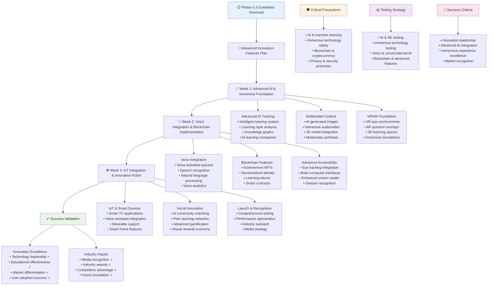

# QuizMaster Pro - Phase 5.3 Instructions & Guidelines

## 🎯 Phase 5.3 Objective
**Goal**: Implement cutting-edge innovation features that establish QuizMaster Pro as the industry leader in educational technology. This phase introduces advanced AI tutoring, multimodal content, voice integration, VR/AR experiences, blockchain features, and next-generation technologies that differentiate the platform and attract media attention.

**Duration**: 3 Weeks (21 days)  
**Success Metric**: Industry-leading innovation platform with advanced AI tutoring, immersive VR/AR experiences, voice integration, and blockchain features that generate significant media attention and establish market leadership

**Prerequisites**: Phase 1.1, 1.2, 1.3, 2.1, 2.2, 2.3, 3.1, 3.2, 3.3, 4.1, 4.2, 4.3, 5.1, and 5.2 must be 100% complete and functional

---

## 📋 FEATURES TO IMPLEMENT

### **Advanced AI Tutoring & Personalized Learning**
- **Intelligent Tutoring System**: AI-powered personalized tutoring with adaptive learning paths
- **Learning Style Analysis**: AI analysis of individual learning styles and preferences
- **Knowledge Graph Construction**: Dynamic knowledge graphs for personalized learning journeys
- **Cognitive Load Management**: AI optimization of cognitive load for optimal learning
- **Spaced Repetition Intelligence**: AI-powered spaced repetition scheduling
- **Learning Companion**: Conversational AI learning companion for support and motivation
- **Metacognitive Coaching**: AI coaching for learning strategies and self-regulation
- **Emotional Learning Support**: AI recognition and response to learner emotional states

### **Multimodal Content & Interactive Media**
- **AI-Generated Images**: Dynamic image generation for visual question enhancement
- **Interactive Audio Content**: AI-generated audio content with voice synthesis
- **Video Question Integration**: AI-generated questions based on video content analysis
- **3D Model Integration**: Interactive 3D models for spatial and scientific learning
- **Augmented Reality Overlays**: AR content overlay for real-world learning contexts
- **Interactive Simulations**: Physics, chemistry, and biology simulation integration
- **Dynamic Infographics**: AI-generated infographics and data visualizations
- **Multimedia Synthesis**: Seamless integration of text, audio, video, and interactive elements

### **Voice Integration & Conversational AI**
- **Voice-Activated Quizzes**: Complete voice control for quiz navigation and answers
- **Speech Recognition**: Advanced speech recognition with multiple language support
- **Natural Language Processing**: Conversational AI for question clarification and help
- **Voice Synthesis**: High-quality text-to-speech for accessibility and convenience
- **Voice Biometrics**: Voice-based user identification and authentication
- **Multilingual Voice Support**: Voice features in multiple languages and accents
- **Conversational Assessment**: AI-powered conversational assessment and evaluation
- **Voice Analytics**: Analysis of speech patterns for learning insights

### **Virtual & Augmented Reality Integration**
- **VR Quiz Environments**: Immersive virtual reality quiz experiences
- **AR Question Overlays**: Augmented reality question overlays in real environments
- **3D Learning Spaces**: Virtual 3D environments for collaborative learning
- **Immersive Simulations**: VR simulations for science, history, and technical subjects
- **Spatial Learning**: 3D spatial learning experiences for geometry and architecture
- **Virtual Collaboration**: VR spaces for multiplayer quiz collaboration
- **Mixed Reality Support**: Support for mixed reality devices and experiences
- **Haptic Feedback Integration**: Tactile feedback for enhanced VR/AR experiences

### **Blockchain & Decentralized Features**
- **Achievement NFTs**: Blockchain-based achievement tokens and certificates
- **Decentralized Identity**: Blockchain identity verification and credentials
- **Learning Tokens**: Cryptocurrency rewards for learning achievements
- **Smart Contracts**: Automated contracts for educational achievements and rewards
- **Decentralized Content**: Blockchain-based content verification and attribution
- **Peer-to-Peer Learning**: Blockchain-enabled peer learning and reward systems
- **Credential Verification**: Immutable blockchain-based credential verification
- **Decentralized Governance**: Community governance for platform development

### **Advanced Accessibility & Inclusion**
- **Eye Tracking Integration**: Eye-tracking technology for accessibility and engagement
- **Brain-Computer Interfaces**: BCI integration for users with mobility limitations
- **Advanced Screen Reader**: Enhanced screen reader support with AI descriptions
- **Gesture Recognition**: Hand gesture recognition for touchless interaction
- **Neurodiverse Support**: Specialized features for ADHD, dyslexia, and autism support
- **Cultural Adaptation**: AI-powered cultural adaptation of content and interactions
- **Cognitive Accessibility**: Features supporting various cognitive abilities and differences
- **Universal Design**: Universal design principles throughout all innovation features

### **IoT & Smart Device Integration**
- **Smart TV Applications**: Native smart TV apps for large-screen learning
- **Smart Speaker Integration**: Amazon Alexa and Google Assistant quiz experiences
- **Wearable Device Support**: Smartwatch and fitness tracker integration
- **Smart Home Integration**: Home automation integration for learning reminders
- **IoT Sensor Integration**: Environmental sensors for context-aware learning
- **Smart Classroom Technology**: Integration with interactive whiteboards and projectors
- **Edge Computing**: Edge device processing for low-latency interactions
- **Device Ecosystem Management**: Seamless experience across multiple connected devices

### **Social Learning & Community Innovation**
- **AI-Powered Community Matching**: Intelligent matching of learners with similar interests
- **Collaborative Knowledge Building**: Community-driven knowledge base construction
- **Peer Learning Networks**: AI-facilitated peer learning and mentorship networks
- **Social Learning Analytics**: Analysis of social learning patterns and effectiveness
- **Gamified Community Features**: Advanced gamification for community engagement
- **Content Creator Tools**: Advanced tools for community content creation
- **Virtual Study Groups**: AI-moderated virtual study groups and learning circles
- **Social Impact Tracking**: Measurement of social learning impact and outcomes

### **Advanced Gamification & Engagement**
- **Dynamic Difficulty Adjustment**: Real-time difficulty adjustment based on engagement
- **Narrative Learning Experiences**: Story-driven learning with branching narratives
- **Achievement System 2.0**: Complex achievement systems with social and blockchain elements
- **Learning Streaks & Habits**: Advanced habit formation and streak maintenance
- **Competitive Learning Leagues**: Seasonal competitive learning leagues and tournaments
- **Virtual Rewards & Economy**: Virtual economy with earning, spending, and trading
- **Progress Visualization**: Advanced progress visualization and learning journey mapping
- **Motivation AI**: AI-powered motivation and engagement optimization

### **Predictive Analytics & Future Learning**
- **Learning Outcome Prediction**: AI prediction of learning outcomes and success rates
- **Career Path Recommendations**: AI-powered career guidance based on learning patterns
- **Skill Gap Analysis**: Predictive analysis of future skill requirements and gaps
- **Trend Prediction**: AI prediction of educational trends and content needs
- **Performance Forecasting**: Predictive modeling of learner performance trajectories
- **Intervention Recommendations**: AI recommendations for learning interventions
- **Market Intelligence**: AI analysis of education market trends and opportunities
- **Future Skills Mapping**: Mapping of future skills requirements for career preparation

---

## ⚠️ CRITICAL PRECAUTIONS

### **AI & Machine Learning Precautions**
1. **Algorithmic Bias**: Prevent AI bias in tutoring, recommendations, and assessments
2. **Data Privacy**: Protect sensitive learning data used for AI training and inference
3. **AI Transparency**: Provide transparency in AI decision-making and recommendations
4. **Model Accuracy**: Ensure AI models are accurate and reliable for educational use
5. **Ethical AI Use**: Follow ethical guidelines for AI use in educational contexts
6. **Model Drift**: Monitor and address AI model drift and degradation over time
7. **Explainable AI**: Ensure AI recommendations and decisions can be explained to users

### **Immersive Technology Precautions**
1. **Motion Sickness**: Prevent motion sickness and discomfort in VR experiences
2. **Accessibility Compliance**: Ensure VR/AR features are accessible to users with disabilities
3. **Content Appropriateness**: Ensure immersive content is appropriate for all age groups
4. **Hardware Requirements**: Manage hardware requirements and compatibility issues
5. **Safety Guidelines**: Implement safety guidelines for VR/AR usage
6. **Performance Optimization**: Optimize VR/AR performance to prevent lag and discomfort
7. **User Guidance**: Provide clear guidance for safe and effective VR/AR usage

### **Blockchain & Cryptocurrency Precautions**
1. **Regulatory Compliance**: Comply with cryptocurrency and blockchain regulations
2. **Security Implementation**: Implement robust security for blockchain features
3. **Volatility Management**: Handle cryptocurrency volatility appropriately
4. **Environmental Impact**: Consider environmental impact of blockchain technology
5. **User Education**: Educate users about blockchain features and risks
6. **Scalability Issues**: Address blockchain scalability and performance limitations
7. **Recovery Mechanisms**: Implement recovery mechanisms for lost keys or tokens

### **Privacy & Security Precautions**
1. **Biometric Data Protection**: Securely handle voice, eye-tracking, and other biometric data
2. **Third-Party Integrations**: Ensure third-party AI and IoT integrations are secure
3. **Data Minimization**: Collect only necessary data for innovative features
4. **Consent Management**: Obtain appropriate consent for innovative data collection
5. **Cross-Border Compliance**: Handle international data transfer for global features
6. **Children's Privacy**: Extra protection for children's data in innovative features
7. **Vendor Security**: Ensure all innovation technology vendors meet security standards

---

## 🚫 COMMON ERRORS TO PREVENT

### **AI Implementation Errors**
- **Overpersonalization**: AI creating filter bubbles that limit learning breadth
- **Bias Amplification**: AI systems amplifying existing educational or cultural biases
- **Over-reliance on AI**: Users becoming too dependent on AI assistance
- **Inaccurate Predictions**: AI making incorrect predictions about learning outcomes
- **Context Misunderstanding**: AI failing to understand learning context and nuance
- **Privacy Violations**: AI features exposing more personal data than necessary
- **Model Brittleness**: AI models failing in unexpected ways or edge cases

### **Immersive Technology Errors**
- **Motion Sickness Issues**: VR experiences causing discomfort or nausea
- **Accessibility Barriers**: VR/AR creating barriers for users with disabilities
- **Hardware Fragmentation**: Poor compatibility across different VR/AR devices
- **Performance Problems**: Lag or low frame rates in immersive experiences
- **Content Quality Issues**: Low-quality or inappropriate immersive content
- **User Safety Problems**: VR/AR experiences causing physical safety issues
- **Integration Complexity**: Overly complex integration with existing platform

### **Voice & Conversational AI Errors**
- **Speech Recognition Failures**: Poor recognition accuracy affecting user experience
- **Language Bias**: Voice systems working poorly for non-native speakers
- **Privacy Concerns**: Voice data collection and storage privacy issues
- **Context Misunderstanding**: Conversational AI misunderstanding user intent
- **Response Appropriateness**: AI providing inappropriate or incorrect responses
- **Accessibility Issues**: Voice features not working with assistive technologies
- **Performance Latency**: Slow voice processing affecting real-time interaction

### **Blockchain Implementation Errors**
- **Scalability Problems**: Blockchain features not scaling with user growth
- **Transaction Costs**: High transaction costs making features impractical
- **Key Management Issues**: Users losing access to blockchain assets or credentials
- **Regulatory Violations**: Blockchain features violating financial or data regulations
- **Environmental Concerns**: High energy consumption from blockchain operations
- **User Confusion**: Complex blockchain concepts confusing users
- **Integration Complexity**: Blockchain features poorly integrated with main platform

### **Innovation Feature Integration Errors**
- **Feature Bloat**: Too many innovation features overwhelming users
- **Performance Impact**: Innovation features degrading overall platform performance
- **Accessibility Regression**: New features breaking existing accessibility
- **Security Vulnerabilities**: Innovation features introducing security weaknesses
- **User Experience Disruption**: Innovation features disrupting established user workflows
- **Maintenance Overhead**: Innovation features creating excessive maintenance burden
- **Technology Debt**: Innovation features creating technical debt and complexity

---

## 🏗️ BEST IMPLEMENTATION PRACTICES

### **AI & Machine Learning Best Practices**
1. **Ethical AI Framework**: Implement comprehensive ethical AI guidelines and review processes
2. **Bias Testing**: Regular testing for algorithmic bias in AI systems
3. **Explainable AI**: Design AI systems to provide clear explanations for decisions
4. **Continuous Learning**: Implement continuous learning and model improvement processes
5. **Human-AI Collaboration**: Design AI to augment rather than replace human instruction
6. **Privacy Preservation**: Use privacy-preserving machine learning techniques
7. **Model Governance**: Implement comprehensive ML model lifecycle management

### **Immersive Technology Best Practices**
1. **User-Centered Design**: Design VR/AR experiences around user comfort and learning
2. **Progressive Enhancement**: Provide VR/AR as enhancement to core functionality
3. **Accessibility Integration**: Design immersive experiences with accessibility from start
4. **Performance Optimization**: Optimize for smooth, comfortable immersive experiences
5. **Content Standards**: Establish quality standards for immersive educational content
6. **Safety Guidelines**: Implement comprehensive safety guidelines for immersive use
7. **Cross-Platform Support**: Design for multiple VR/AR platforms and devices

### **Innovation Integration Best Practices**
1. **Gradual Rollout**: Implement innovation features with gradual rollout and feedback
2. **A/B Testing**: Extensively test innovation features with user groups
3. **Backward Compatibility**: Ensure innovation features don't break existing functionality
4. **Performance Monitoring**: Monitor performance impact of all innovation features
5. **User Education**: Provide comprehensive education about innovation features
6. **Accessibility Testing**: Test all innovation features with assistive technologies
7. **Feedback Integration**: Actively collect and integrate user feedback on innovations

### **Security & Privacy Best Practices**
1. **Privacy by Design**: Build privacy protection into all innovation features
2. **Data Minimization**: Collect and process only necessary data for innovation features
3. **Security Assessment**: Conduct security assessments for all third-party integrations
4. **Consent Management**: Implement granular consent for innovative data collection
5. **Biometric Protection**: Implement strong protection for biometric data
6. **Vendor Management**: Rigorous security evaluation of all technology vendors
7. **Regular Auditing**: Regular security and privacy audits of innovation features

### **User Experience Best Practices**
1. **Progressive Disclosure**: Introduce innovation features gradually without overwhelming users
2. **Contextual Help**: Provide contextual help and guidance for complex features
3. **Feature Discovery**: Design intuitive ways for users to discover innovation features
4. **Customization**: Allow users to customize or disable innovation features
5. **Performance Impact**: Minimize performance impact on users without high-end devices
6. **Cross-Device Consistency**: Ensure innovation features work consistently across devices
7. **Accessibility Excellence**: Ensure all innovation features exceed accessibility standards

---

## 🧪 COMPREHENSIVE TESTING STRATEGY

### **AI & Machine Learning Testing**

**Unit Testing:**
- AI model accuracy and performance validation
- Bias detection and mitigation testing
- Personalization algorithm effectiveness
- Learning path generation accuracy
- AI recommendation quality assessment
- Model explainability and transparency

**Integration Testing:**
- AI integration with existing learning systems
- Real-time AI performance under load
- Cross-platform AI feature consistency
- AI system interaction with user data
- End-to-end personalized learning workflows
- AI-driven content generation and delivery

### **Immersive Technology Testing**

**Unit Testing:**
- VR/AR application functionality and stability
- Motion tracking accuracy and responsiveness
- 3D rendering performance and quality
- Immersive interaction mechanics
- Cross-device VR/AR compatibility
- Content loading and streaming performance

**Integration Testing:**
- VR/AR integration with quiz platform
- Multi-user VR collaboration functionality
- Cross-platform immersive experience consistency
- Performance impact on overall system
- Accessibility feature functionality in VR/AR
- Educational effectiveness of immersive content

### **Voice & Conversational AI Testing**

**Unit Testing:**
- Speech recognition accuracy across languages and accents
- Natural language understanding and response generation
- Voice synthesis quality and naturalness
- Conversational flow and context management
- Voice command recognition and execution
- Voice biometric accuracy and security

**Integration Testing:**
- Voice integration with quiz gameplay
- Multi-modal interaction (voice + visual) functionality
- Voice accessibility feature integration
- Cross-platform voice feature consistency
- Real-time voice processing performance
- Voice privacy and security implementation

### **Blockchain & Advanced Features Testing**

**Unit Testing:**
- Blockchain transaction processing and validation
- NFT creation and management functionality
- Smart contract execution and security
- Cryptocurrency reward system accuracy
- Decentralized identity verification
- Blockchain data integrity and immutability

**Integration Testing:**
- Blockchain integration with learning platform
- Cross-chain compatibility and functionality
- Performance impact of blockchain operations
- User experience with blockchain features
- Regulatory compliance of blockchain implementations
- Security and privacy of blockchain data

---

## 📊 TESTING CHECKLIST

### **Advanced AI Features Testing**
- [ ] AI tutoring provides personalized and effective learning experiences
- [ ] Learning style analysis accurately identifies individual preferences
- [ ] Knowledge graphs create meaningful learning pathways
- [ ] Cognitive load management optimizes learning without overwhelming users
- [ ] AI learning companion provides helpful and appropriate responses
- [ ] Metacognitive coaching improves learning strategies effectively
- [ ] AI bias testing confirms fair treatment across all user groups

### **Multimodal & Interactive Content Testing**
- [ ] AI-generated images enhance question quality and engagement
- [ ] Interactive audio content works seamlessly across platforms
- [ ] Video question integration provides accurate and relevant questions
- [ ] 3D model integration enhances spatial and scientific learning
- [ ] AR overlays provide valuable real-world learning context
- [ ] Interactive simulations are educationally effective and accurate
- [ ] Multimedia synthesis creates cohesive learning experiences

### **Voice Integration Testing**
- [ ] Voice-activated quizzes work accurately with natural speech
- [ ] Speech recognition performs well across diverse accents and languages
- [ ] Natural language processing understands complex questions and requests
- [ ] Voice synthesis provides clear and natural audio output
- [ ] Voice biometrics provide secure and convenient authentication
- [ ] Conversational AI assessment provides fair and accurate evaluation
- [ ] Voice analytics provide meaningful insights into learning patterns

### **VR/AR Experience Testing**
- [ ] VR quiz environments provide immersive and comfortable experiences
- [ ] AR question overlays integrate naturally with real environments
- [ ] 3D learning spaces facilitate effective collaborative learning
- [ ] VR simulations are educationally accurate and engaging
- [ ] Spatial learning experiences enhance understanding of 3D concepts
- [ ] Virtual collaboration enables effective multiplayer interactions
- [ ] Mixed reality support works across different device types

### **Blockchain & Decentralized Features Testing**
- [ ] Achievement NFTs are created, managed, and verified correctly
- [ ] Decentralized identity provides secure and verifiable credentials
- [ ] Learning tokens reward system motivates and tracks progress
- [ ] Smart contracts execute educational agreements automatically
- [ ] Decentralized content verification maintains quality and attribution
- [ ] Peer-to-peer learning enables effective community-driven education
- [ ] Blockchain credential verification provides tamper-proof certification

### **Advanced Accessibility Testing**
- [ ] Eye tracking integration works with various eye movement patterns
- [ ] Brain-computer interface support provides alternative interaction methods
- [ ] Advanced screen reader provides comprehensive AI descriptions
- [ ] Gesture recognition enables touchless interaction for accessibility
- [ ] Neurodiverse support features accommodate various cognitive differences
- [ ] Cultural adaptation provides relevant content across cultures
- [ ] Universal design principles are implemented throughout all features

### **IoT & Smart Device Integration Testing**
- [ ] Smart TV applications provide optimal large-screen learning experiences
- [ ] Smart speaker integration works seamlessly with voice assistants
- [ ] Wearable device support enhances learning with contextual information
- [ ] Smart home integration provides helpful learning reminders
- [ ] IoT sensor integration creates context-aware learning experiences
- [ ] Smart classroom technology integrates with educational hardware
- [ ] Edge computing provides low-latency responsive interactions

---

## 🎯 SUCCESS VALIDATION

### **Acceptance Criteria**
1. **Innovation Leadership**: Platform recognized as industry leader in educational technology innovation
2. **Advanced AI Integration**: Sophisticated AI tutoring and personalization delivering measurable learning improvements
3. **Immersive Experience Excellence**: VR/AR features providing compelling and educational immersive experiences
4. **Voice Integration Success**: Natural voice interaction enabling accessible and convenient platform usage
5. **Blockchain Implementation**: Functional blockchain features providing verifiable credentials and rewards
6. **Accessibility Innovation**: Advanced accessibility features serving users with diverse needs effectively
7. **Technology Integration**: Seamless integration of all innovation features without platform disruption
8. **Market Recognition**: Significant media attention and industry recognition for innovation achievements

### **Quality Gates**
- All automated tests pass (unit, integration, performance, accessibility, security)
- Innovation features tested across multiple devices and platforms
- Accessibility testing confirms features work with assistive technologies
- Performance testing validates innovation features don't degrade platform performance
- Security audit confirms no vulnerabilities introduced by innovation features
- User testing validates educational effectiveness and user satisfaction
- Industry expert validation confirms innovation feature quality and implementation

### **Performance Benchmarks**
- **AI Response Time**: <2 seconds for AI tutoring recommendations and responses
- **VR/AR Performance**: 90fps maintained in VR experiences for comfort
- **Voice Recognition**: >95% accuracy for speech recognition across languages
- **Blockchain Performance**: <5 seconds for blockchain transaction confirmation
- **Cross-Platform Consistency**: 100% feature parity across supported platforms
- **Accessibility Performance**: No performance degradation when using assistive technologies
- **Innovation Integration**: <10% performance impact from innovation features

### **Innovation Impact Standards**
- **Learning Effectiveness**: 30% improvement in learning outcomes with AI tutoring
- **Engagement Enhancement**: 50% increase in user engagement with immersive features
- **Accessibility Reach**: 25% increase in users with disabilities successfully using platform
- **Voice Usage**: 40% of users regularly use voice features for platform interaction
- **Blockchain Adoption**: 20% of users actively use blockchain features for credentials
- **Technology Leadership**: Recognition as top 3 most innovative educational technology platform
- **Industry Influence**: Speaking opportunities and partnerships based on innovation leadership

### **Business & Market Impact Standards**
- **Media Coverage**: 50+ major media mentions highlighting platform innovation
- **Industry Awards**: 3+ industry awards for innovation and technological advancement
- **Market Differentiation**: Clear competitive differentiation through innovation features
- **Investment Interest**: Increased investor interest due to innovation and market position
- **Partnership Opportunities**: 10+ strategic partnerships due to innovation capabilities
- **Talent Attraction**: Ability to attract top technology talent due to innovation work
- **Market Expansion**: Access to new market segments through innovation features

### **User Adoption Standards**
- **Feature Discovery**: 80% of users discover and try innovation features within first month
- **Regular Usage**: 50% of users regularly use at least one innovation feature
- **User Satisfaction**: >4.7/5 satisfaction rating for innovation features
- **Educational Impact**: Measurable learning improvement for users of innovation features
- **Accessibility Impact**: Positive feedback from users with diverse accessibility needs
- **Community Engagement**: Active community discussion and feedback about innovation features
- **Retention Impact**: 20% improvement in user retention through innovation features

### **Documentation Requirements**
- **Innovation Feature Guide**: Comprehensive guide to all innovation features and capabilities
- **AI Implementation Documentation**: Complete documentation of AI systems and algorithms
- **Immersive Technology Guide**: User and developer guide for VR/AR features
- **Voice Integration Manual**: Complete guide to voice features and implementation
- **Blockchain Feature Documentation**: User guide and technical documentation for blockchain features
- **Accessibility Innovation Guide**: Documentation of advanced accessibility features and usage
- **Future Innovation Roadmap**: Strategic roadmap for continued innovation and technology advancement

---

## ⚡ IMPLEMENTATION TIMELINE

**Week 1 - Advanced AI & Immersive Foundation**

**Day 1-3**: Advanced AI Tutoring Implementation
- Intelligent tutoring system with personalized learning paths
- Learning style analysis and cognitive load management
- Knowledge graph construction for personalized journeys
- AI learning companion and metacognitive coaching

**Day 4-5**: Multimodal Content & Interactive Media
- AI-generated image integration for visual enhancement
- Interactive audio content and voice synthesis
- Video question integration and 3D model support
- Dynamic infographic generation and multimedia synthesis

**Day 6-7**: VR/AR Foundation & Basic Experiences
- VR quiz environment development and testing
- AR question overlay implementation
- 3D learning space creation for collaboration
- Basic immersive simulation integration

**Week 2 - Voice Integration & Blockchain Implementation**

**Day 8-10**: Voice Integration & Conversational AI
- Voice-activated quiz navigation and control
- Advanced speech recognition and natural language processing
- Voice synthesis and multilingual support
- Conversational assessment and voice analytics

**Day 11-12**: Blockchain & Decentralized Features
- Achievement NFT creation and management system
- Decentralized identity and credential verification
- Learning token reward system implementation
- Smart contract integration for educational achievements

**Day 13-14**: Advanced Accessibility & Inclusion
- Eye tracking integration for accessibility and engagement
- Brain-computer interface support implementation
- Enhanced screen reader with AI descriptions
- Gesture recognition and neurodiverse support features

**Week 3 - IoT Integration & Innovation Polish**

**Day 15-17**: IoT & Smart Device Integration
- Smart TV application development and deployment
- Smart speaker integration with voice assistants
- Wearable device support and smart home integration
- IoT sensor integration for context-aware learning

**Day 18-19**: Advanced Gamification & Social Innovation
- AI-powered community matching and peer networks
- Dynamic difficulty adjustment and narrative experiences
- Virtual rewards economy and competitive learning leagues
- Advanced progress visualization and motivation AI

**Day 20-21**: Testing, Optimization & Launch Preparation
- Comprehensive testing of all innovation features
- Performance optimization and cross-platform validation
- Security audit and accessibility compliance verification
- Launch strategy preparation and media outreach

---

## 🚨 CRITICAL SUCCESS FACTORS

1. **Innovation Excellence**: Innovation features must be genuinely groundbreaking and provide clear educational value
2. **Educational Effectiveness**: All innovation features must demonstrably improve learning outcomes and user experience  
3. **Accessibility Leadership**: Advanced accessibility features must set new industry standards for inclusive design
4. **Technical Integration**: Seamless integration of innovation features without disrupting core platform stability
5. **Market Differentiation**: Innovation features must create significant competitive advantages and market leadership
6. **User Adoption**: Innovation features must be discoverable, useful, and regularly adopted by users
7. **Industry Recognition**: Platform must gain recognition as innovation leader in educational technology
8. **Future Foundation**: Innovation features must create foundation for continued technological advancement

**Technology Leadership**: This phase establishes QuizMaster Pro as the definitive technology leader in educational platforms.

**Market Transformation**: Innovation features transform the educational technology market and establish new standards.

**Competitive Moats**: Advanced technology features create significant barriers to competition and market differentiation.

**Future Platform**: Innovation infrastructure enables rapid adoption of future technologies and continued market leadership.

---

